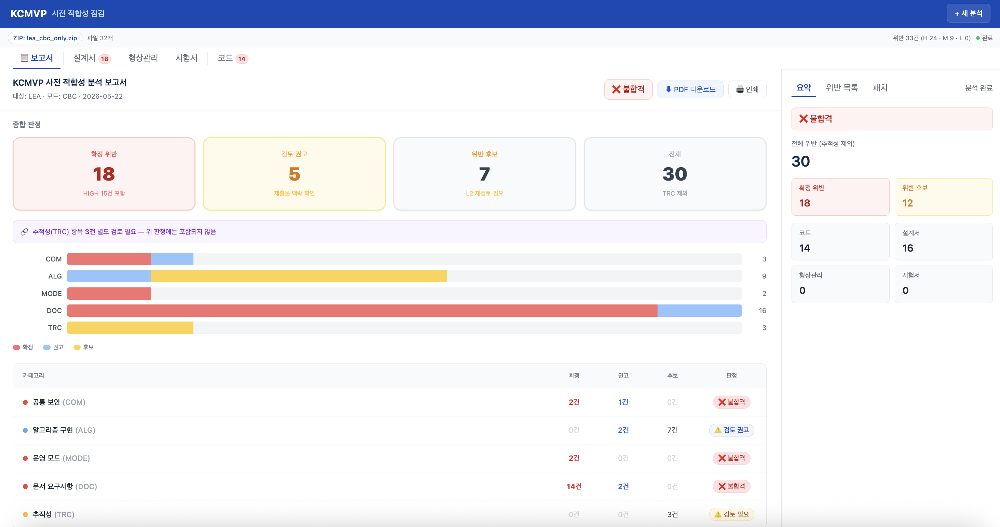
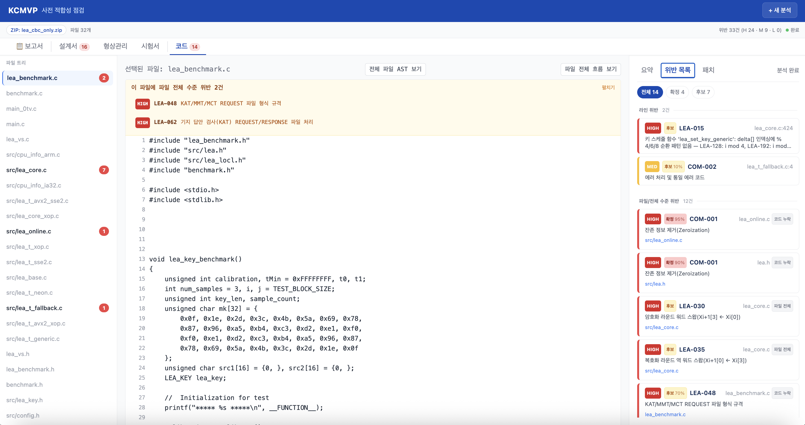
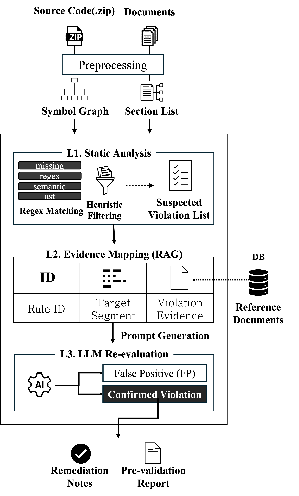

<p align="center">
  
</p>

<h1 align="center">KCMVP Pre-Compliance Validator</h1>

<p align="center">
  A web-based tool that automatically validates cryptographic module source code and submission documents before official KCMVP certification.
</p>

<p align="center">
  
  
  
  
  
</p>

<p align="center">
  <a href="https://github.com/SuBeen-Cho/KCMVP-Compliance-Tool/stargazers"></a>
  <a href="https://github.com/SuBeen-Cho/KCMVP-Compliance-Tool/commits/main"></a>
  <a href="https://github.com/SuBeen-Cho/KCMVP-Compliance-Tool"></a>
  <a href="LICENSE"></a>
</p>

---

## Demo

<p align="center">
  <a href="https://www.youtube.com/watch?v=6zdJuxVHgmE">
    
  </a>
</p>

<p align="center">Click the thumbnail to watch the demo on YouTube.</p>

---

## Features

|  | Feature | Description |
|--|---------|-------------|
| **L1** | Static Code Analysis | Parses C/C++ source via AST + regex. Checks LEA/ARIA + 8 operation modes with 170+ rules |
| **L1** | Document Validation | Parses design docs, configuration management, and test report PDFs by section/table structure |
| **L2** | Evidence Mapping | Links each rule to KCMVP guideline references via RAG |
| **L3** | LLM Re-evaluation | Gemini verifies semantic validity of candidate violations and filters out false positives |
|  | Traceability | Cross-checks consistency between design docs, code, and test reports |
|  | Patch Generation | Auto-generates before/after code fixes with explanations for each violation |

---

## Screenshots

<p align="center">
  
</p>

<p align="center">
  Select a file from the tree view — violations are displayed inline on the code. Filter by severity and confidence in the right panel.
</p>

---

## Pipeline

<p align="center">
  
</p>

Upload source code via ZIP or GitHub URL along with PDF documents, and the analysis runs through:

1. **Preprocessing** — AST parsing (libclang/pycparser), PDF section/table extraction (PyMuPDF + pdfplumber), scanned PDF OCR
2. **L1 Static Analysis** — YAML rule matching (missing / regex / semantic / ast)
3. **L2 Evidence Mapping** — Links rules to KCMVP guideline references (RAG)
4. **L3 LLM Re-evaluation** — Gemini reviews code/document context to filter false positives
5. **Report + Patches** — Merges and deduplicates violations, generates report and code fixes

---

## Quick Start

### Backend

```bash
cd backend
python3 -m venv venv && source venv/bin/activate
pip install -r requirements.txt

cp ../.env.example .env
# Set GOOGLE_API_KEY in .env (get one from Google AI Studio)

uvicorn app.main:app --reload --host 0.0.0.0 --port 8000
```

### Frontend

```bash
cd frontend
npm install && npm run dev
```

---

<details>
<summary><b>Evaluation Results</b></summary>

### Code Violation Detection

| Metric | Value |
|--------|-------|
| L1 Recall | 89.5% (baseline 49.5% → +40pp) |
| L1+L3 Recall | 87.6% |
| L3 FP Removal Rate | 94.3% (50 out of 53 removed) |
| KISA LEA FP Reduction | 208 → 11 (94.7% reduction) |

### Document Violation Detection

| Metric | Value |
|--------|-------|
| Recall | 100% (10/10) |
| Precision (L1+L2) | 58.8% |

6-stage systematic evaluation: Blind Test → Wilson CI → Mutation Testing → LOO Cross-Validation → External Blind → Mutation Automation

</details>

<details>
<summary><b>Environment Variables</b></summary>

```env
# Required
GOOGLE_API_KEY=AIza...          # Google AI Studio API key

# Defaults available
API_V1_PREFIX=/api
GEMINI_L2_MODEL=gemini-2.5-flash-lite
L2_PROVIDER=gemini              # or "local"

# Optional
RAG_USE_CHROMA=false
LOCAL_LLM_BASE_URL=http://localhost:8080/v1
LOCAL_LLM_MODEL=kcmvp-judge
```

</details>

---

## Tech Stack

| Layer | Technologies |
|-------|-------------|
| Backend | Python, FastAPI, pycparser, libclang, PyMuPDF, pdfplumber |
| Frontend | React 18, Vite, Zustand |
| LLM | Google Gemini 2.5 Flash |
| DB | ChromaDB (RAG, optional) |

---

## Contributors

<a href="https://github.com/SuBeen-Cho"></a>
<a href="https://github.com/yulim4hyoung"></a>
<a href="https://github.com/lima050627-ops"></a>
<a href="https://github.com/jaedol2023-oss"></a>
<a href="https://github.com/sumiiniee"></a>
<a href="https://github.com/rhcp030418"></a>

---

## License

This project is licensed under the MIT License — see [LICENSE](LICENSE) for details.

The rulesets in this project are independently authored based on publicly available KISA guidelines (KS X ISO/IEC 19790, KS X 3246, etc.). See [NOTICE.md](NOTICE.md) for the full list of referenced standards.
