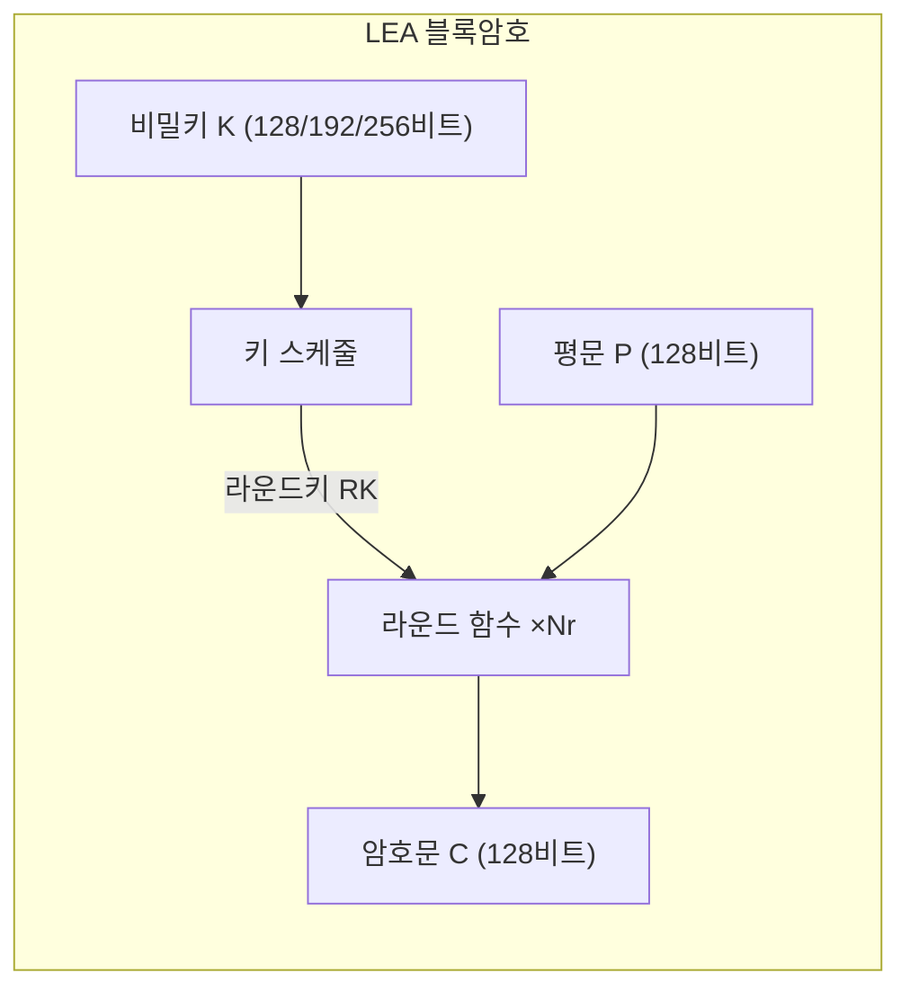

# [LEA.001] LEA 개요 및 특성

## 1. 보안요구사항 개요
LEA(Lightweight Encryption Algorithm)는 128비트 데이터 블록을 암호화하는 경량 블록암호 알고리즘으로, 128·192·256비트 비밀키를 지원하며 S-box 없이 32비트 ARX 연산만으로 구성되어 부채널 공격에 강인한 구조를 갖는다.

## 2. 상세 요구사항 (Requirements)
- **LEA-001**: LEA는 128비트(16바이트) 고정 블록 크기의 블록암호 알고리즘이며, 128·192·256비트 비밀키를 사용하여 데이터를 암호화·복호화해야 한다. 라운드 함수는 32비트 단위의 ARX(Addition, Rotation, XOR) 연산만으로 구성되어야 한다.
- **LEA-041**: S-box를 사용하지 않는 구조를 채택하여 캐시 타이밍 공격(Cache-timing Attack) 위험을 원천 차단해야 한다. 테이블 참조(lookup table) 기반 연산이 구현에 포함되지 않아야 한다.

## 3. 작성 예시 (Examples)
### 3.1. 표 형식 예시

| 항목 | 내용 |
| :--- | :--- |
| 알고리즘 명칭 | LEA (Lightweight Encryption Algorithm) |
| 블록 크기 | 128비트 (16바이트) |
| 키 길이 | 128 / 192 / 256비트 |
| 내부 구조 | ARX (Addition, Rotation, XOR) |
| S-box 사용 여부 | 없음 (No S-box) |
| 표준 근거 | TTAS.KO-12.0223, KS X 3246 |

### 3.2. 서술형 예시
"본 암호모듈은 KCMVP 검증 대상 블록암호 알고리즘으로 LEA를 채택하였다. LEA는 128비트 고정 블록 크기에 128·192·256비트 키를 지원하며, 라운드 함수가 32비트 정수 덧셈(mod 2³²), 비트 회전(Rotation), 배타적 논리합(XOR)만으로 구성된 ARX 구조이다. S-box를 사용하지 않으므로 캐시 타이밍 부채널 공격에 대한 구조적 안전성을 확보하였다."

## 4. 구조도 및 시각 자료 (Visuals)
### 4.1. LEA 알고리즘 구조 개요 (Mermaid)

### 4.2. ARX 연산 구조
LEA 라운드 함수는 다음 세 가지 32비트 연산의 조합으로만 구성된다:
- **Addition**: 32비트 모듈러 덧셈 (mod 2³²)
- **Rotation**: 32비트 비트 회전 (ROL / ROR)
- **XOR**: 32비트 배타적 논리합

S-box나 치환 테이블을 참조하지 않으므로 메모리 접근 패턴이 키에 의존하지 않는다.

## 5. 해설 및 증빙 가이드 (Guide)
- **S-box 배제의 의의**: S-box 기반 알고리즘(AES 등)은 테이블 참조 시 캐시 히트/미스 패턴이 비밀키에 따라 달라져 부채널 공격에 취약할 수 있다. LEA는 ARX 연산만 사용하여 이러한 위험을 구조적으로 제거한다.
- **32비트 CPU 최적화**: LEA의 모든 연산이 32비트 단위이므로 범용 32비트/64비트 프로세서에서 별도의 SIMD 명령어 없이도 높은 성능을 달성할 수 있다.
- **증빙 시 주안점**: 구현 코드에 S-box 배열이나 lookup table이 존재하지 않음을 확인하고, 모든 라운드 연산이 `+`, `<<<`, `⊕`로만 구성되어 있는지 검증한다.
- **참고 규격**: LEA 검증시스템 §4, LEA 논문 §3.
