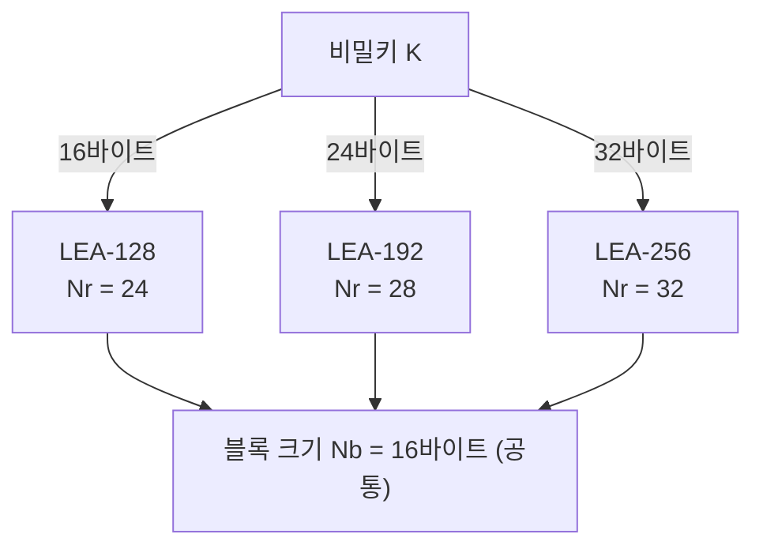

# [LEA.002] 키 길이 및 라운드 수

## 1. 보안요구사항 개요
LEA는 비밀키 길이에 따라 세 가지 변형(LEA-128, LEA-192, LEA-256)을 지원하며, 각 변형은 고유한 라운드 수(Nr)를 가진다. 블록 크기(Nb)는 항상 16바이트로 고정된다.

## 2. 상세 요구사항 (Requirements)
- **LEA-002**: 비밀키 길이(Nk)에 따라 LEA-128(Nk=16바이트), LEA-192(Nk=24바이트), LEA-256(Nk=32바이트)의 세 가지 변형을 지원해야 하며, 각각에 대응하는 라운드 수(Nr)를 정확히 적용해야 한다.
- **LEA-003**: 블록 크기(Nb)는 16바이트(128비트)로 고정되며, 라운드 수는 LEA-128=24, LEA-192=28, LEA-256=32로 규정된다. 이 값은 하드코딩 상수 또는 표준 참조 테이블에서 도출되어야 한다.

## 3. 작성 예시 (Examples)
### 3.1. 표 형식 예시

| 구분 | Nb (블록 크기, 바이트) | Nk (키 길이, 바이트) | Nr (라운드 수) |
| :--- | :---: | :---: | :---: |
| LEA-128 | 16 | 16 | 24 |
| LEA-192 | 16 | 24 | 28 |
| LEA-256 | 16 | 32 | 32 |

### 3.2. 코드 예시

```c
/* LEA 키 길이별 라운드 수 결정 */
int lea_get_num_rounds(int mk_len) {
    switch (mk_len) {
        case 16: return 24;  /* LEA-128 */
        case 24: return 28;  /* LEA-192 */
        case 32: return 32;  /* LEA-256 */
        default: return -1;  /* 허용되지 않는 키 길이 */
    }
}
```

### 3.3. 서술형 예시
"본 구현은 LEA-128(128비트 키, 24라운드), LEA-192(192비트 키, 28라운드), LEA-256(256비트 키, 32라운드)를 지원하며, 블록 크기는 128비트(16바이트)로 고정된다. 지원되지 않는 키 길이가 입력될 경우 오류를 반환한다."

## 4. 구조도 및 시각 자료 (Visuals)



## 5. 해설 및 증빙 가이드 (Guide)
- **라운드 수 고정 준수**: 구현 코드에서 라운드 수가 표준 값(24/28/32)과 정확히 일치하는지 확인해야 한다. 라운드 수를 변수로 받는 경우 허용 범위 검증 로직이 필수이다.
- **키 길이 검증**: `mk_len` 파라미터가 16, 24, 32 이외의 값일 때 즉시 오류를 반환하는지 확인한다. 잘못된 키 길이로 암호화가 진행되면 보안성이 보장되지 않는다.
- **증빙 시 주안점**: 키 길이별 라운드 수 매핑 테이블이 설계서에 명시되어 있는지, 구현 코드의 상수가 표준과 일치하는지 대조 검증한다.
- **참고 규격**: 블록암호 LEA 소스코드 사용 매뉴얼(v1.0) §1, LEA 표준 규격서 §5.1 <표 5-1>.
