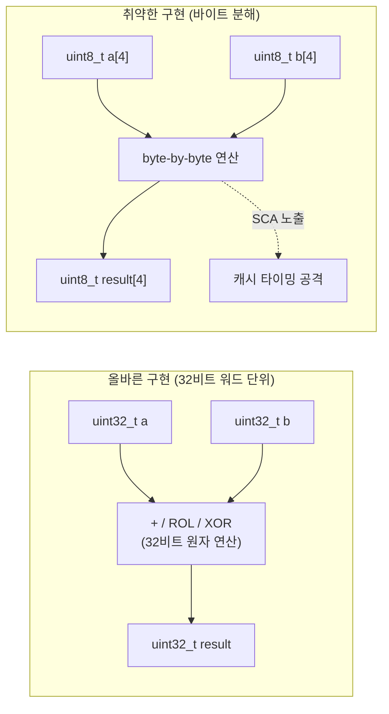

# [LEA.003] 32비트 워드 단위 연산

## 1. 보안요구사항 개요
LEA의 모든 내부 연산은 32비트 워드(uint32_t) 단위로 수행되어야 하며, 바이트 단위로 분해하여 연산하는 것은 부채널 공격(SCA) 취약점을 유발할 수 있으므로 32비트 워드 원자성을 반드시 유지해야 한다.

## 2. 상세 요구사항 (Requirements)
- **LEA-004**: LEA의 모든 산술·논리 연산(덧셈, 회전, XOR)은 32비트 부호 없는 정수(uint32_t) 단위로 수행되어야 한다. 바이트 단위 쪼개기 연산은 허용되지 않는다.
- **LEA-045**: 32비트 워드 연산의 원자성을 유지하여 부채널 공격(SCA, Side-Channel Attack) 취약점을 방지해야 한다. 바이트 단위 분해 시 메모리 접근 패턴이 달라져 타이밍/캐시 기반 공격에 노출될 수 있다.

## 3. 작성 예시 (Examples)
### 3.1. 코드 예시 (올바른 구현)

```c
#include <stdint.h>

/* 올바른 예: 32비트 워드 단위 연산 */
uint32_t lea_round_op(uint32_t a, uint32_t b, uint32_t rk) {
    uint32_t temp = (a ^ rk);
    temp = (temp + b);                    /* 32비트 모듈러 덧셈 */
    temp = (temp << 9) | (temp >> 23);    /* ROL9: 32비트 회전 */
    return temp;
}
```

### 3.2. 코드 예시 (잘못된 구현 - 바이트 분해)

```c
/* 잘못된 예: 바이트 단위 분해 - SCA 취약 */
uint32_t bad_add(uint32_t a, uint32_t b) {
    uint8_t *pa = (uint8_t *)&a;
    uint8_t *pb = (uint8_t *)&b;
    uint8_t result[4];
    uint16_t carry = 0;
    for (int i = 0; i < 4; i++) {
        carry += pa[i] + pb[i];
        result[i] = (uint8_t)carry;
        carry >>= 8;
    }
    return *(uint32_t *)result;
}
```

### 3.3. 서술형 예시
"LEA 구현의 모든 산술·논리 연산은 `uint32_t` 자료형을 사용하여 32비트 단위로 수행한다. 바이트 포인터를 이용한 분해 접근은 금지하며, 이를 통해 캐시 타이밍 부채널 공격에 대한 구조적 안전성을 확보한다."

## 4. 구조도 및 시각 자료 (Visuals)



## 5. 해설 및 증빙 가이드 (Guide)
- **32비트 원자성 검증**: 코드 리뷰 시 `uint8_t` 포인터 캐스팅을 통한 워드 내부 바이트 접근이 연산 경로에 존재하지 않는지 확인한다. 바이트→워드 변환은 초기 입력 변환 단계에서만 허용된다.
- **SCA 위험 요소**: 바이트 단위 분해 시 캐시 라인 접근 패턴이 데이터 의존적으로 변할 수 있으며, 이는 타이밍 분석을 통해 비밀키 유추에 활용될 수 있다.
- **컴파일러 최적화 주의**: 컴파일러가 32비트 연산을 바이트 단위로 분해하지 않도록 최적화 옵션 및 volatile 키워드 사용을 검토한다.
- **증빙 시 주안점**: 라운드 함수 내 모든 변수의 자료형이 `uint32_t`인지 검증하고, 바이트 단위 접근이 없음을 코드 정적 분석으로 확인한다.
- **참고 규격**: LEA 검증시스템 §4.
