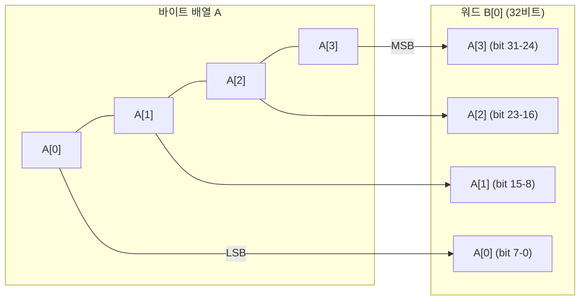

# [LEA.004] 바이트-워드 변환 (리틀 엔디안)

## 1. 보안요구사항 개요
LEA에서 바이트 배열과 워드 배열 간의 변환은 리틀 엔디안(Little-Endian) 규약을 따라야 하며, 이 변환 규칙은 암호화·복호화·키 스케줄 전반에 걸쳐 일관되게 적용되어야 한다.

## 2. 상세 요구사항 (Requirements)
- **LEA-005**: 바이트 배열 A에서 워드 배열 B로의 변환은 리틀 엔디안 규약에 따라 `B[i] = A[4i+3] || A[4i+2] || A[4i+1] || A[4i]` 형태로 수행되어야 한다. 역변환도 동일한 규약을 적용하여 `A[4i] = B[i]의 최하위 바이트`, `A[4i+3] = B[i]의 최상위 바이트` 순서를 유지해야 한다.

## 3. 작성 예시 (Examples)
### 3.1. 표 형식 예시 (변환 매핑)

| 바이트 인덱스 | 워드 매핑 | 설명 |
| :---: | :--- | :--- |
| A[0], A[1], A[2], A[3] | B[0] = A[3]∥A[2]∥A[1]∥A[0] | 첫 번째 워드 |
| A[4], A[5], A[6], A[7] | B[1] = A[7]∥A[6]∥A[5]∥A[4] | 두 번째 워드 |
| A[8], A[9], A[10], A[11] | B[2] = A[11]∥A[10]∥A[9]∥A[8] | 세 번째 워드 |
| A[12], A[13], A[14], A[15] | B[3] = A[15]∥A[14]∥A[13]∥A[12] | 네 번째 워드 |

### 3.2. 코드 예시

```c
#include <stdint.h>
#include <string.h>

/* 바이트 배열 → 워드 배열 (리틀 엔디안) */
void byte_to_word(const uint8_t *byte_arr, uint32_t *word_arr, int word_count) {
    for (int i = 0; i < word_count; i++) {
        word_arr[i] = ((uint32_t)byte_arr[4*i + 3] << 24) |
                      ((uint32_t)byte_arr[4*i + 2] << 16) |
                      ((uint32_t)byte_arr[4*i + 1] <<  8) |
                      ((uint32_t)byte_arr[4*i]);
    }
}

/* 워드 배열 → 바이트 배열 (리틀 엔디안) */
void word_to_byte(const uint32_t *word_arr, uint8_t *byte_arr, int word_count) {
    for (int i = 0; i < word_count; i++) {
        byte_arr[4*i]     = (uint8_t)(word_arr[i]);
        byte_arr[4*i + 1] = (uint8_t)(word_arr[i] >>  8);
        byte_arr[4*i + 2] = (uint8_t)(word_arr[i] >> 16);
        byte_arr[4*i + 3] = (uint8_t)(word_arr[i] >> 24);
    }
}
```

### 3.3. 서술형 예시
"바이트 배열에서 워드 배열로의 변환은 리틀 엔디안 규약에 따라 수행한다. 즉, 바이트 인덱스 4i가 워드의 최하위 바이트(LSB)에, 4i+3이 최상위 바이트(MSB)에 대응한다. 이는 LEA 표준 규격서 §4.2.3에 명시된 핵심 변환 규칙이다."

## 4. 구조도 및 시각 자료 (Visuals)



### 4.1. 변환 관계 요약
- **바이트→워드**: 리틀 엔디안이므로 낮은 주소의 바이트가 워드의 하위 비트에 위치
- **워드→바이트**: 역순으로 워드의 하위 비트부터 낮은 주소에 저장

## 5. 해설 및 증빙 가이드 (Guide)
- **엔디안 일관성**: 구현 전체에서 리틀 엔디안 변환이 일관되게 적용되는지 확인한다. 빅 엔디안 시스템에서 실행 시에도 명시적 변환 로직이 적용되어야 한다.
- **플랫폼 독립성**: `memcpy`를 이용한 변환은 시스템 엔디안에 의존하므로, 리틀 엔디안 플랫폼에서만 올바르게 동작한다. 이식성을 위해 비트 시프트 기반 변환을 권장한다.
- **증빙 시 주안점**: 테스트 벡터의 바이트 순서와 구현 결과가 일치하는지 확인하여 엔디안 변환의 정확성을 검증한다.
- **참고 규격**: LEA 논문 §2.2, LEA 표준 규격서 §4.2.3.
