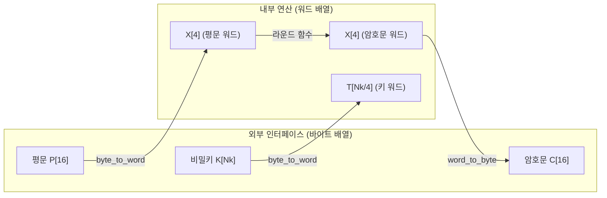

# [LEA.006] 입출력 배열 형식

## 1. 보안요구사항 개요
LEA의 비밀키(K), 평문(P), 암호문(C)은 모두 바이트 배열로 외부에 표기되며, 내부 연산 수행 시에는 워드 배열로 변환한 후 처리한다. 각 배열의 크기와 인덱스 범위가 표준에 정확히 부합해야 한다.

## 2. 상세 요구사항 (Requirements)
- **LEA-007**: 비밀키 K는 바이트 배열 `K = (K[0], K[1], ..., K[Nk-1])`로 정의하며, 평문 P는 `P = (P[0], P[1], ..., P[15])`, 암호문 C는 `C = (C[0], C[1], ..., C[15])`로 표기해야 한다. 모든 외부 인터페이스는 바이트 배열을 사용하고, 내부 연산은 리틀 엔디안 변환 후 워드 배열로 수행해야 한다.

## 3. 작성 예시 (Examples)
### 3.1. 표 형식 예시

| 데이터 | 배열 표기 | 크기 | 비고 |
| :--- | :--- | :---: | :--- |
| 비밀키 K | K[0], K[1], ..., K[Nk-1] | Nk 바이트 | Nk = 16 / 24 / 32 |
| 평문 P | P[0], P[1], ..., P[15] | 16 바이트 | 고정 (128비트 블록) |
| 암호문 C | C[0], C[1], ..., C[15] | 16 바이트 | 고정 (128비트 블록) |
| 내부 워드 (평문) | X[0], X[1], X[2], X[3] | 4 워드 | 각 워드 32비트 |
| 내부 워드 (키) | T[0], ..., T[Nk/4-1] | Nk/4 워드 | LEA-128: 4, 192: 6, 256: 8 |

### 3.2. 코드 예시

```c
#include <stdint.h>

typedef struct {
    uint32_t rk[32][6];  /* 라운드키: 최대 32라운드 × 6워드 */
    int nr;              /* 라운드 수 */
} LEA_KEY;

/* 암호화 함수 인터페이스: 바이트 배열 입출력 */
void lea_encrypt(const uint8_t pt[16],   /* 평문 (바이트 배열) */
                 uint8_t ct[16],          /* 암호문 (바이트 배열) */
                 const LEA_KEY *key) {
    uint32_t X[4];
    byte_to_word(pt, X, 4);  /* 바이트 → 워드 변환 */
    /* ... 라운드 연산 수행 ... */
    word_to_byte(X, ct, 4);  /* 워드 → 바이트 변환 */
}
```

### 3.3. 서술형 예시
"LEA 암호화 함수의 외부 인터페이스는 평문 P[16], 암호문 C[16], 비밀키 K[Nk]의 바이트 배열을 사용한다. 내부적으로는 리틀 엔디안 변환을 거쳐 32비트 워드 배열에서 라운드 연산을 수행하고, 최종 결과를 다시 바이트 배열로 변환하여 출력한다."

## 4. 구조도 및 시각 자료 (Visuals)



## 5. 해설 및 증빙 가이드 (Guide)
- **인터페이스 일관성**: 외부 API는 반드시 바이트 배열을 사용하고, 내부 워드 배열이 외부에 노출되지 않아야 한다. 이는 엔디안 독립적 인터페이스를 보장한다.
- **배열 경계 검증**: 평문·암호문은 정확히 16바이트, 비밀키는 Nk바이트가 전달되는지 런타임 검증이 필요하다.
- **증빙 시 주안점**: 함수 시그니처에서 입출력 배열의 크기가 명확히 정의되어 있는지, 바이트↔워드 변환이 올바르게 적용되는지 확인한다.
- **참고 규격**: LEA 표준 규격서 §5.1 <표 5-1>.
