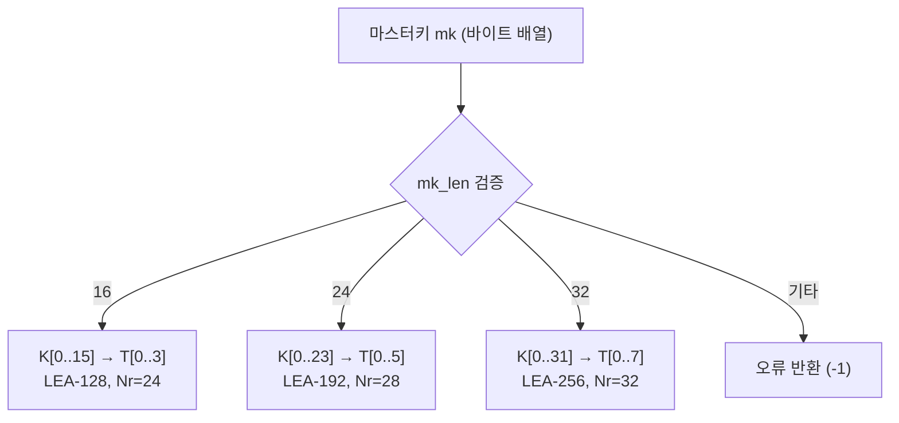

# [LEA.007] 비밀키 배열 구성

## 1. 보안요구사항 개요
LEA의 비밀키는 키 길이에 따라 정확한 크기의 바이트 배열로 정의되어야 하며, 허용되지 않는 키 길이가 입력될 경우 키 스케줄 진행을 거부해야 한다.

## 2. 상세 요구사항 (Requirements)
- **LEA-007**: 비밀키 K는 키 길이에 따른 올바른 크기의 바이트 배열로 정의되어야 한다. LEA-128은 K[16], LEA-192는 K[24], LEA-256은 K[32]로 구성된다. 키 길이 파라미터 `mk_len`은 16, 24, 32만 허용하며, 이외의 값은 오류로 처리해야 한다.

## 3. 작성 예시 (Examples)
### 3.1. 표 형식 예시

| 구분 | 바이트 배열 | mk_len | 워드 변환 후 |
| :--- | :--- | :---: | :--- |
| LEA-128 | K[0] ~ K[15] | 16 | T[0] ~ T[3] (4워드) |
| LEA-192 | K[0] ~ K[23] | 24 | T[0] ~ T[5] (6워드) |
| LEA-256 | K[0] ~ K[31] | 32 | T[0] ~ T[7] (8워드) |

### 3.2. 코드 예시

```c
#include <stdint.h>

#define LEA_KEY_128  16
#define LEA_KEY_192  24
#define LEA_KEY_256  32

int lea_set_key(LEA_KEY *ctx, const uint8_t *mk, int mk_len) {
    if (mk_len != LEA_KEY_128 &&
        mk_len != LEA_KEY_192 &&
        mk_len != LEA_KEY_256) {
        return -1;  /* 허용되지 않는 키 길이 */
    }

    uint32_t T[8] = {0};
    byte_to_word(mk, T, mk_len / 4);

    switch (mk_len) {
        case LEA_KEY_128: ctx->nr = 24; break;
        case LEA_KEY_192: ctx->nr = 28; break;
        case LEA_KEY_256: ctx->nr = 32; break;
    }
    /* ... 키 스케줄링 수행 ... */
    return 0;
}
```

### 3.3. 서술형 예시
"비밀키 K는 LEA-128의 경우 16바이트, LEA-192의 경우 24바이트, LEA-256의 경우 32바이트의 바이트 배열로 정의된다. 키 설정 함수는 `mk_len`이 16, 24, 32 중 하나인지 검증한 후 키 스케줄링을 진행하며, 이외의 값이 입력되면 즉시 오류를 반환한다."

## 4. 구조도 및 시각 자료 (Visuals)



## 5. 해설 및 증빙 가이드 (Guide)
- **키 길이 화이트리스트**: `mk_len` 검증은 반드시 화이트리스트 방식(16, 24, 32만 허용)으로 구현해야 하며, 범위 검사(0 < mk_len ≤ 32)만으로는 부족하다.
- **메모리 안전**: 키 배열의 크기가 `mk_len`과 정확히 일치하는지 확인하고, 버퍼 오버리드가 발생하지 않도록 한다.
- **키 폐기**: 키 스케줄링 완료 후 원본 마스터키 바이트 배열과 중간 워드 배열 T는 `memset_s` 등 안전한 방법으로 제로화해야 한다.
- **증빙 시 주안점**: 키 설정 함수의 입력 검증 로직이 존재하는지, 허용되지 않는 키 길이에 대한 오류 처리가 구현되어 있는지 확인한다.
- **참고 규격**: LEA 표준 규격서 §5.1 <표 5-1>.
