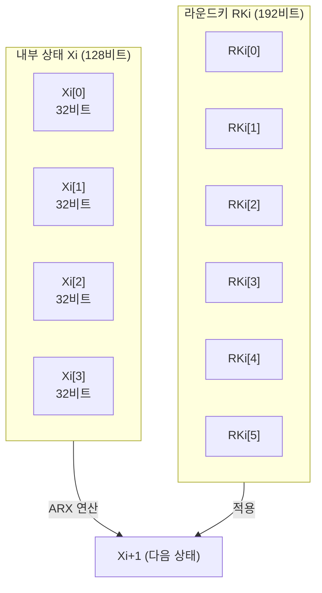

# [LEA.008] 내부 상태 변수 및 라운드키 구조

## 1. 보안요구사항 개요
LEA의 내부 상태 변수 Xi는 4개의 32비트 워드로 구성되며, 각 라운드키 RKi는 6개의 32비트 워드(192비트)로 구성된다. 이 구조가 표준에 정확히 부합해야 암호화·복호화의 정합성이 보장된다.

## 2. 상세 요구사항 (Requirements)
- **LEA-008**: 내부 상태 변수 Xi는 4개의 32비트 워드 배열 `Xi = (Xi[0], Xi[1], Xi[2], Xi[3])`으로 구성되어야 한다. 초기 상태 X0은 평문을 워드로 변환한 값이며, 최종 상태 XNr이 암호문에 대응한다.
- **LEA-009**: 각 라운드키 RKi는 6개의 32비트 워드(총 192비트)로 구성된 배열 `RKi = (RKi[0], RKi[1], RKi[2], RKi[3], RKi[4], RKi[5])`이어야 한다. 라운드키 배열의 크기는 `Nr × 6` 워드이다.

## 3. 작성 예시 (Examples)
### 3.1. 표 형식 예시

| 변수 | 구성 | 크기 | 비고 |
| :--- | :--- | :---: | :--- |
| Xi (내부 상태) | Xi[0], Xi[1], Xi[2], Xi[3] | 4 × 32비트 = 128비트 | 라운드별 중간값 |
| RKi (라운드키) | RKi[0], ..., RKi[5] | 6 × 32비트 = 192비트 | 라운드별 서브키 |
| 전체 라운드키 | RK[0] ~ RK[Nr-1] | Nr × 6 워드 | LEA-128: 144워드 |

### 3.2. 코드 예시

```c
#include <stdint.h>

#define LEA_MAX_ROUNDS  32
#define LEA_RK_WORDS     6
#define LEA_STATE_WORDS  4

typedef struct {
    uint32_t rk[LEA_MAX_ROUNDS][LEA_RK_WORDS];  /* 라운드키 배열 */
    int nr;                                       /* 실제 라운드 수 */
} LEA_KEY;

void lea_encrypt_block(const uint32_t pt[LEA_STATE_WORDS],
                       uint32_t ct[LEA_STATE_WORDS],
                       const LEA_KEY *key) {
    uint32_t X[LEA_STATE_WORDS];
    X[0] = pt[0]; X[1] = pt[1]; X[2] = pt[2]; X[3] = pt[3];

    for (int i = 0; i < key->nr; i++) {
        uint32_t tmp;
        /* 라운드 함수: X[0..3]에 RK[i][0..5] 적용 */
        tmp = (X[0] ^ key->rk[i][0]) + (X[1] ^ key->rk[i][1]);
        tmp = ROL(tmp, 9);
        /* ... 이하 라운드 함수 계속 ... */
    }
    ct[0] = X[0]; ct[1] = X[1]; ct[2] = X[2]; ct[3] = X[3];
}
```

### 3.3. 서술형 예시
"LEA 내부 상태 Xi는 4개의 32비트 워드(128비트)로 구성되며, 각 라운드에서 6개의 32비트 라운드키 워드 RKi와 함께 ARX 연산을 수행한다. 전체 라운드키 저장 공간은 Nr × 6워드이며, LEA-256의 경우 최대 32 × 6 = 192워드(768바이트)이다."

## 4. 구조도 및 시각 자료 (Visuals)



## 5. 해설 및 증빙 가이드 (Guide)
- **배열 크기 정합성**: 라운드키 배열의 두 번째 차원이 반드시 6인지 확인한다. 일부 구현에서 4나 8로 잘못 설정하는 경우가 있다.
- **상태 초기화**: X0은 평문의 워드 변환 결과와 정확히 일치해야 하며, 이전 블록의 잔여 데이터가 남아 있지 않아야 한다.
- **메모리 보호**: 라운드키 배열은 키 스케줄링 후에도 암호화·복호화에 사용되므로, 불필요해진 시점에 안전하게 제로화(zeroize)해야 한다.
- **증빙 시 주안점**: 라운드키 구조체의 선언부에서 차원(Nr × 6)이 올바른지, 상태 배열이 4워드인지 코드 정적 분석으로 확인한다.
- **참고 규격**: LEA 표준 규격서 §5.2.1 알고리즘 2, §5.2.2 알고리즘 3.
