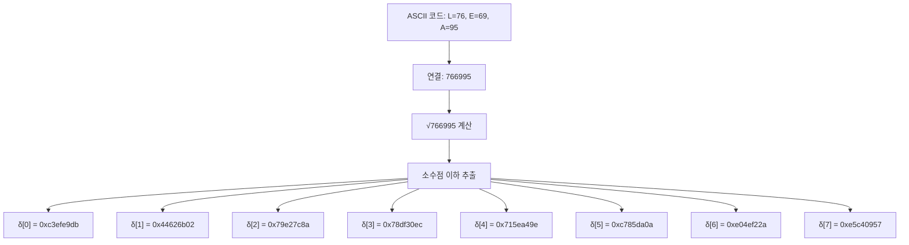

# [LEA.009] 델타(δ) 상수

## 1. 보안요구사항 개요
LEA 키 스케줄에서 사용되는 8개의 32비트 상수 δ[0]~δ[7]은 표준에 정확히 정의된 값을 사용해야 하며, 이 상수의 유도 근거를 주석 또는 설계서에 명시하는 것이 권장된다.

## 2. 상세 요구사항 (Requirements)
- **LEA-011**: 키 스케줄에서 사용되는 8개의 32비트 상수 δ[i]는 다음 값을 정확히 사용해야 한다:
  - δ[0] = 0xc3efe9db
  - δ[1] = 0x44626b02
  - δ[2] = 0x79e27c8a
  - δ[3] = 0x78df30ec
  - δ[4] = 0x715ea49e
  - δ[5] = 0xc785da0a
  - δ[6] = 0xe04ef22a
  - δ[7] = 0xe5c40957
- **LEA-012**: 상수 δ의 유도 근거는 'L', 'E', 'A'의 ASCII 코드(76, 69, 95)와 √766995의 소수점 이하 값에서 도출된 것이며, 이 유도 과정을 구현 코드의 주석 또는 설계서에 명시하여 상수의 출처를 투명하게 밝혀야 한다.

## 3. 작성 예시 (Examples)
### 3.1. 표 형식 예시

| 인덱스 | 상수 값 | 16진수 |
| :---: | :--- | :--- |
| δ[0] | 3,287,812,571 | 0xc3efe9db |
| δ[1] | 1,147,341,570 | 0x44626b02 |
| δ[2] | 2,045,344,906 | 0x79e27c8a |
| δ[3] | 2,027,667,692 | 0x78df30ec |
| δ[4] | 1,902,158,494 | 0x715ea49e |
| δ[5] | 3,347,889,674 | 0xc785da0a |
| δ[6] | 3,762,091,562 | 0xe04ef22a |
| δ[7] | 3,854,862,679 | 0xe5c40957 |

### 3.2. 코드 예시

```c
#include <stdint.h>

/*
 * LEA 키 스케줄용 델타 상수
 * 유도 근거: 'L'=76, 'E'=69, 'A'=95 → 766995
 *            √766995 의 소수점 이하 자릿수에서 추출
 */
static const uint32_t delta[8] = {
    0xc3efe9db, 0x44626b02, 0x79e27c8a, 0x78df30ec,
    0x715ea49e, 0xc785da0a, 0xe04ef22a, 0xe5c40957
};
```

### 3.3. 서술형 예시
"LEA 키 스케줄에서 사용하는 상수 δ[0]~δ[7]은 알고리즘 명칭 'LEA'의 ASCII 코드(L=76, E=69, A=95)를 이어 붙인 수 766995의 제곱근(√766995)에서 유도된 nothing-up-my-sleeve 상수이다. 이를 통해 설계자가 의도적으로 약점을 심을 수 없음을 투명하게 보장한다."

## 4. 구조도 및 시각 자료 (Visuals)



### 4.1. 유도 과정 요약
- 'L' = 0x4C = 76, 'E' = 0x45 = 69, 'A' = 0x5F = 95
- 세 값을 이어 붙여 766995 생성
- √766995의 소수점 이하 비트열을 32비트씩 분할하여 δ[0]~δ[7] 도출
- 이러한 "nothing-up-my-sleeve" 방식은 상수에 백도어가 없음을 보증

## 5. 해설 및 증빙 가이드 (Guide)
- **상수 정확성 검증**: 구현 코드의 δ 배열이 위 8개 값과 비트 단위로 정확히 일치하는지 확인한다. 단 한 비트라도 다르면 키 스케줄 전체가 달라져 모든 라운드키가 오류를 갖게 된다.
- **유도 근거 명시**: "nothing-up-my-sleeve number" 개념에 따라 상수의 출처를 주석으로 밝히는 것이 KCMVP 심사에서 긍정적으로 평가된다.
- **테스트 벡터 교차 검증**: 표준 테스트 벡터로 암호화를 수행하여 결과가 일치하면 δ 상수가 올바르게 적용된 것으로 간접 확인할 수 있다.
- **증빙 시 주안점**: 코드 내 상수 배열의 값을 표준과 1:1 대조하고, 주석에 유도 근거가 기술되어 있는지 확인한다.
- **참고 규격**: LEA 표준 규격서 §5.2.2, LEA 논문 §2.3.
