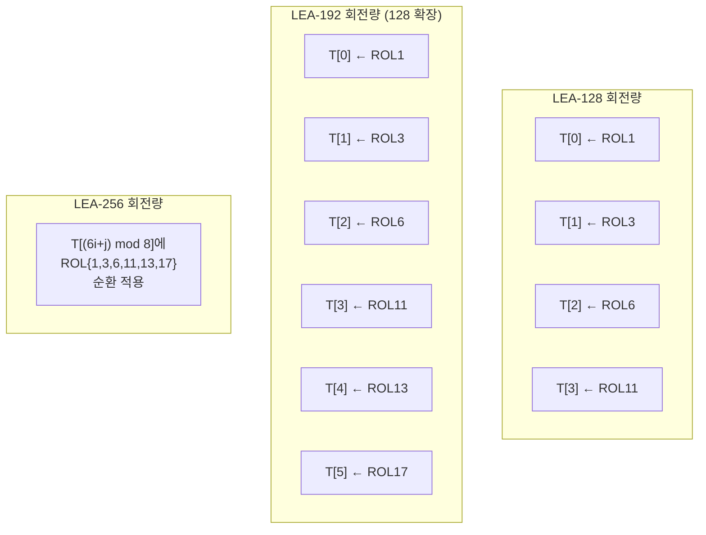

# [LEA.010] 키 스케줄 회전 연산 규격

## 1. 보안요구사항 개요
LEA 키 스케줄에서 내부 상태 T에 적용되는 회전(ROL) 연산의 회전량은 키 길이별로 표준에 정확히 규정되어 있으며, 이 값들이 하나라도 틀리면 전체 라운드키가 오류를 갖게 된다.

## 2. 상세 요구사항 (Requirements)
- **LEA-016**: 32비트 좌측 회전 연산 ROLn(x)은 `(x << n) | (x >> (32 - n))`으로 정의되며, n은 표준에서 규정한 고정 회전량이어야 한다.
- **LEA-017**: LEA-128 키 스케줄에서 T[0]~T[3]에 적용되는 회전량은 각각 ROL1, ROL3, ROL6, ROL11이다.
- **LEA-018**: LEA-192 키 스케줄에서는 LEA-128의 회전량에 T[4]←ROL13, T[5]←ROL17이 추가된다.
- **LEA-019**: LEA-256 키 스케줄에서는 T[(6i+j) mod 8]에 대해 ROL1, ROL3, ROL6, ROL11, ROL13, ROL17의 6가지 회전량이 순환 적용된다.
- **LEA-020**: 모든 회전 연산은 32비트 워드 범위 내에서 수행되어야 하며, 0비트 또는 32비트 회전 시 정의되지 않는 동작(undefined behavior)이 발생하지 않아야 한다.

## 3. 작성 예시 (Examples)
### 3.1. 표 형식 예시 (키 길이별 회전량)

| 키 길이 | T 인덱스 | 회전량 | 비고 |
| :--- | :---: | :---: | :--- |
| LEA-128 | T[0] | ROL1 | 모든 라운드 공통 |
| LEA-128 | T[1] | ROL3 | |
| LEA-128 | T[2] | ROL6 | |
| LEA-128 | T[3] | ROL11 | |
| LEA-192 | T[4] | ROL13 | 128에 추가 |
| LEA-192 | T[5] | ROL17 | 128에 추가 |
| LEA-256 | T[(6i+j) mod 8] | ROL{1,3,6,11,13,17} | 순환 적용 |

### 3.2. 코드 예시

```c
#include <stdint.h>

#define ROL(x, n) (((x) << (n)) | ((x) >> (32 - (n))))

static const int rot_128[4] = {1, 3, 6, 11};
static const int rot_192[6] = {1, 3, 6, 11, 13, 17};
static const int rot_256[6] = {1, 3, 6, 11, 13, 17};

/* LEA-128 키 스케줄 (라운드 i) */
void lea128_key_schedule_round(uint32_t T[4], uint32_t rk[6],
                                int i, const uint32_t delta[8]) {
    uint32_t d = ROL(delta[i % 4], i);
    T[0] = ROL(T[0] + d, 1);
    T[1] = ROL(T[1] + ROL(d, 1), 3);
    T[2] = ROL(T[2] + ROL(d, 2), 6);
    T[3] = ROL(T[3] + ROL(d, 3), 11);
    rk[0] = T[0]; rk[1] = T[1];
    rk[2] = T[2]; rk[3] = T[1];
    rk[4] = T[3]; rk[5] = T[1];
}

/* LEA-192 키 스케줄 (라운드 i) */
void lea192_key_schedule_round(uint32_t T[6], uint32_t rk[6],
                                int i, const uint32_t delta[8]) {
    uint32_t d = ROL(delta[i % 6], i);
    T[0] = ROL(T[0] + d, 1);
    T[1] = ROL(T[1] + ROL(d, 1), 3);
    T[2] = ROL(T[2] + ROL(d, 2), 6);
    T[3] = ROL(T[3] + ROL(d, 3), 11);
    T[4] = ROL(T[4] + ROL(d, 4), 13);
    T[5] = ROL(T[5] + ROL(d, 5), 17);
    rk[0] = T[0]; rk[1] = T[1]; rk[2] = T[2];
    rk[3] = T[3]; rk[4] = T[4]; rk[5] = T[5];
}
```

### 3.3. 서술형 예시
"LEA 키 스케줄에서 내부 상태 T의 각 워드에 적용되는 회전량은 LEA-128에서 (1, 3, 6, 11), LEA-192에서 (1, 3, 6, 11, 13, 17), LEA-256에서는 동일한 6가지 회전량이 T[(6i+j) mod 8]에 순환 적용된다. ROLn(x) = (x << n) | (x >> (32-n))으로 정의된다."

## 4. 구조도 및 시각 자료 (Visuals)



### 4.1. ROL 연산 정의
```
ROLn(x) = (x << n) | (x >> (32 - n))

예시: ROL3(0x80000001) = (0x80000001 << 3) | (0x80000001 >> 29)
    = 0x00000008 | 0x00000004 = 0x0000000C
```

## 5. 해설 및 증빙 가이드 (Guide)
- **회전량 정확성**: 회전량 배열의 값이 {1, 3, 6, 11, 13, 17}과 정확히 일치하는지 확인한다. 회전량이 하나라도 다르면 모든 라운드키가 오류 값을 가진다.
- **UB(Undefined Behavior) 방지**: C/C++ 표준에서 `x << 32`는 정의되지 않은 동작이다. ROL 매크로가 n=0 또는 n=32일 때에도 안전하게 동작하는지 확인한다 (LEA 표준의 회전량에 0이나 32는 없으나 방어적 코딩 권장).
- **LEA-256 순환 인덱스**: `(6i+j) mod 8` 계산이 올바른지 확인한다. 잘못된 인덱스 계산은 T의 잘못된 워드에 회전을 적용하게 된다.
- **증빙 시 주안점**: 키 스케줄 코드에서 각 T[j]에 적용되는 회전량을 추출하여 표준 값과 대조한다. 테스트 벡터의 라운드키 중간값과 비교하면 간접 검증이 가능하다.
- **참고 규격**: LEA 표준 규격서 §5.2.2 알고리즘 3, 4, 5.
