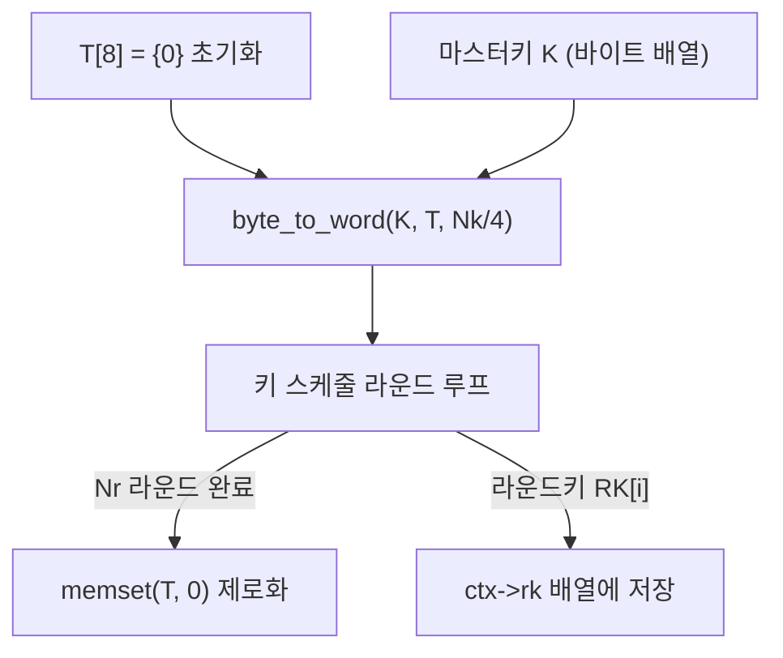

# [LEA.011] 키 스케줄 임시변수 초기화

## 1. 보안요구사항 개요
LEA 키 스케줄링 시작 시 내부 상태 T는 마스터키 K로 초기화되어야 하며, T의 크기는 키 길이에 따라 결정된다. 초기화 이전의 잔여 데이터가 T에 남아 있지 않도록 보장해야 한다.

## 2. 상세 요구사항 (Requirements)
- **LEA-013**: 키 스케줄링 시작 시 내부 상태 T는 마스터키 K의 워드 변환 결과로 초기화해야 한다. T ← K 형태로 구현하며, T의 길이는 키 길이에 따라 LEA-128은 T[4], LEA-192는 T[6], LEA-256은 T[8]이다. 초기화 전 T 배열을 0으로 클리어한 후 마스터키를 복사해야 한다.

## 3. 작성 예시 (Examples)
### 3.1. 표 형식 예시

| 키 길이 | T 배열 크기 | 초기화 소스 | 초기화 방법 |
| :--- | :---: | :--- | :--- |
| LEA-128 | T[4] (16바이트) | K[0..15] → T[0..3] | byte_to_word + memcpy |
| LEA-192 | T[6] (24바이트) | K[0..23] → T[0..5] | byte_to_word + memcpy |
| LEA-256 | T[8] (32바이트) | K[0..31] → T[0..7] | byte_to_word + memcpy |

### 3.2. 코드 예시

```c
#include <stdint.h>
#include <string.h>

void lea_key_schedule(LEA_KEY *ctx, const uint8_t *mk, int mk_len) {
    uint32_t T[8] = {0};   /* 최대 크기로 선언 후 0 초기화 */
    int t_len = mk_len / 4;

    /* 마스터키를 워드 배열로 변환하여 T 초기화 */
    byte_to_word(mk, T, t_len);

    /* 키 길이별 키 스케줄링 수행 */
    switch (mk_len) {
        case 16:
            ctx->nr = 24;
            for (int i = 0; i < 24; i++) {
                lea128_key_schedule_round(T, ctx->rk[i], i, delta);
            }
            break;
        case 24:
            ctx->nr = 28;
            for (int i = 0; i < 28; i++) {
                lea192_key_schedule_round(T, ctx->rk[i], i, delta);
            }
            break;
        case 32:
            ctx->nr = 32;
            for (int i = 0; i < 32; i++) {
                lea256_key_schedule_round(T, ctx->rk[i], i, delta);
            }
            break;
    }

    /* 키 스케줄 완료 후 임시변수 제로화 */
    memset(T, 0, sizeof(T));
}
```

### 3.3. 서술형 예시
"LEA 키 스케줄링은 내부 상태 T를 마스터키 K로 초기화하는 것으로 시작한다. T는 먼저 0으로 클리어된 후, `byte_to_word` 변환을 거쳐 마스터키의 워드 값으로 채워진다. LEA-128의 경우 T[0]~T[3] (4워드), LEA-192는 T[0]~T[5] (6워드), LEA-256은 T[0]~T[7] (8워드)가 사용된다. 키 스케줄 완료 후 T는 반드시 제로화한다."

## 4. 구조도 및 시각 자료 (Visuals)



### 4.1. 초기화 흐름 상세
1. T 배열을 최대 크기(8워드)로 선언하고 0으로 초기화
2. 마스터키 K를 리틀 엔디안 변환하여 T에 복사
3. 키 길이에 따른 라운드 수만큼 키 스케줄 수행
4. 라운드키를 ctx에 저장
5. T 배열을 안전하게 제로화

## 5. 해설 및 증빙 가이드 (Guide)
- **0 초기화 필수**: `uint32_t T[8]`을 선언만 하고 초기화하지 않으면, LEA-128/192에서 사용하지 않는 T[4]~T[7] 영역에 스택의 잔여 데이터가 남을 수 있다. 반드시 `= {0}` 또는 `memset`으로 초기화한다.
- **워드 변환 후 복사**: `memcpy(T, K, mk_len)`은 리틀 엔디안 플랫폼에서만 올바르게 동작한다. 이식성을 위해 `byte_to_word` 함수를 사용한 변환이 권장된다.
- **제로화 안전성**: `memset` 대신 `memset_s`(C11) 또는 `explicit_bzero`(POSIX)를 사용하여 컴파일러 최적화에 의한 제로화 제거를 방지한다.
- **증빙 시 주안점**: T 초기화 코드에서 마스터키가 올바르게 워드 변환되는지, 키 스케줄 완료 후 T가 제로화되는지 확인한다.
- **참고 규격**: LEA 표준 규격서 §5.2.2 알고리즘 3.
