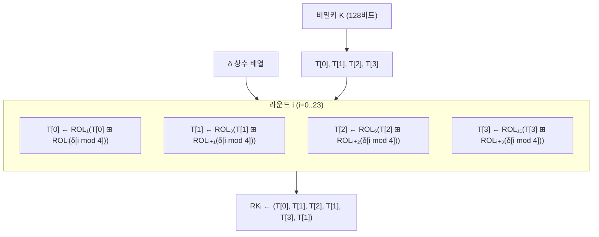

# [LEA.012] 라운드키 생성 구조

## 1. 보안요구사항 개요
LEA의 키 스케줄은 비밀키 K로부터 각 라운드에 사용할 192비트(6워드) 라운드키를 생성하는 과정으로, 키 길이에 따라 알고리즘 3(128비트), 알고리즘 4(192비트), 알고리즘 5(256비트)를 사용하며, 모듈러 덧셈(⊞)과 비트 회전(ROL)을 조합하여 델타 상수(δ)를 기반으로 라운드키 워드를 생성한다.

## 2. 상세 요구사항 (Requirements)
- **LEA-010**: 키 스케줄은 비밀키 K를 32비트 워드 배열 T로 변환한 후, 델타 상수 δ와 모듈러 덧셈(⊞), 비트 좌회전(ROL)을 반복 적용하여 라운드키를 생성해야 한다.
- **LEA-014**: LEA-128 키 스케줄(알고리즘 3)은 4워드 T[0]~T[3]을 사용하여 24라운드 라운드키를 생성해야 하며, 델타 상수 인덱싱은 `δ[i mod 4]`를 따라야 한다.
- **LEA-015**: LEA-192 키 스케줄(알고리즘 4)은 6워드 T[0]~T[5]를 사용하여 28라운드 라운드키를 생성해야 하며, 델타 상수 인덱싱은 `δ[i mod 6]`을 따라야 한다.
- **LEA-021**: LEA-256 키 스케줄(알고리즘 5)은 8워드 T[0]~T[7]에 대해 `T[(6i+j) mod 8]`로 접근하며 32라운드 라운드키를 생성해야 하고, 델타 상수 인덱싱은 `δ[i mod 8]`을 따라야 한다.
- **LEA-022**: 각 라운드키 RK\_i\_enc는 6개의 32비트 워드를 연접한 192비트 값으로 구성되어야 하며, 키 길이별 워드 연접 규칙을 정확히 구현해야 한다.

## 3. 작성 예시 (Examples)
### 3.1. 알고리즘 3 — LEA-128 키 스케줄 (의사코드)

```
Input: K (128비트 비밀키)
Output: RK_0_enc, ..., RK_23_enc (24개 라운드키, 각 192비트)

T ← K   // T[0], T[1], T[2], T[3] (4워드)

for i = 0 to 23 do
    T[0] ← ROL_1( T[0] ⊞ ROL_i( δ[i mod 4] ) )
    T[1] ← ROL_3( T[1] ⊞ ROL_(i+1)( δ[i mod 4] ) )
    T[2] ← ROL_6( T[2] ⊞ ROL_(i+2)( δ[i mod 4] ) )
    T[3] ← ROL_11( T[3] ⊞ ROL_(i+3)( δ[i mod 4] ) )
    RK_i_enc ← ( T[0], T[1], T[2], T[1], T[3], T[1] )
end for
```

### 3.2. 알고리즘 4 — LEA-192 키 스케줄 (의사코드)

```
Input: K (192비트 비밀키)
Output: RK_0_enc, ..., RK_27_enc (28개 라운드키)

T ← K   // T[0], ..., T[5] (6워드)

for i = 0 to 27 do
    T[0] ← ROL_1( T[0] ⊞ ROL_i( δ[i mod 6] ) )
    T[1] ← ROL_3( T[1] ⊞ ROL_(i+1)( δ[i mod 6] ) )
    T[2] ← ROL_6( T[2] ⊞ ROL_(i+2)( δ[i mod 6] ) )
    T[3] ← ROL_11( T[3] ⊞ ROL_(i+3)( δ[i mod 6] ) )
    T[4] ← ROL_13( T[4] ⊞ ROL_(i+4)( δ[i mod 6] ) )
    T[5] ← ROL_17( T[5] ⊞ ROL_(i+5)( δ[i mod 6] ) )
    RK_i_enc ← ( T[0], T[1], T[2], T[3], T[4], T[5] )
end for
```

### 3.3. 알고리즘 5 — LEA-256 키 스케줄 (의사코드)

```
Input: K (256비트 비밀키)
Output: RK_0_enc, ..., RK_31_enc (32개 라운드키)

T ← K   // T[0], ..., T[7] (8워드)

for i = 0 to 31 do
    T[(6i+0) mod 8] ← ROL_1(  T[(6i+0) mod 8] ⊞ ROL_i( δ[i mod 8] ) )
    T[(6i+1) mod 8] ← ROL_3(  T[(6i+1) mod 8] ⊞ ROL_(i+1)( δ[i mod 8] ) )
    T[(6i+2) mod 8] ← ROL_6(  T[(6i+2) mod 8] ⊞ ROL_(i+2)( δ[i mod 8] ) )
    T[(6i+3) mod 8] ← ROL_11( T[(6i+3) mod 8] ⊞ ROL_(i+3)( δ[i mod 8] ) )
    T[(6i+4) mod 8] ← ROL_13( T[(6i+4) mod 8] ⊞ ROL_(i+4)( δ[i mod 8] ) )
    T[(6i+5) mod 8] ← ROL_17( T[(6i+5) mod 8] ⊞ ROL_(i+5)( δ[i mod 8] ) )
    RK_i_enc ← ( T[(6i+0)mod8], T[(6i+1)mod8], ..., T[(6i+5)mod8] )
end for
```

### 3.4. 표 형식 — 키 길이별 비교

| 항목 | LEA-128 (알고리즘 3) | LEA-192 (알고리즘 4) | LEA-256 (알고리즘 5) |
| :--- | :--- | :--- | :--- |
| 비밀키 크기 | 128비트 (4워드) | 192비트 (6워드) | 256비트 (8워드) |
| 라운드 수 (Nr) | 24 | 28 | 32 |
| T 배열 크기 | T[0]~T[3] | T[0]~T[5] | T[0]~T[7] |
| δ 인덱싱 | δ[i mod 4] | δ[i mod 6] | δ[i mod 8] |
| T 접근 방식 | 고정 인덱스 | 고정 인덱스 | (6i+j) mod 8 |
| RK 워드 구성 | (T[0],T[1],T[2],T[1],T[3],T[1]) | (T[0],...,T[5]) | (T[6i mod8],...,T[(6i+5)mod8]) |

## 4. 구조도 및 시각 자료 (Visuals)
### 4.1. LEA-128 키 스케줄 구조 (Mermaid)



### 4.2. 핵심 연산 흐름
- **모듈러 덧셈(⊞)**: 32비트 정수 덧셈 (mod 2³²). 각 T 워드에 회전된 δ 상수를 더하는 역할.
- **비트 좌회전(ROL)**: δ 상수에 대한 회전량은 라운드 인덱스 i에 따라 증가(ROL\_i, ROL\_(i+1), ...). T 워드에 대한 회전량은 고정값(1, 3, 6, 11, 13, 17).
- **워드 연접**: LEA-128에서 T[1]이 3회 반복 사용됨에 유의.

## 5. 해설 및 증빙 가이드 (Guide)
- **모듈러 덧셈 구현 확인**: 키 스케줄 내 모든 덧셈이 32비트 모듈러 연산(⊞)으로 수행되는지 확인한다. C 언어에서는 `uint32_t` 타입의 자연 오버플로우를 활용하여 구현한다.
- **델타 상수 인덱싱 검증**: LEA-128은 `δ[i mod 4]`, LEA-192는 `δ[i mod 6]`, LEA-256은 `δ[i mod 8]`로 인덱싱해야 한다. 인덱싱 오류는 모든 라운드키가 틀어지는 치명적 결과를 초래한다.
- **라운드키 워드 연접 규칙**: LEA-128의 경우 `RK_i = (T[0], T[1], T[2], T[1], T[3], T[1])`로 T[1]이 3번 반복 사용된다. LEA-192/256은 각 T 워드가 1회씩 사용된다.
- **LEA-256의 T 인덱스 회전**: `(6i+j) mod 8` 규칙에 의해 매 라운드마다 T 배열의 접근 위치가 6칸씩 회전한다. 이 규칙의 정확한 구현이 필수적이다.
- **참고 규격**: LEA 표준 규격서 §5.2.2 알고리즘 3, 5.
