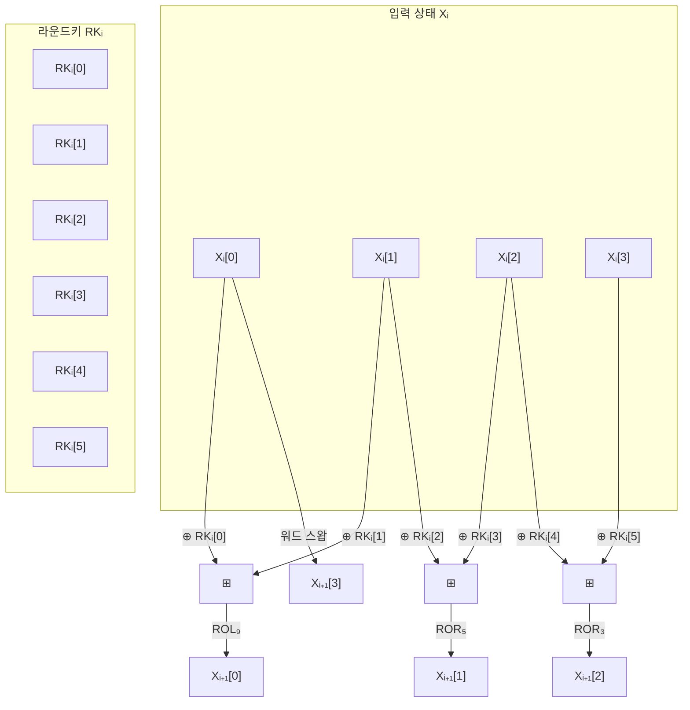

# [LEA.014] 암호화 라운드 연산

## 1. 보안요구사항 개요
LEA 암호화 라운드 함수(알고리즘 2)는 128비트 상태값 Xᵢ와 192비트 라운드키 RKᵢ를 입력받아 XOR(⊕), 모듈러 덧셈(⊞), 비트 회전(ROL/ROR)을 결합하여 다음 상태값 Xᵢ₊₁을 생성하며, 마지막 라운드도 동일 구조를 유지한다.

## 2. 상세 요구사항 (Requirements)
- **LEA-027**: 암호화 i번째 라운드의 첫 번째 워드 연산은 `Xᵢ₊₁[0] = ROL₉((Xᵢ[0] ⊕ RKᵢ[0]) ⊞ (Xᵢ[1] ⊕ RKᵢ[1]))` 형태로 수행되어야 한다. XOR를 먼저 적용한 후 모듈러 덧셈을 수행하고 좌회전 9비트를 적용한다.
- **LEA-028**: 두 번째 워드 연산은 `Xᵢ₊₁[1] = ROR₅((Xᵢ[1] ⊕ RKᵢ[2]) ⊞ (Xᵢ[2] ⊕ RKᵢ[3]))` 형태로 수행되어야 한다. 우회전 5비트를 적용한다.
- **LEA-029**: 세 번째 워드 연산은 `Xᵢ₊₁[2] = ROR₃((Xᵢ[2] ⊕ RKᵢ[4]) ⊞ (Xᵢ[3] ⊕ RKᵢ[5]))` 형태로 수행되어야 한다. 우회전 3비트를 적용한다.
- **LEA-030**: 네 번째 워드는 `Xᵢ₊₁[3] = Xᵢ[0]`으로 이전 상태의 첫 번째 워드를 그대로 대입하는 워드 스왑을 수행해야 한다.
- **LEA-031**: XOR → 모듈러 덧셈(ADD) 결합 순서가 반드시 지켜져야 하며, 마지막 라운드도 다른 라운드와 완전히 동일한 구조로 수행해야 한다(AES의 마지막 라운드 특수 처리와 차이).

## 3. 작성 예시 (Examples)
### 3.1. 알고리즘 2 — 암호화 라운드 함수 (의사코드)

```
// Roundenc(X_i, RK_i) → X_(i+1)
Input: X_i = (X_i[0], X_i[1], X_i[2], X_i[3])   // 4 × 32비트
       RK_i = (RK_i[0], ..., RK_i[5])             // 6 × 32비트
Output: X_(i+1) = (X_(i+1)[0], ..., X_(i+1)[3])

X_(i+1)[0] = ROL_9( (X_i[0] ⊕ RK_i[0]) ⊞ (X_i[1] ⊕ RK_i[1]) )
X_(i+1)[1] = ROR_5( (X_i[1] ⊕ RK_i[2]) ⊞ (X_i[2] ⊕ RK_i[3]) )
X_(i+1)[2] = ROR_3( (X_i[2] ⊕ RK_i[4]) ⊞ (X_i[3] ⊕ RK_i[5]) )
X_(i+1)[3] = X_i[0]
```

### 3.2. C 코드 예시

```c
#define ROL(x, n) (((x) << (n)) | ((x) >> (32 - (n))))
#define ROR(x, n) (((x) >> (n)) | ((x) << (32 - (n))))

void lea_round_enc(uint32_t X[4], const uint32_t RK[6]) {
    uint32_t temp = X[0];

    X[0] = ROL((X[0] ^ RK[0]) + (X[1] ^ RK[1]), 9);
    X[1] = ROR((X[1] ^ RK[2]) + (X[2] ^ RK[3]), 5);
    X[2] = ROR((X[2] ^ RK[4]) + (X[3] ^ RK[5]), 3);
    X[3] = temp;
}
```

### 3.3. 연산 순서 표

| 출력 워드 | 연산 수식 | 회전 방향 | 회전량 |
| :--- | :--- | :--- | :--- |
| Xᵢ₊₁[0] | ROL₉((Xᵢ[0] ⊕ RKᵢ[0]) ⊞ (Xᵢ[1] ⊕ RKᵢ[1])) | 좌회전 | 9비트 |
| Xᵢ₊₁[1] | ROR₅((Xᵢ[1] ⊕ RKᵢ[2]) ⊞ (Xᵢ[2] ⊕ RKᵢ[3])) | 우회전 | 5비트 |
| Xᵢ₊₁[2] | ROR₃((Xᵢ[2] ⊕ RKᵢ[4]) ⊞ (Xᵢ[3] ⊕ RKᵢ[5])) | 우회전 | 3비트 |
| Xᵢ₊₁[3] | Xᵢ[0] (워드 스왑) | — | — |

## 4. 구조도 및 시각 자료 (Visuals)
### 4.1. 암호화 라운드 함수 구조 (Mermaid)



### 4.2. XOR → ADD 결합 순서 상세
각 워드 연산은 반드시 다음 순서를 따른다:
1. **XOR**: 상태 워드와 라운드키 워드를 각각 XOR
2. **ADD**: 두 XOR 결과를 모듈러 덧셈(⊞)
3. **ROT**: 덧셈 결과에 비트 회전 적용

이 순서가 뒤바뀌면 라운드 함수의 비선형성이 변질되어 보안 강도가 저하된다.

## 5. 해설 및 증빙 가이드 (Guide)
- **XOR→ADD 순서의 중요성**: `(a ⊕ k1) ⊞ (b ⊕ k2)`는 `(a ⊞ b) ⊕ (k1 ⊕ k2)`와 동치가 아니다. XOR과 ADD의 비교환성(non-commutativity)이 LEA 보안의 핵심이므로, 구현 시 연산 순서를 반드시 검증해야 한다.
- **워드 스왑(Xᵢ₊₁[3]=Xᵢ[0])**: C 코드 구현 시 Xᵢ[0]이 새 값으로 덮어쓰기 전에 임시 변수에 저장되어야 한다. 이를 누락하면 원본 Xᵢ[0]이 소실된다.
- **마지막 라운드 동일성**: AES와 달리 LEA는 마지막 라운드에서도 동일한 라운드 함수를 적용한다. 마지막 라운드를 특수 처리하는 코드가 있으면 오류이다.
- **회전량 검증**: ROL₉, ROR₅, ROR₃의 회전 방향과 비트 수가 정확한지 확인한다. 회전 방향이 뒤바뀌면 암·복호 쌍이 맞지 않게 된다.
- **참고 규격**: LEA 표준 규격서 §5.2.1 알고리즘 2.
