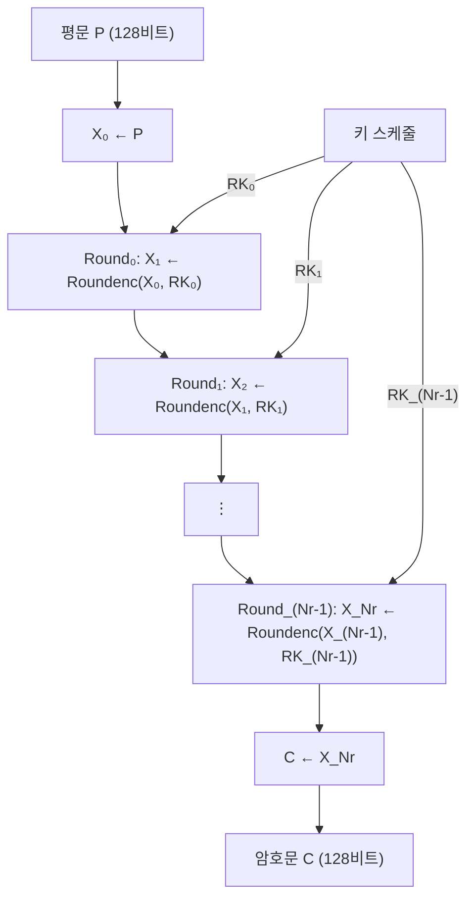

# [LEA.016] 암호화 전체 구조

## 1. 보안요구사항 개요
LEA 암호화 알고리즘 1은 128비트 평문 P와 Nr개의 192비트 라운드키를 입력받아 Nr번의 라운드 함수를 반복 수행하여 128비트 암호문 C를 출력하며, 마지막 라운드도 다른 라운드와 동일한 구조를 유지하는 것이 특징이다.

## 2. 상세 요구사항 (Requirements)
- **LEA-026**: 암호화의 초기 단계에서 128비트 평문 P를 32비트 워드 배열 X₀로 변환하여 대입해야 한다(`X₀ ← P`).
- **LEA-032**: 암호화 전체 구조는 알고리즘 1에 따라 Nr번의 라운드 함수 반복으로 구성되어야 하며, 모든 라운드(마지막 라운드 포함)에 동일한 라운드 함수 Roundenc를 적용해야 한다. AES와 달리 마지막 라운드를 특수 처리하지 않는다.

## 3. 작성 예시 (Examples)
### 3.1. 알고리즘 1 — 암호화 전체 구조 (의사코드)

```
// Algorithm 1: LEA Encryption
Input:  P  (128비트 평문)
        RK_0_enc, ..., RK_(Nr-1)_enc  (Nr개의 192비트 라운드키)
Output: C  (128비트 암호문)

1: X_0 ← P
2: for i = 0 to (Nr - 1) do
3:     X_(i+1) ← Roundenc(X_i, RK_i_enc)
4: end for
5: C ← X_Nr
```

### 3.2. 키 길이별 라운드 수

| 키 길이 | Nr (라운드 수) | 라운드키 수 |
| :--- | :--- | :--- |
| 128비트 | 24 | RK₀ ~ RK₂₃ |
| 192비트 | 28 | RK₀ ~ RK₂₇ |
| 256비트 | 32 | RK₀ ~ RK₃₁ |

### 3.3. C 코드 예시

```c
void lea_encrypt(const uint8_t P[16], const uint32_t RK[][6], int Nr, uint8_t C[16]) {
    uint32_t X[4];

    // 1: X_0 ← P
    memcpy(X, P, 16);

    // 2~4: for i = 0 to Nr-1
    for (int i = 0; i < Nr; i++) {
        uint32_t temp = X[0];
        X[0] = ROL((X[0] ^ RK[i][0]) + (X[1] ^ RK[i][1]), 9);
        X[1] = ROR((X[1] ^ RK[i][2]) + (X[2] ^ RK[i][3]), 5);
        X[2] = ROR((X[2] ^ RK[i][4]) + (X[3] ^ RK[i][5]), 3);
        X[3] = temp;
    }

    // 5: C ← X_Nr
    memcpy(C, X, 16);
}
```

### 3.4. 입출력 사양 표

| 항목 | 규격 |
| :--- | :--- |
| 입력 — 평문 | 128비트 (16바이트) 고정 |
| 입력 — 라운드키 | Nr × 192비트 (Nr × 6워드) |
| 출력 — 암호문 | 128비트 (16바이트) 고정 |
| 라운드 함수 | Roundenc (알고리즘 2) |
| 마지막 라운드 처리 | 다른 라운드와 동일 (특수 처리 없음) |

## 4. 구조도 및 시각 자료 (Visuals)
### 4.1. 암호화 전체 흐름 (Mermaid)



### 4.2. AES와의 구조적 차이
- **AES**: 마지막 라운드에서 MixColumns를 생략하는 특수 처리 존재.
- **LEA**: 모든 라운드(첫 번째부터 마지막까지)에 동일한 Roundenc 함수를 적용. 라운드 함수 분기 없이 단일 루프로 구현 가능.

## 5. 해설 및 증빙 가이드 (Guide)
- **마지막 라운드 동일성 검증**: 코드 리뷰 시 마지막 라운드를 별도로 처리하는 분기(`if (i == Nr-1)`)가 존재하면 규격 위반이다. 모든 라운드가 동일한 함수 호출로 수행되어야 한다.
- **라운드 수(Nr) 정확성**: 키 길이에 따른 Nr 설정이 정확한지 확인한다. Nr이 1이라도 틀리면 KAT 검증에서 불일치가 발생한다.
- **입출력 크기 고정**: LEA는 블록 크기가 128비트로 고정이다. 가변 입력을 처리하려면 운영모드(CBC, CTR 등)를 통해 블록 단위로 분할해야 한다.
- **루프 경계 조건**: `for i = 0 to Nr-1`은 C 코드에서 `for (int i = 0; i < Nr; i++)`에 대응한다. 경계 조건 오류(off-by-one)를 방지하기 위해 반드시 검증한다.
- **참고 규격**: LEA 표준 규격서 §5.2.1 알고리즘 1.
