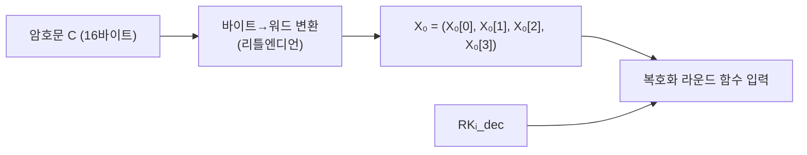

# [LEA.017] 복호화 초기화

## 1. 보안요구사항 개요
LEA 복호화 알고리즘 6의 첫 단계로, 128비트 암호문 C(바이트 배열)를 32비트 워드 배열 X₀ = (X₀[0], X₀[1], X₀[2], X₀[3])로 변환하여 초기 상태값에 대입하며, 이후 복호화 라운드키 RKᵢ\_dec를 사용하여 라운드 함수를 수행한다.

## 2. 상세 요구사항 (Requirements)
- **LEA-033**: 복호화 알고리즘의 첫 단계에서 128비트 암호문 C를 4개의 32비트 워드 배열 X₀로 변환하여 대입해야 한다(`X₀ ← C`). 바이트-워드 변환은 리틀엔디언 바이트 순서를 따르며, 이후 복호화 라운드키 RKᵢ\_dec를 사용하여 라운드 함수를 적용한다.

## 3. 작성 예시 (Examples)
### 3.1. 의사코드 예시

```
// 알고리즘 6 — 복호화 (첫 단계)
Input: C (128비트 암호문, 바이트 배열 c[0]..c[15])
       RK_0_dec, ..., RK_(Nr-1)_dec (복호화 라운드키)
Output: P (128비트 평문)

Step 1: X_0 ← C
  // 바이트 배열 → 워드 배열 변환 (리틀엔디언)
  // X_0[0] = c[0] | (c[1]<<8) | (c[2]<<16) | (c[3]<<24)
  // X_0[1] = c[4] | (c[5]<<8) | (c[6]<<16) | (c[7]<<24)
  // X_0[2] = c[8] | (c[9]<<8) | (c[10]<<16) | (c[11]<<24)
  // X_0[3] = c[12] | (c[13]<<8) | (c[14]<<16) | (c[15]<<24)
```

### 3.2. C 코드 예시

```c
void lea_decrypt(const uint8_t C[16], const uint32_t RK_dec[][6], int Nr, uint8_t P[16]) {
    uint32_t X[4];

    // Step 1: X_0 ← C (바이트 배열 → 워드 배열)
    memcpy(X, C, 16);

    // Step 2~4: 복호화 라운드 함수 반복
    for (int i = 0; i < Nr; i++) {
        lea_round_dec(X, RK_dec[i]);
    }

    // Step 5: P ← X_Nr
    memcpy(P, X, 16);
}
```

### 3.3. 암호화 초기화와의 대비 표

| 항목 | 암호화 초기화 (알고리즘 1) | 복호화 초기화 (알고리즘 6) |
| :--- | :--- | :--- |
| 입력 | 평문 P | 암호문 C |
| 대입 | X₀ ← P | X₀ ← C |
| 변환 방식 | 바이트→워드 (리틀엔디언) | 바이트→워드 (리틀엔디언) |
| 사용 라운드키 | RKᵢ\_enc | RKᵢ\_dec |

## 4. 구조도 및 시각 자료 (Visuals)
### 4.1. 복호화 초기화 흐름



### 4.2. 복호화 라운드키의 유래
복호화 라운드키 RKᵢ\_dec는 암호화 라운드키를 역순으로 배치한 것으로, `RKᵢ_dec = RK_(Nr-1-i)_enc`의 관계를 갖는다. 키 스케줄에서 생성된 암호화 라운드키 배열을 뒤집어 사용한다.

## 5. 해설 및 증빙 가이드 (Guide)
- **암호화 초기화와 동일한 변환 규칙**: 복호화 초기화도 암호화 초기화와 동일한 리틀엔디언 바이트-워드 변환을 사용한다. 다만 입력이 암호문 C라는 점만 다르다.
- **복호화 라운드키 준비**: 복호화를 시작하기 전에 반드시 복호화 라운드키 배열이 올바르게 준비되어야 한다. 암호화 라운드키를 역순 배치하거나, 별도의 복호화 키 스케줄을 수행한다.
- **memcpy 기반 구현**: 암호화와 마찬가지로 `memcpy(X, C, 16)` 형태로 간결하게 구현할 수 있다.
- **참고 규격**: LEA 표준 규격서 §5.3.1 알고리즘 6.
