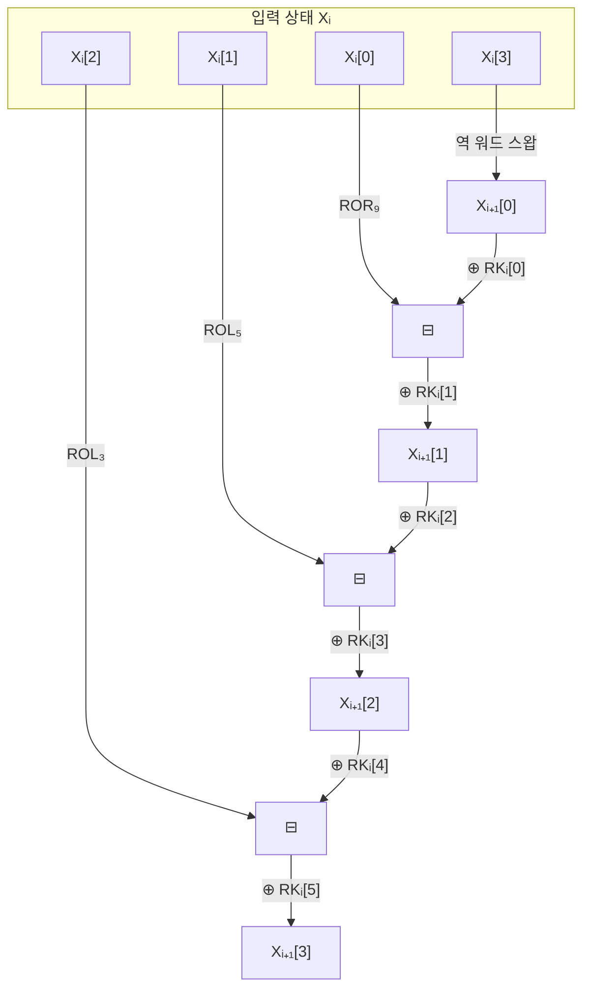

# [LEA.018] 복호화 역 회전

## 1. 보안요구사항 개요
LEA 복호화 라운드 함수(알고리즘 7)는 암호화 라운드 함수의 역연산으로, 역 워드 스왑(Xᵢ₊₁[0]=Xᵢ[3]), 역 비트 회전(ROR₉, ROL₅, ROL₃), 모듈러 뺄셈(⊟)을 사용하여 암호화 과정을 정확히 되돌린다.

## 2. 상세 요구사항 (Requirements)
- **LEA-034**: 복호화 i번째 라운드의 역 워드 스왑은 `Xᵢ₊₁[0] = Xᵢ[3]`으로 수행해야 한다. 암호화의 `Xᵢ₊₁[3] = Xᵢ[0]` 워드 스왑에 대한 역연산이다.
- **LEA-035**: 복호화 라운드의 나머지 워드 연산은 다음을 따라야 한다:
  - `Xᵢ₊₁[1] = (ROR₉(Xᵢ[0]) ⊟ (Xᵢ₊₁[0] ⊕ RKᵢ[0])) ⊕ RKᵢ[1]`
  - `Xᵢ₊₁[2] = (ROL₅(Xᵢ[1]) ⊟ (Xᵢ₊₁[1] ⊕ RKᵢ[2])) ⊕ RKᵢ[3]`
  - `Xᵢ₊₁[3] = (ROL₃(Xᵢ[2]) ⊟ (Xᵢ₊₁[2] ⊕ RKᵢ[4])) ⊕ RKᵢ[5]`
- **LEA-036**: 복호화 라운드 함수는 모듈러 뺄셈(⊟, 32비트 모듈러 감산)을 사용해야 하며, 역 비트 회전의 방향과 크기가 암호화 라운드의 역연산으로서 정확히 대응해야 한다.

## 3. 작성 예시 (Examples)
### 3.1. 알고리즘 7 — 복호화 라운드 함수 (의사코드)

```
// Rounddec(X_i, RK_i) → X_(i+1)
Input: X_i = (X_i[0], X_i[1], X_i[2], X_i[3])   // 4 × 32비트
       RK_i = (RK_i[0], ..., RK_i[5])             // 6 × 32비트 (복호화 라운드키)
Output: X_(i+1) = (X_(i+1)[0], ..., X_(i+1)[3])

X_(i+1)[0] = X_i[3]
X_(i+1)[1] = (ROR_9(X_i[0]) ⊟ (X_(i+1)[0] ⊕ RK_i[0])) ⊕ RK_i[1]
X_(i+1)[2] = (ROL_5(X_i[1]) ⊟ (X_(i+1)[1] ⊕ RK_i[2])) ⊕ RK_i[3]
X_(i+1)[3] = (ROL_3(X_i[2]) ⊟ (X_(i+1)[2] ⊕ RK_i[4])) ⊕ RK_i[5]
```

### 3.2. C 코드 예시

```c
#define ROL(x, n) (((x) << (n)) | ((x) >> (32 - (n))))
#define ROR(x, n) (((x) >> (n)) | ((x) << (32 - (n))))

void lea_round_dec(uint32_t X[4], const uint32_t RK[6]) {
    uint32_t temp;

    temp = X[0];
    X[0] = X[3];
    X[1] = (ROR(temp, 9) - (X[0] ^ RK[0])) ^ RK[1];
    X[2] = (ROL(X[1], 5) - (X[1] ^ RK[2])) ^ RK[3];  // 주의: 여기서 X[1]은 이미 갱신된 값
    X[3] = (ROL(X[2], 3) - (X[2] ^ RK[4])) ^ RK[5];   // 주의: 여기서 X[2]는 이미 갱신된 값
}
```

> **주의**: C 코드에서 X[1], X[2]는 이미 갱신된 Xᵢ₊₁ 값을 사용한다. 의사코드의 `X_(i+1)[0]`, `X_(i+1)[1]`, `X_(i+1)[2]`가 순차적으로 계산에 사용됨에 유의.

### 3.3. 암호화↔복호화 역연산 대응표

| 암호화 (Roundenc) | 복호화 (Rounddec) | 역연산 관계 |
| :--- | :--- | :--- |
| ROL₉ | ROR₉ | 좌회전 ↔ 우회전 |
| ROR₅ | ROL₅ | 우회전 ↔ 좌회전 |
| ROR₃ | ROL₃ | 우회전 ↔ 좌회전 |
| ⊞ (모듈러 덧셈) | ⊟ (모듈러 뺄셈) | 덧셈 ↔ 뺄셈 |
| Xᵢ₊₁[3] = Xᵢ[0] | Xᵢ₊₁[0] = Xᵢ[3] | 워드 스왑 역전 |

## 4. 구조도 및 시각 자료 (Visuals)
### 4.1. 복호화 라운드 함수 구조 (Mermaid)



### 4.2. 연산 순서의 순차적 의존성
복호화 라운드 함수에서 Xᵢ₊₁[1], Xᵢ₊₁[2], Xᵢ₊₁[3]는 순차적으로 계산되며, 각 단계의 결과가 다음 단계의 입력으로 사용된다:
1. Xᵢ₊₁[0] = Xᵢ[3] (독립 계산)
2. Xᵢ₊₁[1] = f(Xᵢ[0], **Xᵢ₊₁[0]**) (1단계 결과 사용)
3. Xᵢ₊₁[2] = f(Xᵢ[1], **Xᵢ₊₁[1]**) (2단계 결과 사용)
4. Xᵢ₊₁[3] = f(Xᵢ[2], **Xᵢ₊₁[2]**) (3단계 결과 사용)

## 5. 해설 및 증빙 가이드 (Guide)
- **모듈러 뺄셈(⊟) 구현**: C 언어에서 `uint32_t` 타입의 자연 언더플로우를 활용한다. `a ⊟ b`는 `(uint32_t)(a - b)`로 구현한다.
- **역 회전 방향 검증**: 암호화에서 ROL₉을 사용했으므로 복호화에서는 ROR₉을 사용해야 한다. 마찬가지로 ROR₅↔ROL₅, ROR₃↔ROL₃이 대응된다. 방향이 하나라도 틀리면 복호화 결과가 원래 평문과 일치하지 않는다.
- **순차 의존성 주의**: 복호화는 암호화와 달리 각 워드 계산이 이전 결과에 의존한다. 병렬화 시 이 의존성을 반드시 고려해야 한다.
- **암호화·복호화 쌍 검증**: `Decrypt(Encrypt(P, K), K) = P`가 성립하는지 라운드 단위로 확인하여 역연산의 정확성을 검증한다.
- **참고 규격**: LEA 표준 규격서 §5.3.1 알고리즘 7.
