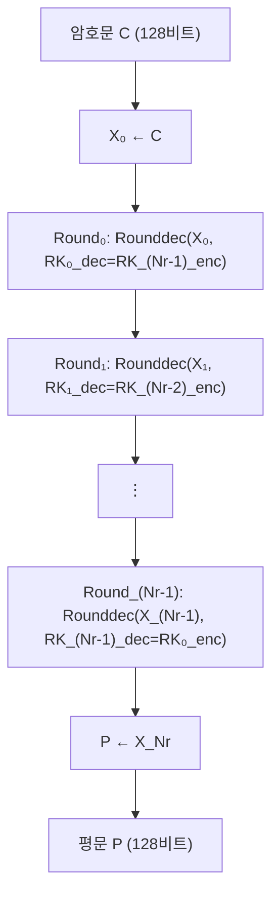
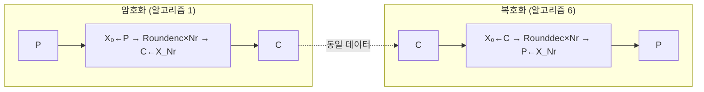

# [LEA.019] 복호화 전체 구조

## 1. 보안요구사항 개요
LEA 복호화 알고리즘 6은 128비트 암호문 C를 입력받아 Nr번의 복호화 라운드 함수를 수행하여 128비트 평문 P를 복원하며, 복호화 라운드키는 암호화 라운드키의 역순 배치(`RKᵢ_dec = RK_(Nr-1-i)_enc`)로 동일한 δ 상수를 사용한다.

## 2. 상세 요구사항 (Requirements)
- **LEA-023**: 복호화 라운드키 RKᵢ\_dec는 암호화 라운드키 RKᵢ\_enc의 역순으로 배치해야 한다. 즉, `RKᵢ_dec = RK_(Nr-1-i)_enc` (i = 0, 1, ..., Nr-1). 키 스케줄에서 사용하는 δ 상수는 암호화와 동일하다.
- **LEA-025**: 복호화 전체 구조는 알고리즘 6에 따라 `X₀ ← C`, Nr번의 Rounddec 반복, `P ← X_Nr` 순서로 수행해야 하며, 모든 라운드에 동일한 복호화 라운드 함수를 적용해야 한다.

## 3. 작성 예시 (Examples)
### 3.1. 알고리즘 6 — 복호화 전체 구조 (의사코드)

```
// Algorithm 6: LEA Decryption
Input:  C  (128비트 암호문)
        RK_0_dec, ..., RK_(Nr-1)_dec  (Nr개의 192비트 복호화 라운드키)
Output: P  (128비트 평문)

1: X_0 ← C
2: for i = 0 to (Nr - 1) do
3:     X_(i+1) ← Rounddec(X_i, RK_i_dec)
4: end for
5: P ← X_Nr
```

### 3.2. 복호화 라운드키 생성 규칙

```
// 방법 1: 암호화 라운드키를 역순 배치
for i = 0 to Nr-1 do
    RK_i_dec = RK_(Nr-1-i)_enc
end for

// 방법 2: 암호화 라운드키 배열을 뒤집기
reverse(RK_enc[0..Nr-1]) → RK_dec[0..Nr-1]
```

### 3.3. 암호화↔복호화 라운드키 대응 표 (LEA-128 예시)

| 복호화 라운드 i | 복호화 키 RKᵢ\_dec | 대응 암호화 키 |
| :--- | :--- | :--- |
| 0 | RK₀\_dec | RK₂₃\_enc |
| 1 | RK₁\_dec | RK₂₂\_enc |
| 2 | RK₂\_dec | RK₂₁\_enc |
| ... | ... | ... |
| 22 | RK₂₂\_dec | RK₁\_enc |
| 23 | RK₂₃\_dec | RK₀\_enc |

### 3.4. C 코드 예시

```c
void lea_decrypt(const uint8_t C[16], const uint32_t RK_enc[][6], int Nr, uint8_t P[16]) {
    uint32_t X[4];

    // 1: X_0 ← C
    memcpy(X, C, 16);

    // 2~4: for i = 0 to Nr-1 (복호화 라운드키는 암호화 키의 역순)
    for (int i = 0; i < Nr; i++) {
        lea_round_dec(X, RK_enc[Nr - 1 - i]);
    }

    // 5: P ← X_Nr
    memcpy(P, X, 16);
}
```

## 4. 구조도 및 시각 자료 (Visuals)
### 4.1. 복호화 전체 흐름 (Mermaid)



### 4.2. 암호화·복호화 구조 비교



## 5. 해설 및 증빙 가이드 (Guide)
- **라운드키 역순 배치 검증**: 복호화 구현에서 `RK_enc[Nr-1-i]`가 올바르게 참조되는지 확인한다. 인덱스 계산 오류는 복호화 실패의 가장 흔한 원인이다.
- **δ 상수 동일성**: 복호화 키 스케줄에서도 암호화와 동일한 δ 상수 배열을 사용한다. 별도의 복호화 전용 δ가 존재하지 않는다.
- **양방향 검증**: `Decrypt(Encrypt(P, K), K) = P`와 `Encrypt(Decrypt(C, K), K) = C`가 모두 성립해야 한다. KAT 벡터의 평문·암호문 쌍으로 검증한다.
- **구현 최적화**: 암호화 라운드키 배열을 복사하여 뒤집는 대신, 복호화 루프에서 `RK_enc[Nr-1-i]`로 직접 접근하면 메모리를 절약할 수 있다.
- **참고 규격**: LEA 표준 규격서 §5.3.2.
