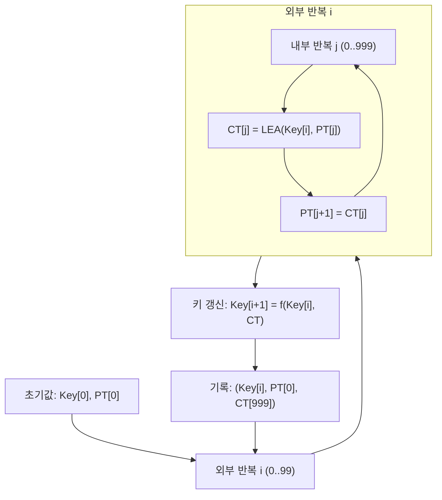

# [LEA.021] MCT 구조

## 1. 보안요구사항 개요
MCT(Monte Carlo Test, 몬테카를로 검사)는 LEA 구현의 장기 안정성을 검증하기 위해 100개의 임의 입력에 대해 각 1,000회 반복 암호화를 수행하며, 각 운영모드(ECB, CBC, CTR 등)별로 키 갱신 및 상태 갱신 규칙을 적용하여 누적 오류를 탐지하는 시험이다.

## 2. 상세 요구사항 (Requirements)
- **LEA-046**: MCT는 100회 외부 반복(i=0..99) × 1,000회 내부 반복(j=0..999) 구조로 수행해야 한다. 각 외부 반복 후 키 갱신을 수행하며, 갱신 규칙은 키 길이에 따라 다르다.
- **LEA-047**: 각 운영모드별 MCT 수행 규칙을 따라야 한다:
  - **ECB**: `CT[j] = LEA_Encrypt(Key[i], PT[j])`, `PT[j+1] = CT[j]`
  - **CBC**: IV 갱신 포함, `CT[j] = LEA_Encrypt(Key[i], PT[j] ⊕ IV)`, IV = CT[j]
  - **CTR**: 카운터 갱신 포함
  - 키 갱신: 128비트 키는 `Key[i+1] = Key[i] ⊕ CT[999]`, 192비트 키는 `Key[i+1] = Key[i] ⊕ (CT64[998] || CT[999])`, 256비트 키는 `Key[i+1] = Key[i] ⊕ (CT[998] || CT[999])`

## 3. 작성 예시 (Examples)
### 3.1. MCT-ECB 의사코드

```
// MCT-ECB (Monte Carlo Test for ECB mode)
Input: Key[0] (초기 키), PT[0] (초기 평문)
Output: 100개의 (Key[i], PT[i], CT[999]) 기록

for i = 0 to 99 do
    for j = 0 to 999 do
        CT[j] = LEA_Encrypt(Key[i], PT[j])
        PT[j+1] = CT[j]
    end for

    // 키 갱신
    if (KeySize == 128) then
        Key[i+1] = Key[i] ⊕ CT[999]
    else if (KeySize == 192) then
        Key[i+1] = Key[i] ⊕ (CT64[998] || CT[999])
        // CT64[998]: CT[998]의 하위 64비트
    else if (KeySize == 256) then
        Key[i+1] = Key[i] ⊕ (CT[998] || CT[999])
    end if

    PT[0] = CT[999]    // 다음 외부 반복의 초기 평문

    // 출력: Key[i], CT[999]
end for
```

### 3.2. MCT-CBC 의사코드

```
// MCT-CBC (Monte Carlo Test for CBC mode)
Input: Key[0], IV[0], PT[0]

for i = 0 to 99 do
    for j = 0 to 999 do
        if (j == 0) then
            CT[j] = LEA_Encrypt(Key[i], PT[j] ⊕ IV[i])
        else
            CT[j] = LEA_Encrypt(Key[i], PT[j] ⊕ CT[j-1])
        end if

        if (j == 0) then
            PT[j+1] = IV[i]
        else
            PT[j+1] = CT[j-1]
        end if
    end for

    // 키 갱신 (ECB와 동일)
    if (KeySize == 128) then
        Key[i+1] = Key[i] ⊕ CT[999]
    else if (KeySize == 192) then
        Key[i+1] = Key[i] ⊕ (CT64[998] || CT[999])
    else if (KeySize == 256) then
        Key[i+1] = Key[i] ⊕ (CT[998] || CT[999])
    end if

    IV[i+1] = CT[999]
    PT[0] = CT[998]
end for
```

### 3.3. 키 갱신 규칙 표

| 키 길이 | 갱신 수식 | 설명 |
| :--- | :--- | :--- |
| 128비트 | `Key[i+1] = Key[i] ⊕ CT[999]` | 128비트 CT[999]로 전체 키 XOR |
| 192비트 | `Key[i+1] = Key[i] ⊕ (CT64[998] \|\| CT[999])` | CT[998]의 하위 64비트 + CT[999] 128비트 = 192비트 |
| 256비트 | `Key[i+1] = Key[i] ⊕ (CT[998] \|\| CT[999])` | CT[998] 128비트 + CT[999] 128비트 = 256비트 |

### 3.4. MCT-CTR 카운터 갱신 개요

```
// MCT-CTR (Monte Carlo Test for CTR mode)
// CTR 모드에서는 카운터 값의 갱신이 추가됨

for i = 0 to 99 do
    CTR[0] = initial_counter
    for j = 0 to 999 do
        CT[j] = LEA_Encrypt(Key[i], CTR[j]) ⊕ PT[j]
        CTR[j+1] = CTR[j] + 1    // 카운터 증가
    end for

    // 키 갱신 (동일 규칙)
    // CTR 초기값 갱신
end for
```

## 4. 구조도 및 시각 자료 (Visuals)
### 4.1. MCT 전체 구조 (Mermaid)



### 4.2. MCT 반복 구조 요약
- **외부 루프**: 100회 (i = 0 ~ 99), 각 반복 후 키를 갱신하여 다음 반복에 사용
- **내부 루프**: 1,000회 (j = 0 ~ 999), 이전 암호문을 다음 평문으로 사용(ECB 기준)
- **총 암호화 횟수**: 100 × 1,000 = **100,000회**

## 5. 해설 및 증빙 가이드 (Guide)
- **키 갱신 규칙의 정확한 적용**: 키 길이에 따른 XOR 범위가 다르므로, 192비트/256비트 키의 경우 CT 연접(concatenation) 규칙을 정확히 구현해야 한다. 192비트에서 `CT64[998]`은 CT[998]의 **하위 64비트**(마지막 8바이트)를 의미한다.
- **누적 오류 탐지 원리**: 내부 1,000회 반복에서 1비트 오류가 발생하면 눈사태 효과(avalanche effect)에 의해 최종 CT[999]가 완전히 달라진다. 이를 통해 단일 KAT로 발견하기 어려운 미세한 구현 오류를 탐지한다.
- **운영모드별 차이 주의**: ECB, CBC, CTR 등 각 모드별로 내부 상태 갱신(PT, IV, CTR) 규칙이 다르다. 모드 간 코드를 재사용할 때 갱신 로직의 차이를 반드시 확인한다.
- **결과 검증**: 검증 시스템에서 제공하는 MCT RESPONSE 파일과 비교하여 100개의 (Key, CT[999]) 쌍이 모두 일치해야 한다.
- **참고 규격**: LEA 검증시스템 §6.4.
