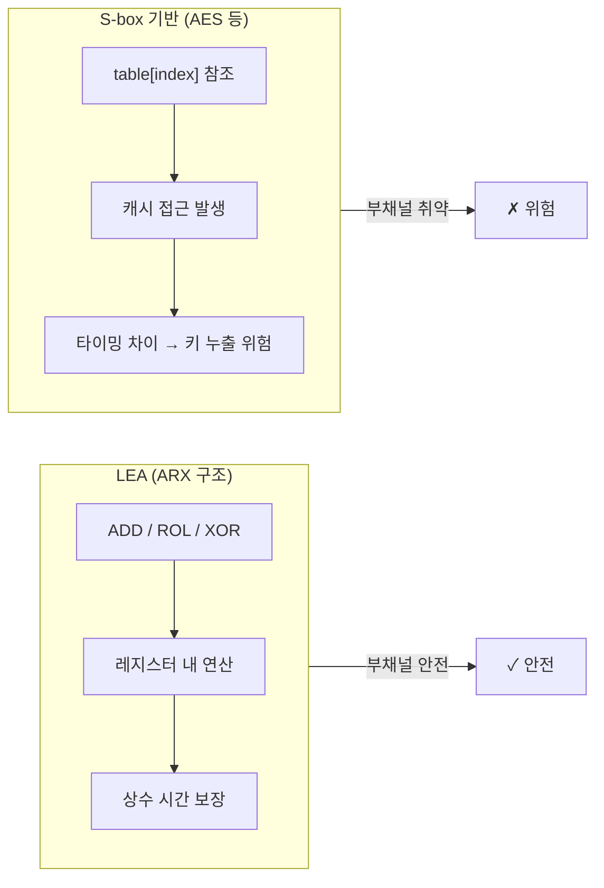
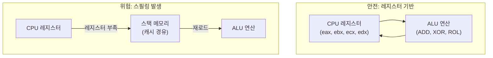

# [LEA.022] 부채널 방지 ARX

## 1. 보안요구사항 개요
LEA는 ARX(Addition, Rotation, XOR) 구조로 S-box를 사용하지 않아 캐시 타이밍 공격 위험을 원천 차단하며, 상수 시간(Constant-time) 연산 보장과 레지스터 스필링(Register Spilling) 방지를 통해 부채널 공격에 대한 구조적 안전성을 확보해야 한다.

## 2. 상세 요구사항 (Requirements)
- **LEA-041**: LEA 구현에서 S-box나 lookup table 기반 연산을 포함하지 않아야 한다. ARX 구조(32비트 모듈러 덧셈, 비트 회전, XOR)만으로 라운드 함수를 구성하여 캐시 타이밍 공격(Cache-timing Attack) 위험을 원천 차단해야 한다.
- **LEA-042**: 상수 시간(Constant-time) 연산을 보장해야 한다. 데이터 값(키, 평문, 중간 상태값)에 따라 실행 시간이 변하는 조건 분기(if/else, switch)를 라운드 함수 내에서 사용하지 않아야 한다. 모든 연산의 실행 경로가 데이터에 무관하게 동일해야 한다.
- **LEA-043**: 레지스터 스필링(Register Spilling)을 방지해야 한다. 암호 연산의 중간 상태값(라운드키, 상태 워드)이 CPU 레지스터에서 스택 메모리로 유출되지 않도록 레지스터 기반 연산 구현을 권장한다. 컴파일러 최적화 옵션에 따른 스필링 여부를 검증해야 한다.

## 3. 작성 예시 (Examples)
### 3.1. 안전한 구현 vs 취약한 구현 비교

```c
// ✓ 안전한 구현 (상수 시간, ARX only)
void lea_round_enc(uint32_t X[4], const uint32_t RK[6]) {
    uint32_t temp = X[0];
    X[0] = ROL((X[0] ^ RK[0]) + (X[1] ^ RK[1]), 9);
    X[1] = ROR((X[1] ^ RK[2]) + (X[2] ^ RK[3]), 5);
    X[2] = ROR((X[2] ^ RK[4]) + (X[3] ^ RK[5]), 3);
    X[3] = temp;
}

// ✗ 취약한 구현 예시 (데이터 의존 분기 - 절대 사용 금지)
void lea_round_enc_VULNERABLE(uint32_t X[4], const uint32_t RK[6]) {
    uint32_t temp = X[0];
    if (X[0] & 0x80000000) {   // 데이터 값에 따른 분기 → 타이밍 누출
        X[0] = ROL((X[0] ^ RK[0]) + (X[1] ^ RK[1]), 9);
    } else {
        X[0] = ROL((X[0] ^ RK[0]) + (X[1] ^ RK[1]), 9);
    }
    // ...
}
```

### 3.2. S-box 미사용 검증 체크리스트

| 검증 항목 | 기준 | 판정 |
| :--- | :--- | :--- |
| S-box 배열 존재 여부 | `uint8_t sbox[]` 등 lookup table 없어야 함 | PASS / FAIL |
| 배열 인덱스에 비밀 데이터 사용 | `table[secret_value]` 패턴 없어야 함 | PASS / FAIL |
| 연산 종류 | `+`, `^`, `<<`, `>>` (ROL/ROR) 만 사용 | PASS / FAIL |
| 데이터 의존 분기 | `if(secret)`, `switch(secret)` 없어야 함 | PASS / FAIL |

### 3.3. 레지스터 스필링 검증 방법

```bash
# 컴파일 후 어셈블리 확인 (GCC)
gcc -O2 -S -o lea_round.s lea.c

# 어셈블리에서 스택 접근 패턴 확인
# 스필링 징후: mov %reg, -offset(%rbp) 형태의 스택 저장
# 안전한 패턴: 레지스터 간 직접 연산 (add, xor, rol 등)
```

### 3.4. ARX 연산의 부채널 안전성 표

| 연산 | 실행 시간 | 캐시 접근 | 부채널 안전성 |
| :--- | :--- | :--- | :--- |
| 모듈러 덧셈 (ADD) | 상수 시간 | 메모리 접근 없음 | 안전 |
| 비트 회전 (ROL/ROR) | 상수 시간 | 메모리 접근 없음 | 안전 |
| 배타적 논리합 (XOR) | 상수 시간 | 메모리 접근 없음 | 안전 |
| S-box 참조 (비교용) | 데이터 의존 | 캐시 히트/미스 발생 | **취약** |

## 4. 구조도 및 시각 자료 (Visuals)
### 4.1. ARX vs S-box 부채널 위험 비교 (Mermaid)



### 4.2. 레지스터 스필링 개념도



## 5. 해설 및 증빙 가이드 (Guide)
- **ARX 구조의 본질적 안전성**: S-box 기반 알고리즘(AES 등)은 테이블 참조 시 캐시 라인의 히트/미스 패턴이 비밀키에 따라 달라져 타이밍 부채널 공격에 취약할 수 있다. LEA는 모든 연산이 ADD, ROL, XOR만으로 구성되어 메모리 접근 패턴이 데이터에 무관하며, 이 위험을 구조적으로 제거한다.
- **상수 시간 연산 검증 방법**: (1) 코드 리뷰로 데이터 의존 분기 부재 확인, (2) 어셈블리 분석으로 조건부 점프(jne, je 등) 부재 확인, (3) 타이밍 측정 도구(예: dudect)를 사용한 통계적 검증.
- **레지스터 스필링 방지 전략**: (1) 컴파일러 최적화 레벨(-O2 이상) 사용, (2) `register` 키워드 또는 인라인 어셈블리 활용, (3) 어셈블리 출력에서 스택 저장 명령(`mov %reg, -offset(%rbp)`) 부재 확인.
- **KCMVP 부채널 요구사항**: KS X ISO/IEC 19790:2015 §7.8에서 부채널 공격 대응을 요구하며, LEA의 ARX 구조는 이 요구를 구조적으로 충족한다.
- **참고 규격**: LEA 논문 §1.1, §3, KS X ISO/IEC 19790:2015 §7.8.
