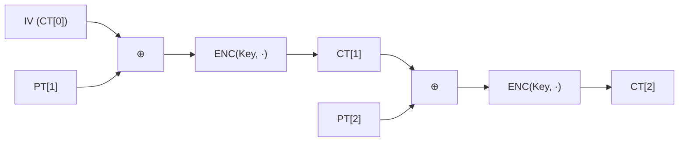

# [CBC.001] CBC 암호화 수식

## 1. 보안요구사항 개요
CBC(Cipher Block Chaining) 모드의 암호화는 현재 평문 블록과 이전 암호문 블록을 XOR한 결과를 암호화 함수의 입력으로 사용하는 연쇄(Chaining) 구조로, 동일 평문이라도 IV와 이전 블록에 따라 서로 다른 암호문을 생성하여 ECB 모드의 패턴 노출 문제를 해결한다.

## 2. 상세 요구사항 (Requirements)
- **CBC-001**: CBC 암호화 수식 `CT[i] = ENC(Key, PT[i] ⊕ CT[i-1])`에 따라 현재 평문 블록과 이전 암호문 블록을 XOR(⊕)한 결과를 암호화 함수의 입력으로 사용해야 한다. 첫 번째 블록의 경우 `CT[0] = IV`를 이전 블록 대신 사용한다.

## 3. 작성 예시 (Examples)
### 3.1. 수식 표현

| 단계 | 수식 | 설명 |
| :--- | :--- | :--- |
| 초기화 | CT[0] = IV | 초기벡터를 첫 번째 이전 블록으로 설정 |
| i번째 블록 암호화 | CT[i] = ENC(Key, PT[i] ⊕ CT[i-1]) | 평문과 이전 암호문을 XOR 후 암호화 |

### 3.2. 코드 예시 (C 의사코드)

```c
/* CBC 암호화 연쇄 구조 */
uint8_t ct_prev[16];
memcpy(ct_prev, iv, 16);  /* CT[0] = IV */

for (int i = 0; i < num_blocks; i++) {
    uint8_t xored[16];
    for (int j = 0; j < 16; j++)
        xored[j] = pt[i * 16 + j] ^ ct_prev[j];  /* PT[i] ⊕ CT[i-1] */

    lea_encrypt(ct + i * 16, xored, &key);         /* CT[i] = ENC(Key, ...) */
    memcpy(ct_prev, ct + i * 16, 16);
}
```

### 3.3. 서술형 예시
"본 구현은 CBC 운영모드 암호화 시 각 평문 블록을 이전 암호문 블록과 XOR 연산한 결과를 LEA 암호화 함수의 입력으로 사용하며, 첫 블록에는 IV를 이전 블록으로 대체한다."

## 4. 구조도 및 시각 자료 (Visuals)
### 4.1. CBC 암호화 흐름도 (Mermaid)



### 4.2. 구조 설명
- 각 블록의 암호화가 이전 암호문 블록에 의존하므로 **순차 처리**만 가능하다 (병렬 암호화 불가).
- IV가 다르면 동일 평문이라도 완전히 다른 암호문이 생성된다.

## 5. 해설 및 증빙 가이드 (Guide)
- **연쇄 구조 핵심**: XOR 연산이 `ENC` 호출 **이전**에 수행되어야 한다. 순서가 뒤바뀌면 CBC가 아닌 다른 모드가 되므로 구현 코드에서 연산 순서를 반드시 검증한다.
- **순차 처리 제약**: CBC 암호화는 이전 블록 결과가 필요하므로 병렬 처리가 불가능하다. 성능이 중요한 경우 CTR 모드를 고려할 수 있다.
- **증빙 시 주안점**: 소스 코드에서 `pt[i] ^ ct[i-1]` 패턴이 `lea_encrypt` 호출 직전에 위치하는지 확인한다.
- **참고 규격**: LEA 검증시스템 §5.2.
