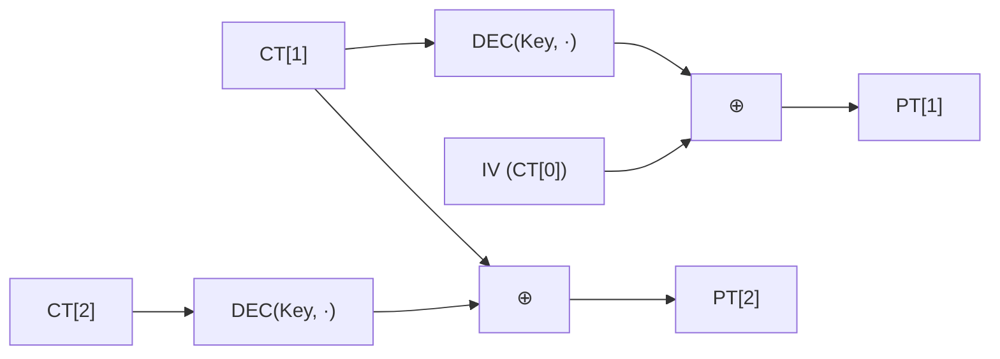

# [CBC.002] CBC 복호화 수식

## 1. 보안요구사항 개요
CBC 모드의 복호화는 암호문 블록을 복호화 함수에 통과시킨 후 이전 암호문 블록과 XOR하여 평문을 복구하는 구조로, 암호화의 역과정을 정확히 수행해야 원문을 올바르게 복원할 수 있다.

## 2. 상세 요구사항 (Requirements)
- **CBC-002**: CBC 복호화 수식 `PT[i] = DEC(Key, CT[i]) ⊕ CT[i-1]`에 따라 복호화 함수의 출력과 이전 암호문 블록을 XOR(⊕)하여 평문을 복구해야 한다. 첫 번째 블록의 경우 `CT[0] = IV`를 이전 블록 대신 사용한다.

## 3. 작성 예시 (Examples)
### 3.1. 수식 표현

| 단계 | 수식 | 설명 |
| :--- | :--- | :--- |
| 초기화 | CT[0] = IV | 초기벡터를 첫 번째 이전 블록으로 설정 |
| i번째 블록 복호화 | PT[i] = DEC(Key, CT[i]) ⊕ CT[i-1] | 복호화 후 이전 암호문과 XOR |

### 3.2. 코드 예시 (C 의사코드)

```c
/* CBC 복호화 연쇄 구조 */
uint8_t ct_prev[16];
memcpy(ct_prev, iv, 16);  /* CT[0] = IV */

for (int i = 0; i < num_blocks; i++) {
    uint8_t dec_out[16];
    lea_decrypt(dec_out, ct + i * 16, &key);        /* DEC(Key, CT[i]) */

    for (int j = 0; j < 16; j++)
        pt[i * 16 + j] = dec_out[j] ^ ct_prev[j];  /* ⊕ CT[i-1] */

    memcpy(ct_prev, ct + i * 16, 16);
}
```

### 3.3. 서술형 예시
"본 구현은 CBC 운영모드 복호화 시 각 암호문 블록을 LEA 복호화 함수에 통과시킨 후, 그 결과를 이전 암호문 블록과 XOR하여 평문을 복원한다. 첫 블록에는 IV를 이전 블록으로 대체한다."

## 4. 구조도 및 시각 자료 (Visuals)
### 4.1. CBC 복호화 흐름도 (Mermaid)



### 4.2. 구조 설명
- 복호화 시 XOR 연산은 `DEC` 호출 **이후**에 수행된다 (암호화와 반대 순서).
- 각 블록의 복호화는 독립적으로 `DEC`를 수행할 수 있으므로 **병렬 복호화가 가능**하다.

## 5. 해설 및 증빙 가이드 (Guide)
- **암호화와의 차이점**: 암호화에서는 XOR → ENC 순서이지만, 복호화에서는 DEC → XOR 순서이다. 이 비대칭성을 정확히 구현해야 한다.
- **병렬 처리 가능**: 복호화 시 각 블록은 `CT[i]`와 `CT[i-1]`만 있으면 독립적으로 복호화 가능하므로, 암호화와 달리 병렬 처리가 가능하다.
- **증빙 시 주안점**: `lea_decrypt` 호출 후 XOR이 수행되는 순서, 그리고 `ct_prev`가 현재 블록 복호화 전에 갱신되지 않는지 확인한다.
- **참고 규격**: LEA 검증시스템 §5.2.
