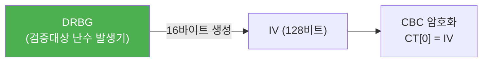

# [CBC.003] IV 길이 및 관리

## 1. 보안요구사항 개요
CBC 모드에서 초기벡터(IV)는 LEA의 블록 크기인 128비트(16바이트)와 동일한 길이여야 하며, 예측 불가능하도록 검증대상 난수 발생기(DRBG)를 통해 생성해야 한다. 비암호학적 난수 생성기(rand()/srand())의 사용은 금지된다.

## 2. 상세 요구사항 (Requirements)
- **CBC-003**: IV와 같은 중요 보안매개변수(SSP)는 예측 불가능하도록 검증대상 난수 발생기(DRBG)를 통해 생성되어야 하며, `rand()`/`srand()` 등 비암호학적 함수 사용은 금지된다.
- **CBC-061**: LEA의 블록 크기인 128비트에 맞추어 IV의 길이는 반드시 16바이트여야 한다. `uint8_t iv[16]`으로 선언하며, 이와 다른 크기의 배열을 IV로 사용하는 것은 규격 위반이다.

## 3. 작성 예시 (Examples)
### 3.1. 표 형식 예시

| 항목 | 규격 |
| :--- | :--- |
| IV 길이 | 16바이트 (128비트) |
| IV 생성 방식 | DRBG (검증대상 난수 발생기) |
| 금지 함수 | rand(), srand(), random(), Math.random() |
| C 선언 | `uint8_t iv[16];` |

### 3.2. 코드 예시 (올바른 IV 생성)

```c
/* 올바른 예: DRBG를 통한 IV 생성 */
uint8_t iv[16];
drbg_generate(iv, 16);  /* 검증대상 DRBG 사용 */
```

### 3.3. 코드 예시 (금지 패턴)

```c
/* 금지: 비암호학적 난수 사용 */
uint8_t iv[16];
srand(time(NULL));
for (int i = 0; i < 16; i++)
    iv[i] = rand() & 0xFF;  /* 위반! rand() 사용 금지 */
```

### 3.4. 서술형 예시
"본 암호모듈의 CBC 모드에서 사용하는 초기벡터(IV)는 128비트(16바이트) 길이로 고정되며, 검증대상 난수 발생기(DRBG)를 이용하여 생성한다. 비암호학적 함수인 rand(), srand()는 사용하지 않는다."

## 4. 구조도 및 시각 자료 (Visuals)
### 4.1. IV 생성 및 사용 흐름 (Mermaid)



### 4.2. 구조 설명
- DRBG에서 생성된 16바이트 IV가 CBC 암호화의 초기 연쇄 값으로 사용된다.
- IV는 암호화마다 새로 생성하여 동일 평문에 대해 서로 다른 암호문을 보장한다.

## 5. 해설 및 증빙 가이드 (Guide)
- **16바이트 강제**: `uint8_t iv[16]` 외의 크기(예: `iv[32]`, `iv[8]`)로 선언된 배열을 IV로 사용하면 규격 위반이다.
- **DRBG 필수**: `rand()`, `srand()`, `random()`, `Math.random()` 등 비암호학적 함수로 생성한 IV는 예측 가능하여 CBC 보안이 무력화된다.
- **증빙 시 주안점**: ① IV 배열 크기가 16인지 확인, ② IV 생성 코드에서 DRBG 호출 여부 확인, ③ `rand`/`srand` 패턴이 IV 생성 경로에 존재하지 않는지 확인.
- **참고 규격**: KS X ISO/IEC 19790:2015 §7.9.2, 블록암호 LEA 소스코드 사용 매뉴얼(v1.0) §2.2.2.
