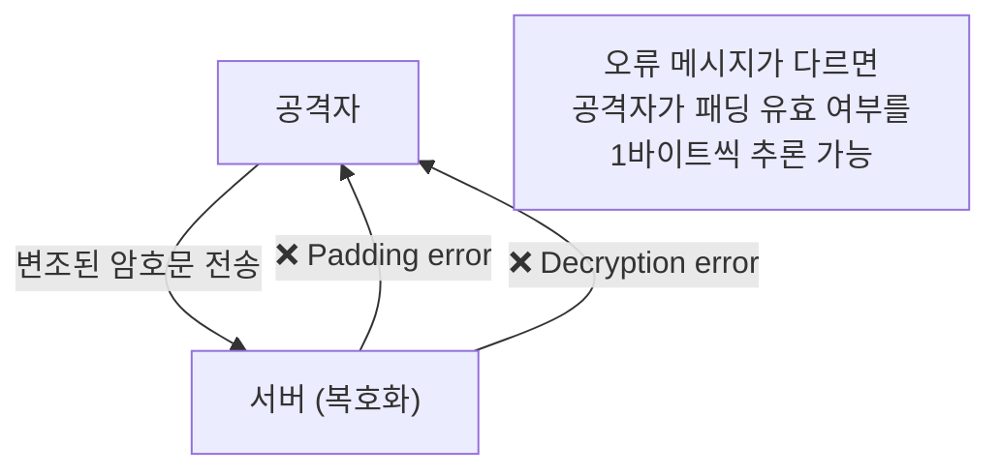
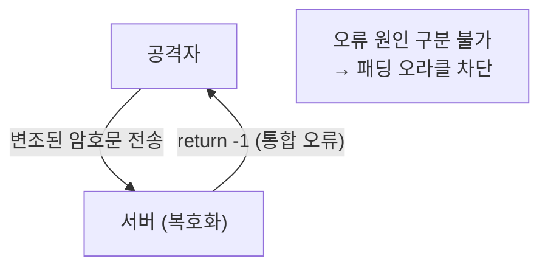

# [CBC.004] 패딩 오라클 공격 방지

## 1. 보안요구사항 개요
CBC 모드 복호화 실패 시 패딩 오류와 같은 구체적 원인을 외부에 노출하면 패딩 오라클 공격(Padding Oracle Attack)이 가능해진다. 실패 시에는 일반적인 음수 값만 반환하고, 구체적 오류 메시지를 출력하거나 반환해서는 안 된다.

## 2. 상세 요구사항 (Requirements)
- **CBC-005**: 복호화 실패 시 패딩 오류와 같은 구체적 원인을 외부에 노출해서는 안 된다. `printf`, `fprintf`, `puts`, `cerr`, `cout`, `System.out`, `System.err`, `logger` 등으로 "Padding error", "Invalid padding" 등의 메시지를 출력하는 것은 금지되며, 실패 시에는 일반적인 음수 값(예: `-1`)만 반환해야 한다.

## 3. 작성 예시 (Examples)
### 3.1. 금지 패턴 (위반 예시)

```c
/* 위반: 패딩 오류를 구체적으로 외부에 노출 */
if (padding_check_failed) {
    printf("Padding error: invalid PKCS5 padding\n");  /* 금지! */
    return PADDING_ERR;                                  /* 금지! 구체적 에러 코드 */
}
```

```java
/* 위반: Java에서의 패딩 오류 노출 */
catch (BadPaddingException e) {
    System.err.println("Padding validation failed");  /* 금지! */
    throw e;                                           /* 금지! 예외 전파 */
}
```

### 3.2. 올바른 패턴

```c
/* 올바른 예: 일반적인 음수 값만 반환 */
if (padding_check_failed) {
    return -1;  /* 구체적 원인을 노출하지 않음 */
}
```

```java
/* 올바른 예: 통합 에러 처리 */
catch (Exception e) {
    return -1;  /* 패딩/복호화 오류를 구분하지 않음 */
}
```

### 3.3. 서술형 예시
"본 구현은 CBC 모드 복호화 실패 시 패딩 유효성 여부와 관계없이 동일한 오류 코드(-1)만 반환한다. 이를 통해 공격자가 패딩 오류와 복호화 오류를 구분할 수 없도록 하여 패딩 오라클 공격을 방지한다."

## 4. 구조도 및 시각 자료 (Visuals)
### 4.1. 패딩 오라클 공격 원리 (Mermaid)



### 4.2. 올바른 처리 흐름



## 5. 해설 및 증빙 가이드 (Guide)
- **패딩 오라클 공격이란**: 서버가 "패딩 오류"와 "기타 오류"를 구분하여 응답하면, 공격자는 이 차이를 이용해 바이트 단위로 평문을 복구할 수 있다.
- **에러 통합 원칙**: 복호화 과정에서 발생하는 모든 오류(패딩, 길이, MAC 등)를 단일 오류 코드로 통합 반환한다.
- **로깅 주의**: 내부 디버깅용 로그에도 패딩 관련 상세 정보를 기록하지 않는 것이 원칙이다. 불가피하게 기록할 경우 접근 통제된 내부 로그에만 한정한다.
- **증빙 시 주안점**: 소스 코드에서 `printf`, `fprintf`, `cerr`, `System.out`과 "padding", "Padding" 키워드가 함께 사용되는 패턴이 없는지 확인한다.
- **참고 규격**: 블록암호 LEA 소스코드 사용 매뉴얼(v1.0) §4.3.12.
