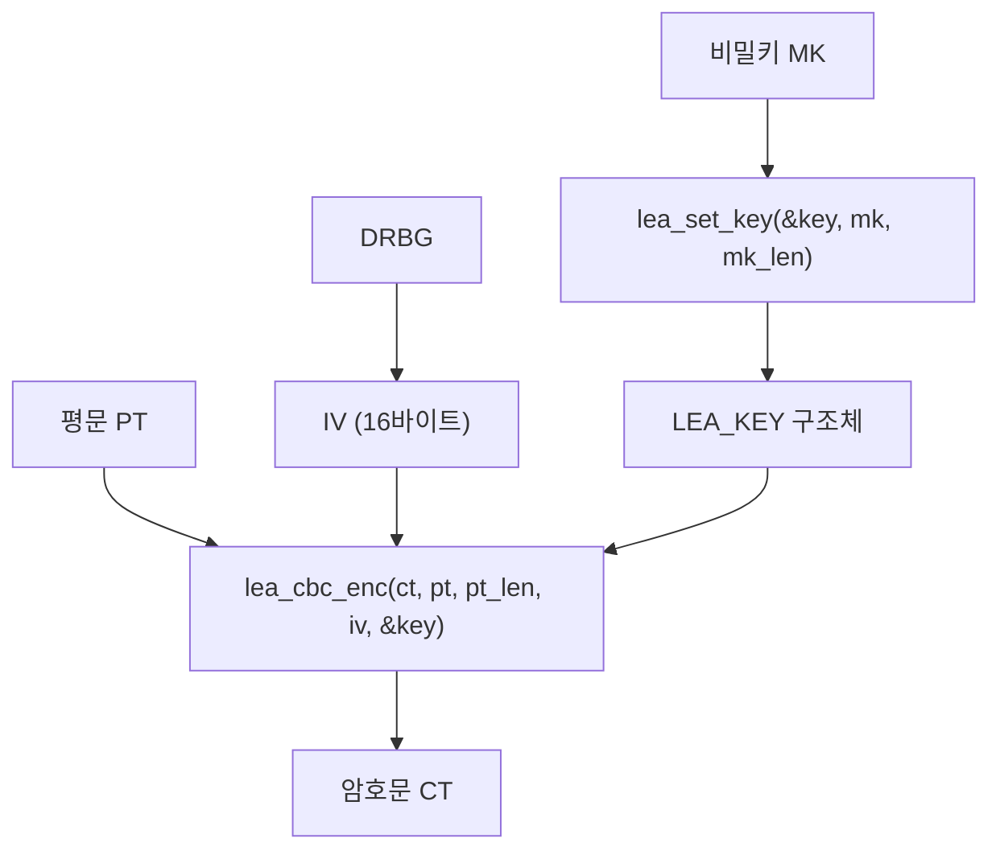

# [CBC.006] LEA 전용 CBC API

## 1. 보안요구사항 개요
국보연(KISA) 배포 매뉴얼에서 정의한 LEA 전용 표준 인터페이스 함수명을 사용하여 CBC 암복호화를 수행해야 한다. 자체 정의한 비표준 함수명은 검증 시 부적합 판정의 원인이 된다.

## 2. 상세 요구사항 (Requirements)
- **CBC-LEA-004**: 국보연 배포 매뉴얼에서 정의한 LEA 전용 표준 인터페이스 함수명을 사용해야 한다. 암호화: `lea_cbc_enc(ct, pt, pt_len, iv, key)`, 복호화: `lea_cbc_dec(pt, ct, ct_len, iv, key)`. `pt_len`/`ct_len`은 16의 배수, `iv`는 16바이트, `key`는 `lea_set_key`로 설정된 `LEA_KEY` 구조체이다.

## 3. 작성 예시 (Examples)
### 3.1. 표 형식 예시 (API 명세)

| 함수명 | 프로토타입 | 설명 |
| :--- | :--- | :--- |
| lea_cbc_enc | `void lea_cbc_enc(unsigned char *ct, const unsigned char *pt, unsigned int pt_len, unsigned char *iv, const LEA_KEY *key)` | CBC 암호화 |
| lea_cbc_dec | `void lea_cbc_dec(unsigned char *pt, const unsigned char *ct, unsigned int ct_len, unsigned char *iv, const LEA_KEY *key)` | CBC 복호화 |

### 3.2. 매개변수 상세

| 매개변수 | 타입 | 크기/조건 | 설명 |
| :--- | :--- | :--- | :--- |
| ct / pt | `unsigned char *` | pt_len 이상 | 암호문/평문 출력 버퍼 |
| pt / ct | `const unsigned char *` | pt_len / ct_len | 평문/암호문 입력 |
| pt_len / ct_len | `unsigned int` | 16의 배수 | 입력 데이터 길이 |
| iv | `unsigned char *` | 16바이트 | 초기벡터 (in/out) |
| key | `const LEA_KEY *` | - | lea_set_key로 설정된 키 구조체 |

### 3.3. 코드 예시

```c
#include "lea.h"

LEA_KEY key;
uint8_t mk[16] = { /* 128비트 비밀키 */ };
uint8_t iv[16];
uint8_t pt[64] = { /* 평문 데이터 */ };
uint8_t ct[64];
uint8_t pt2[64];

/* 키 설정 */
lea_set_key(&key, mk, 16);

/* DRBG로 IV 생성 */
drbg_generate(iv, 16);

/* 암호화 */
lea_cbc_enc(ct, pt, 64, iv, &key);

/* 복호화 (IV를 재설정해야 함) */
drbg_generate(iv, 16);  /* 또는 암호화 시 사용한 IV 복원 */
lea_cbc_dec(pt2, ct, 64, iv, &key);
```

### 3.4. 서술형 예시
"본 구현은 국보연 배포 LEA 소스코드 매뉴얼에서 정의한 표준 API인 lea_cbc_enc, lea_cbc_dec를 사용하여 CBC 모드 암복호화를 수행하며, 키 설정은 lea_set_key로 LEA_KEY 구조체를 초기화한다."

## 4. 구조도 및 시각 자료 (Visuals)
### 4.1. API 호출 흐름 (Mermaid)



### 4.2. 구조 설명
- `lea_set_key`로 라운드키를 사전 계산하여 `LEA_KEY` 구조체에 저장한 후, `lea_cbc_enc`/`lea_cbc_dec`에 전달한다.
- `iv`는 in/out 파라미터로, 함수 호출 후 갱신될 수 있다.

## 5. 해설 및 증빙 가이드 (Guide)
- **표준 함수명 준수**: `lea_cbc_enc`, `lea_cbc_dec` 외의 자체 함수명(예: `my_cbc_encrypt`)을 사용하면 검증 시 부적합 판정을 받을 수 있다.
- **pt_len은 16의 배수**: CBC 모드에서 입력 데이터 길이가 블록 크기(16바이트)의 배수가 아닐 경우 사전에 패딩을 적용해야 한다.
- **iv 파라미터 주의**: `iv`는 in/out 매개변수이므로, 동일 IV로 복호화하려면 암호화 전 IV 값을 별도로 보관해야 한다.
- **증빙 시 주안점**: 프로젝트 전체에서 `lea_cbc_enc`/`lea_cbc_dec` 함수 호출이 존재하는지, 자체 구현 함수로 대체하지 않았는지 확인한다.
- **참고 규격**: 블록암호 LEA 소스코드 사용 매뉴얼(v1.0) §4.3.4, §4.3.5.
