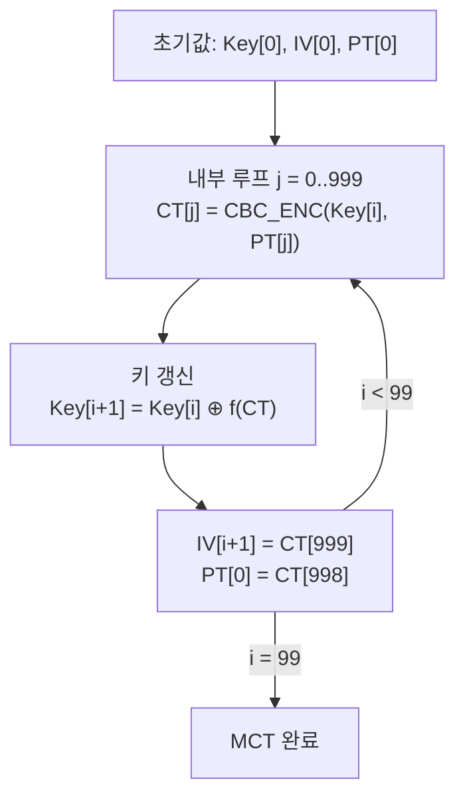

# [CBC.007] MCT-CBC 키 갱신

## 1. 보안요구사항 개요
몬테카를로 테스트(MCT, Monte Carlo Test)는 KCMVP 검증에서 알고리즘 구현의 정확성을 반복 검증하는 핵심 절차이다. CBC 모드 MCT에서는 LEA의 키 길이(128/192/256비트)에 따라 정해진 키 갱신 수식을 정확히 수행해야 한다.

## 2. 상세 요구사항 (Requirements)
- **CBC-LEA-005**: 몬테카를로 테스트 시 LEA의 키 길이에 따라 다음과 같은 키 갱신 로직을 정확히 수행해야 한다:
  - **128비트 키**: `Key[i+1] = Key[i] ⊕ CT[j]`
  - **192비트 키**: `Key[i+1] = Key[i] ⊕ (CT64[j-1] || CT[j])` — CT64[j-1]은 CT[j-1]의 하위 64비트
  - **256비트 키**: `Key[i+1] = Key[i] ⊕ (CT[j-1] || CT[j])`
  - 공통: `IV[i+1] = CT[j]`, `PT[0] = CT[j-1]`

## 3. 작성 예시 (Examples)
### 3.1. 표 형식 예시

| 키 길이 | 키 갱신 수식 | 비고 |
| :--- | :--- | :--- |
| 128비트 | Key[i+1] = Key[i] ⊕ CT[j] | CT[j]: 마지막 암호문 블록 (128비트) |
| 192비트 | Key[i+1] = Key[i] ⊕ (CT64[j-1] ‖ CT[j]) | CT64[j-1]: CT[j-1]의 하위 64비트 |
| 256비트 | Key[i+1] = Key[i] ⊕ (CT[j-1] ‖ CT[j]) | CT[j-1], CT[j]: 각 128비트 |

### 3.2. 코드 예시 (MCT-CBC 의사코드)

```c
/* MCT-CBC: 100회 외부 루프 × 1000회 내부 루프 */
for (int i = 0; i < 100; i++) {
    for (int j = 0; j < 1000; j++) {
        /* CBC 암호화 1블록 수행 */
        ct[j] = lea_cbc_enc_block(key[i], iv, pt[j]);
        pt[j+1] = (j == 0) ? iv : ct[j-1];
        iv = ct[j];
    }

    /* 키 갱신 (128비트 예시) */
    for (int k = 0; k < 16; k++)
        key[i+1][k] = key[i][k] ^ ct[999][k];

    iv_next = ct[999];       /* IV[i+1] = CT[j] */
    pt_next = ct[998];       /* PT[0] = CT[j-1] */
}
```

### 3.3. 서술형 예시
"MCT-CBC 검증 수행 시 외부 루프 100회, 내부 루프 1000회를 반복하며, 각 외부 루프 종료 시 LEA 키 길이에 따른 갱신 수식으로 다음 라운드의 키를 생성한다. 128비트 키의 경우 Key[i+1] = Key[i] ⊕ CT[999]이다."

## 4. 구조도 및 시각 자료 (Visuals)
### 4.1. MCT-CBC 흐름 (Mermaid)



### 4.2. 키 갱신 상세 설명
- 128비트: CT[j]만으로 XOR (동일 크기)
- 192비트: CT[j-1]의 하위 64비트 + CT[j] 128비트 = 192비트로 XOR
- 256비트: CT[j-1] 128비트 + CT[j] 128비트 = 256비트로 XOR

## 5. 해설 및 증빙 가이드 (Guide)
- **MCT의 목적**: 구현체가 대량의 반복 연산에서도 표준과 동일한 결과를 생성하는지 검증한다. 단 1비트의 오차도 허용되지 않는다.
- **키 길이별 분기 필수**: 128/192/256비트에 따라 키 갱신 수식이 다르므로, 구현 시 키 길이에 따른 분기 로직이 정확히 구현되어야 한다.
- **CT64[j-1] 주의**: 192비트 키의 경우 CT[j-1]의 전체 128비트가 아닌 **하위 64비트**만 사용한다는 점에 주의한다.
- **증빙 시 주안점**: MCT 구현 코드에서 키 갱신 로직이 표준 수식과 정확히 일치하는지, 100×1000 반복 구조가 올바른지 확인한다.
- **참고 규격**: LEA 검증시스템 §6.4.
