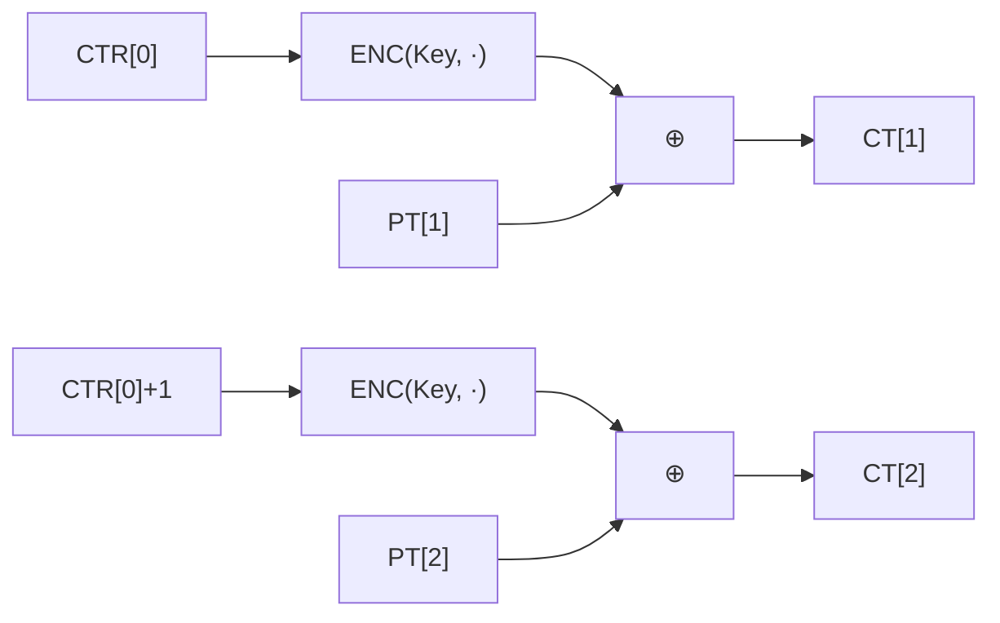

# [CTR.001] CTR 암복호화 수식

## 1. 보안요구사항 개요
CTR(Counter) 모드는 카운터 값을 암호화한 키스트림과 평문을 XOR하여 암호문을 생성하는 스트림 암호 방식의 운영모드이다. 암호화와 복호화 모두 ENC(암호화) 함수만 사용하며, DEC(복호화) 함수는 불필요한 대칭 구조를 갖는다.

## 2. 상세 요구사항 (Requirements)
- **CTR-001**: CTR 모드 수식 `CT[i] = PT[i] ⊕ ENC(Key, CTR[0]+i-1)`에 따라 암호화와 복호화 모두 ENC 함수만 사용해야 한다. 카운터 초기값 CTR[0]에 블록 인덱스를 더한 값을 ENC의 입력으로 사용하며, 그 출력과 평문(또는 암호문)을 XOR하여 결과를 생성한다. DEC 함수는 사용하지 않는다.

## 3. 작성 예시 (Examples)
### 3.1. 수식 표현

| 연산 | 수식 | 설명 |
| :--- | :--- | :--- |
| 암호화 | CT[i] = PT[i] ⊕ ENC(Key, CTR[0]+i-1) | 키스트림과 평문 XOR |
| 복호화 | PT[i] = CT[i] ⊕ ENC(Key, CTR[0]+i-1) | 키스트림과 암호문 XOR (동일 구조) |

### 3.2. 코드 예시 (C 의사코드)

```c
/* CTR 모드 암호화 (복호화도 동일) */
uint8_t ctr_block[16];
memcpy(ctr_block, ctr_init, 16);

for (int i = 0; i < num_blocks; i++) {
    uint8_t keystream[16];
    lea_encrypt(keystream, ctr_block, &key);  /* ENC(Key, CTR) */

    for (int j = 0; j < 16; j++)
        ct[i * 16 + j] = pt[i * 16 + j] ^ keystream[j];  /* PT ⊕ 키스트림 */

    increment_counter(ctr_block);  /* CTR[0]+i → CTR[0]+i+1 */
}
```

### 3.3. 서술형 예시
"본 구현은 CTR 모드에서 암호화와 복호화 모두 LEA의 ENC 함수만을 사용한다. 카운터 값을 블록마다 1씩 증가시켜 ENC의 입력으로 사용하고, 출력된 키스트림과 평문(또는 암호문)을 XOR하여 결과를 생성한다."

## 4. 구조도 및 시각 자료 (Visuals)
### 4.1. CTR 모드 암호화 흐름 (Mermaid)



### 4.2. 구조 설명
- 각 블록의 키스트림 생성이 서로 독립적이므로 **병렬 처리가 가능**하다.
- DEC 함수를 구현할 필요가 없으므로 코드 크기와 검증 범위가 줄어든다.
- 평문이 블록 크기의 배수가 아니어도 마지막 블록의 키스트림을 잘라서 사용할 수 있다.

## 5. 해설 및 증빙 가이드 (Guide)
- **ENC만 사용**: CTR 모드에서 DEC 함수를 호출하는 코드가 있으면 구현 오류이다. 암복호화 모두 ENC만 사용해야 한다.
- **병렬 처리 이점**: 각 카운터 값이 독립적이므로 CBC와 달리 모든 블록을 동시에 암호화/복호화할 수 있다. 이는 SIMD 가속의 근거가 된다.
- **패딩 불필요**: 마지막 블록이 16바이트 미만이더라도 키스트림의 해당 바이트만 XOR하면 되므로 패딩이 필요 없다.
- **증빙 시 주안점**: 소스 코드에서 `lea_decrypt` 또는 DEC 관련 함수가 CTR 모드 경로에서 호출되지 않는지 확인한다.
- **참고 규격**: LEA 검증시스템 §5.5.
