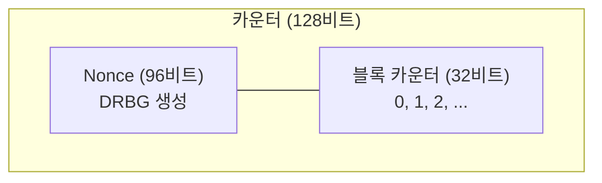

# [CTR.002] 카운터 유일성

## 1. 보안요구사항 개요
CTR 모드에서 동일한 키로 동일한 카운터 값을 재사용하면 동일한 키스트림이 생성되어, 두 암호문의 XOR로부터 평문 정보가 노출되는 치명적 보안 취약점이 발생한다. 매 암호화 시마다 서로 다른 카운터 초기값을 사용해야 한다.

## 2. 상세 요구사항 (Requirements)
- **CTR-002**: 매 암호화 시마다 서로 다른 카운터 초기값을 사용해야 한다. 동일한 키로 동일한 카운터 값을 재사용할 경우 `CT1 ⊕ CT2 = PT1 ⊕ PT2`가 성립하여 보안이 완전히 파괴된다.

## 3. 작성 예시 (Examples)
### 3.1. 카운터 재사용 공격 원리

| 상황 | 결과 |
| :--- | :--- |
| 같은 Key, 같은 CTR로 PT1 암호화 | CT1 = PT1 ⊕ ENC(Key, CTR) |
| 같은 Key, 같은 CTR로 PT2 암호화 | CT2 = PT2 ⊕ ENC(Key, CTR) |
| 공격자가 CT1 ⊕ CT2 계산 | CT1 ⊕ CT2 = PT1 ⊕ PT2 (평문 노출!) |

### 3.2. 올바른 카운터 관리

```c
/* 올바른 예: 매 암호화마다 새로운 카운터 초기값 */
uint8_t ctr[16];

/* 방법 1: DRBG로 Nonce 생성 후 카운터 결합 */
drbg_generate(ctr, 12);     /* 상위 96비트: Nonce */
memset(ctr + 12, 0, 4);     /* 하위 32비트: 카운터 = 0 */

lea_ctr_enc(ct, pt, pt_len, ctr, &key);
```

### 3.3. 금지 패턴

```c
/* 위반: 고정된 카운터 초기값 재사용 */
uint8_t ctr[16] = {0};  /* 항상 0으로 초기화 → 같은 키스트림 반복! */
lea_ctr_enc(ct1, pt1, len1, ctr, &key);

memset(ctr, 0, 16);     /* 다시 0으로 → 위반! */
lea_ctr_enc(ct2, pt2, len2, ctr, &key);
```

### 3.4. 서술형 예시
"본 구현은 CTR 모드 사용 시 매 암호화 호출마다 DRBG로 생성한 고유 Nonce를 카운터 초기값에 포함하여, 동일 키에서 카운터 값이 절대 반복되지 않도록 보장한다."

## 4. 구조도 및 시각 자료 (Visuals)
### 4.1. 카운터 구성 예시 (Mermaid)



### 4.2. 구조 설명
- 카운터를 Nonce(고유값) + 블록 카운터로 분리하면, Nonce만 매번 다르게 생성하면 카운터 유일성을 확보할 수 있다.
- 블록 카운터 32비트 → 최대 2³² 블록(약 64GB)까지 단일 암호화에서 처리 가능.

## 5. 해설 및 증빙 가이드 (Guide)
- **카운터 재사용은 치명적**: CTR 모드에서 카운터 재사용은 CBC 모드에서의 IV 재사용보다 더 심각하다. 평문 간의 XOR이 직접 노출되기 때문이다.
- **Nonce + 카운터 분리 설계**: 상위 비트를 Nonce(매 세션/메시지마다 고유), 하위 비트를 블록 카운터(0부터 증가)로 분리하는 것이 일반적이다.
- **오버플로 주의**: 단일 암호화에서 블록 카운터가 오버플로하면 카운터가 반복될 수 있으므로, 처리 가능한 최대 데이터 크기를 제한해야 한다.
- **증빙 시 주안점**: 카운터 초기값이 매 암호화 호출마다 변경되는지, 고정값이나 예측 가능한 패턴이 아닌지 확인한다.
- **참고 규격**: LEA 검증시스템 §5.5.
