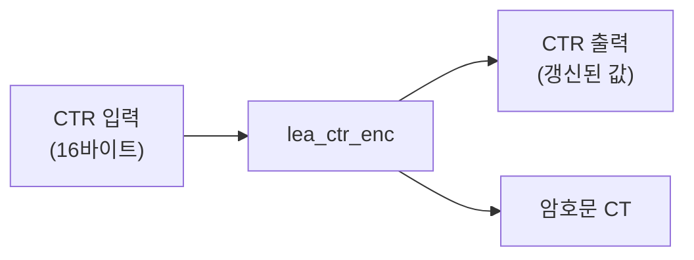

# [CTR.003] 초기 카운터 길이

## 1. 보안요구사항 개요
LEA의 CTR 모드에서 초기 카운터(CTR)의 길이는 LEA의 블록 크기인 128비트(16바이트)와 동일해야 한다. 카운터는 CTR 모드 연산 후 내부적으로 갱신되는 in/out 매개변수이다.

## 2. 상세 요구사항 (Requirements)
- **CTR-LEA-001**: 초기 카운터(CTR)의 길이는 반드시 16바이트(128비트)이어야 한다. `uint8_t ctr[16]`으로 선언하며, CTR 모드 API 호출 시 in/out 매개변수로 전달된다. 함수 호출 후 카운터 값이 갱신된 상태로 반환된다.

## 3. 작성 예시 (Examples)
### 3.1. 표 형식 예시

| 항목 | 규격 |
| :--- | :--- |
| 카운터 길이 | 16바이트 (128비트) |
| C 선언 | `uint8_t ctr[16];` |
| 매개변수 특성 | in/out (호출 후 갱신됨) |
| 증가 방식 | (CTR[0]+1) mod 2¹²⁸ |

### 3.2. 코드 예시

```c
/* 올바른 예: 16바이트 카운터 선언 및 사용 */
uint8_t ctr[16];
drbg_generate(ctr, 16);  /* 또는 Nonce + 카운터 조합으로 초기화 */

lea_ctr_enc(ct, pt, pt_len, ctr, &key);
/* 이 시점에서 ctr은 내부적으로 갱신된 상태 */
```

### 3.3. 금지 패턴

```c
/* 위반: 카운터 크기가 16바이트가 아님 */
uint8_t ctr[8];   /* 8바이트 → 규격 위반! */
uint8_t ctr[32];  /* 32바이트 → 규격 위반! */
```

### 3.4. 서술형 예시
"본 구현의 CTR 모드에서 사용하는 초기 카운터는 LEA 블록 크기에 맞추어 16바이트로 고정되며, lea_ctr_enc/dec 호출 시 in/out 매개변수로 전달되어 함수 내부에서 블록 처리 후 자동 갱신된다."

## 4. 구조도 및 시각 자료 (Visuals)
### 4.1. 카운터 동작 흐름 (Mermaid)



### 4.2. 구조 설명
- 카운터는 `lea_ctr_enc`/`lea_ctr_dec` 호출 시 포인터로 전달되며, 함수 내부에서 처리된 블록 수만큼 증가한 값으로 갱신된다.
- 연속 호출 시 별도의 카운터 재설정 없이 이어서 사용할 수 있다.

## 5. 해설 및 증빙 가이드 (Guide)
- **16바이트 강제**: LEA의 블록 크기가 128비트이므로 카운터도 반드시 128비트(16바이트)여야 한다. 다른 크기의 카운터를 사용하면 ENC 함수 입력 크기와 불일치하여 오동작한다.
- **in/out 특성 주의**: `ctr` 파라미터는 함수 호출 후 값이 변경되므로, 원본 카운터 값이 필요한 경우 호출 전에 별도 복사해두어야 한다.
- **증가 방식**: 카운터는 128비트 정수로 취급하여 `(CTR+1) mod 2¹²⁸`로 증가한다.
- **증빙 시 주안점**: 카운터 배열 선언이 `[16]`인지 확인하고, in/out 특성을 고려한 올바른 사용 패턴인지 검증한다.
- **참고 규격**: 블록암호 LEA 소스코드 사용 매뉴얼(v1.0) §2.2.3.
