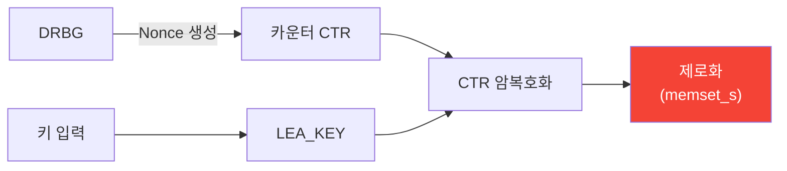

# [CTR.004] SSP 관리 및 제로화

## 1. 보안요구사항 개요
CTR 모드에서 카운터 값과 비밀키는 중요 보안매개변수(SSP)로서, 사용 종료 후 즉시 메모리에서 0화해야 한다. 또한 Nonce(카운터 초기값의 일부)는 DRBG를 통해 생성해야 하며, `rand()`/`srand()` 등 비암호학적 함수의 사용은 금지된다.

## 2. 상세 요구사항 (Requirements)
- **CTR-003**: Nonce는 예측 불가능하도록 검증대상 난수 발생기(DRBG)를 통해 생성되어야 한다. `rand()`/`srand()` 등 비암호학적 함수 사용은 금지된다.
- **CTR-004**: 카운터 값과 비밀키는 사용 종료 후 `memset_s`, `SecureZeroMemory`, `explicit_bzero` 등으로 메모리에서 즉시 0화해야 한다.

## 3. 작성 예시 (Examples)
### 3.1. 표 형식 예시

| SSP 항목 | 생성 방식 | 제로화 방법 |
| :--- | :--- | :--- |
| 비밀키 (LEA_KEY) | 외부 주입 / KDF | memset_s |
| 카운터 초기값 (CTR) | DRBG 생성 | memset_s |
| Nonce | DRBG 생성 | memset_s |

### 3.2. 코드 예시

```c
LEA_KEY key;
uint8_t mk[16] = { /* 비밀키 */ };
uint8_t ctr[16];

/* 키 설정 및 Nonce 생성 (DRBG 사용) */
lea_set_key(&key, mk, 16);
drbg_generate(ctr, 16);

/* CTR 암호화 수행 */
lea_ctr_enc(ct, pt, pt_len, ctr, &key);

/* 사용 완료 → 즉시 제로화 */
memset_s(&key, sizeof(LEA_KEY), 0, sizeof(LEA_KEY));
memset_s(mk, 16, 0, 16);
memset_s(ctr, 16, 0, 16);
```

### 3.3. 금지 패턴

```c
/* 위반: rand()로 Nonce 생성 */
srand(time(NULL));
for (int i = 0; i < 16; i++)
    ctr[i] = rand() & 0xFF;  /* 예측 가능 → 위반! */

/* 위반: 제로화 누락 */
lea_ctr_enc(ct, pt, pt_len, ctr, &key);
return ct;  /* key, ctr이 메모리에 잔존! */
```

### 3.4. 서술형 예시
"본 암호모듈은 CTR 모드의 Nonce를 검증대상 DRBG로 생성하며, 암복호화 수행 후 비밀키와 카운터 값을 memset_s로 즉시 0화하여 메모리 잔존 위험을 방지한다."

## 4. 구조도 및 시각 자료 (Visuals)
### 4.1. SSP 생명주기 (Mermaid)



### 4.2. 구조 설명
- DRBG를 통해 Nonce가 생성되고, 키와 함께 CTR 암복호화에 사용된다.
- 사용 완료 후 모든 SSP(키, 카운터, Nonce)가 즉시 제로화된다.

## 5. 해설 및 증빙 가이드 (Guide)
- **DRBG 필수**: `rand()`로 생성한 Nonce는 예측 가능하므로, 동일 카운터 값이 사용될 위험이 있다.
- **카운터도 SSP**: 카운터 값은 키스트림 생성에 직접 영향을 주므로, 비밀키와 동일한 수준의 보호가 필요하다.
- **제로화 대상 목록**: LEA_KEY 구조체, 마스터키 배열, 카운터 배열, 중간 키스트림 버퍼.
- **증빙 시 주안점**: ① Nonce 생성에 DRBG가 사용되는지, ② `rand`/`srand` 패턴이 없는지, ③ 함수 종료 전 모든 SSP에 대해 안전한 제로화가 수행되는지 확인한다.
- **참고 규격**: KS X ISO/IEC 19790:2015 §7.9, §7.9.2.
