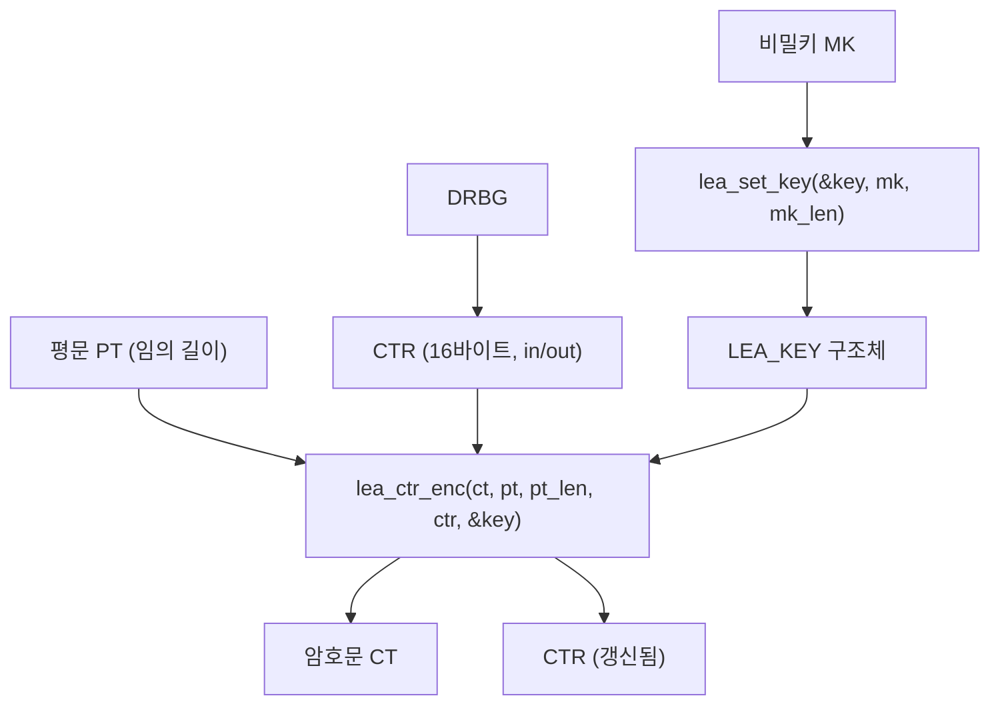

# [CTR.005] LEA 전용 CTR API

## 1. 보안요구사항 개요
국보연(KISA) 배포 매뉴얼에서 정의한 LEA 전용 표준 인터페이스 함수명을 사용하여 CTR 암복호화를 수행해야 한다. CTR 모드는 CBC와 달리 임의 길이 평문을 허용하며, 카운터(ctr)는 16바이트 in/out 매개변수이다.

## 2. 상세 요구사항 (Requirements)
- **CTR-LEA-004**: 국보연 배포 매뉴얼에서 정의한 LEA 전용 표준 인터페이스 함수명을 사용해야 한다. 암호화: `lea_ctr_enc(ct, pt, pt_len, ctr, key)`, 복호화: `lea_ctr_dec(pt, ct, ct_len, ctr, key)`. `pt_len`/`ct_len`은 임의 길이 허용, `ctr`은 16바이트(in/out), `key`는 `lea_set_key`로 설정된 `LEA_KEY` 구조체이다.

## 3. 작성 예시 (Examples)
### 3.1. 표 형식 예시 (API 명세)

| 함수명 | 프로토타입 | 설명 |
| :--- | :--- | :--- |
| lea_ctr_enc | `void lea_ctr_enc(unsigned char *ct, const unsigned char *pt, unsigned int pt_len, unsigned char *ctr, const LEA_KEY *key)` | CTR 암호화 |
| lea_ctr_dec | `void lea_ctr_dec(unsigned char *pt, const unsigned char *ct, unsigned int ct_len, unsigned char *ctr, const LEA_KEY *key)` | CTR 복호화 |

### 3.2. 매개변수 상세

| 매개변수 | 타입 | 크기/조건 | 설명 |
| :--- | :--- | :--- | :--- |
| ct / pt | `unsigned char *` | 입력 길이 이상 | 암호문/평문 출력 버퍼 |
| pt / ct | `const unsigned char *` | pt_len / ct_len | 평문/암호문 입력 |
| pt_len / ct_len | `unsigned int` | 임의 길이 | 입력 데이터 길이 (16배수 불필요) |
| ctr | `unsigned char *` | 16바이트 | 카운터 (in/out) |
| key | `const LEA_KEY *` | - | lea_set_key로 설정된 키 구조체 |

### 3.3. 코드 예시

```c
#include "lea.h"

LEA_KEY key;
uint8_t mk[16] = { /* 128비트 비밀키 */ };
uint8_t ctr[16];
uint8_t pt[100] = { /* 100바이트 평문 (16배수 아님) */ };
uint8_t ct[100];

lea_set_key(&key, mk, 16);
drbg_generate(ctr, 16);

/* 임의 길이 평문 암호화 가능 */
lea_ctr_enc(ct, pt, 100, ctr, &key);
```

### 3.4. 서술형 예시
"본 구현은 국보연 배포 LEA 소스코드 매뉴얼에서 정의한 표준 API인 lea_ctr_enc, lea_ctr_dec를 사용하여 CTR 모드 암복호화를 수행한다. CTR 모드는 블록 크기 배수 제약이 없어 임의 길이 데이터를 처리할 수 있다."

## 4. 구조도 및 시각 자료 (Visuals)
### 4.1. API 호출 흐름 (Mermaid)



### 4.2. CBC API와의 차이점

| 항목 | CBC API | CTR API |
| :--- | :--- | :--- |
| 입력 길이 제약 | 16의 배수 필수 | 임의 길이 허용 |
| IV/CTR 특성 | IV (in/out) | CTR (in/out) |
| DEC 함수 내부 | lea_decrypt 사용 | lea_encrypt 사용 |

## 5. 해설 및 증빙 가이드 (Guide)
- **임의 길이 허용**: CTR 모드는 스트림 암호 방식이므로 평문 길이가 16의 배수가 아니어도 된다. CBC와의 주요 차이점이다.
- **ctr in/out 주의**: 카운터는 함수 호출 후 갱신되므로, 동일 카운터로 복호화하려면 호출 전 값을 별도 보관해야 한다.
- **표준 함수명 준수**: `lea_ctr_enc`, `lea_ctr_dec` 외의 자체 함수명 사용은 검증 시 부적합 판정의 원인이 된다.
- **증빙 시 주안점**: 프로젝트 전체에서 `lea_ctr_enc`/`lea_ctr_dec` 함수 호출이 존재하는지, 자체 구현 함수로 대체하지 않았는지 확인한다.
- **참고 규격**: 블록암호 LEA 소스코드 사용 매뉴얼(v1.0) §4.3.6, §4.3.7.
