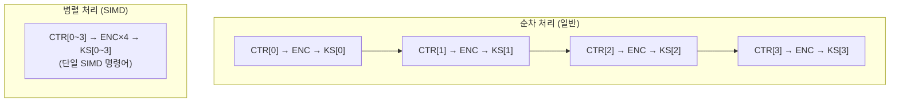

# [CTR.006] SIMD 가속

## 1. 보안요구사항 개요
CTR 모드는 각 블록의 키스트림 생성이 서로 독립적이므로 SIMD(Single Instruction, Multiple Data) 명령어를 활용한 병렬 처리가 가능하다. LEA 소스코드는 SSE2, AVX2, XOP, NEON 등 다양한 SIMD 가속 구현을 제공한다.

## 2. 상세 요구사항 (Requirements)
- **CTR-LEA-005**: CTR 모드의 병렬 처리 특성을 활용하여 SIMD 가속을 적용할 수 있다. 지원되는 SIMD 확장: SSE2, AVX2, XOP, NEON. 각 확장에 대응하는 소스 파일: `lea_t_sse2.c`, `lea_t_avx2.c`, `lea_t_xop.c`, `lea_t_neon.c` 등을 빌드 환경에 맞게 선택하여 사용한다.

## 3. 작성 예시 (Examples)
### 3.1. 표 형식 예시

| SIMD 확장 | 소스 파일 | 대상 플랫폼 | 병렬 처리 단위 |
| :--- | :--- | :--- | :--- |
| SSE2 | `lea_t_sse2.c` | x86/x64 (대부분) | 128비트 (4×32비트) |
| AVX2 | `lea_t_avx2.c` | x86/x64 (최신) | 256비트 (8×32비트) |
| XOP | `lea_t_xop.c` | AMD (Bulldozer~) | 128비트 + 확장 연산 |
| NEON | `lea_t_neon.c` | ARM | 128비트 (4×32비트) |

### 3.2. 빌드 설정 예시

```makefile
# x86/x64 환경 (SSE2 기본 지원)
CFLAGS += -msse2
SRCS += lea_t_sse2.c

# x86/x64 환경 (AVX2 지원 시)
CFLAGS += -mavx2
SRCS += lea_t_avx2.c

# ARM 환경 (NEON 지원)
CFLAGS += -mfpu=neon
SRCS += lea_t_neon.c
```

### 3.3. 서술형 예시
"본 구현은 CTR 모드의 병렬 처리 특성을 활용하여 대상 플랫폼에 따라 SSE2 또는 AVX2 SIMD 가속을 적용하였다. 이를 통해 단일 명령어로 다수의 블록을 동시에 암호화하여 처리 성능을 향상시킨다."

## 4. 구조도 및 시각 자료 (Visuals)
### 4.1. SIMD 병렬 처리 구조 (Mermaid)



### 4.2. 구조 설명
- SIMD를 사용하면 4개(SSE2) 또는 8개(AVX2) 블록의 카운터를 동시에 암호화할 수 있다.
- API 인터페이스(`lea_ctr_enc`/`lea_ctr_dec`)는 동일하며, 내부 구현만 SIMD로 대체된다.

## 5. 해설 및 증빙 가이드 (Guide)
- **CTR만 병렬 가능**: CBC 암호화는 이전 블록에 의존하므로 SIMD 가속이 불가능하지만, CTR은 각 블록이 독립적이므로 가속이 가능하다.
- **빌드 환경 확인**: 대상 플랫폼의 CPU가 해당 SIMD 확장을 지원하는지 반드시 확인하고, 미지원 환경에서는 일반 C 구현(`lea.c`)으로 폴백해야 한다.
- **검증 결과 동일**: SIMD 가속 여부와 관계없이 동일한 입력에 대해 동일한 출력이 생성되어야 한다. 검증 테스트 벡터 통과가 필수이다.
- **증빙 시 주안점**: 사용한 SIMD 소스 파일명과 빌드 플래그를 명시하고, 표준 테스트 벡터 통과 결과를 첨부한다.
- **참고 규격**: 블록암호 LEA 소스코드 사용 매뉴얼(v1.0) §3.
