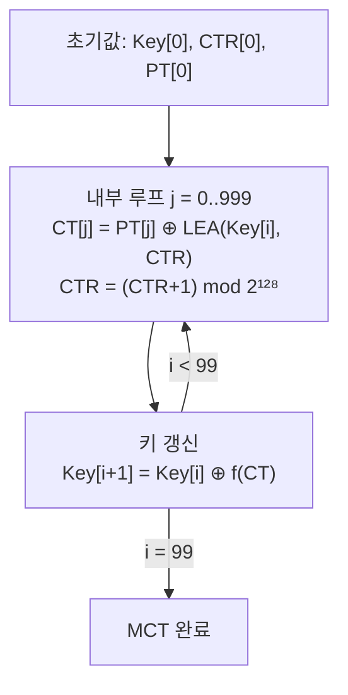

# [CTR.007] MCT-CTR 카운터 갱신

## 1. 보안요구사항 개요
몬테카를로 테스트(MCT)의 CTR 모드에서는 각 블록 암호화 후 카운터를 `(CTR[0]+1) mod 2¹²⁸`로 증가시키며, 외부 루프 종료 시 키 갱신은 ECB/CBC와 동일한 방식으로 수행한다.

## 2. 상세 요구사항 (Requirements)
- **CTR-LEA-006**: MCT-CTR 수행 시 각 블록은 `CT[j] = PT[j] ⊕ LEA(Key[i], CTR[0])`으로 암호화하고, 카운터를 `CTR[0] = (CTR[0]+1) mod 2¹²⁸`로 증가시킨다. 키 갱신은 ECB/CBC MCT와 동일한 수식을 적용한다.

## 3. 작성 예시 (Examples)
### 3.1. MCT-CTR 수식 요약

| 단계 | 수식 | 설명 |
| :--- | :--- | :--- |
| 블록 암호화 | CT[j] = PT[j] ⊕ LEA(Key[i], CTR[0]) | 키스트림 생성 후 XOR |
| 카운터 증가 | CTR[0] = (CTR[0]+1) mod 2¹²⁸ | 128비트 카운터 1 증가 |
| 키 갱신 (128비트) | Key[i+1] = Key[i] ⊕ CT[j] | CBC MCT와 동일 |
| 키 갱신 (192비트) | Key[i+1] = Key[i] ⊕ (CT64[j-1] ‖ CT[j]) | CBC MCT와 동일 |
| 키 갱신 (256비트) | Key[i+1] = Key[i] ⊕ (CT[j-1] ‖ CT[j]) | CBC MCT와 동일 |

### 3.2. 코드 예시 (MCT-CTR 의사코드)

```c
/* MCT-CTR: 100회 외부 루프 × 1000회 내부 루프 */
for (int i = 0; i < 100; i++) {
    uint8_t ctr[16];
    memcpy(ctr, ctr_init, 16);

    for (int j = 0; j < 1000; j++) {
        uint8_t keystream[16];
        lea_encrypt(keystream, ctr, &key[i]);

        /* CT[j] = PT[j] ⊕ LEA(Key[i], CTR) */
        for (int k = 0; k < 16; k++)
            ct[j][k] = pt[j][k] ^ keystream[k];

        /* 카운터 증가: (CTR+1) mod 2^128 */
        increment_counter_128(ctr);

        pt[j+1][...] = ct[j][...];  /* 다음 평문 = 현재 암호문 */
    }

    /* 키 갱신 (128비트 예시) */
    for (int k = 0; k < 16; k++)
        key_bytes[i+1][k] = key_bytes[i][k] ^ ct[999][k];
}
```

### 3.3. 서술형 예시
"MCT-CTR 검증 수행 시 각 블록 암호화 후 128비트 카운터를 1 증가시키며, 외부 루프 종료 시 키 길이에 따른 표준 갱신 수식으로 다음 라운드의 키를 생성한다."

## 4. 구조도 및 시각 자료 (Visuals)
### 4.1. MCT-CTR 흐름 (Mermaid)



### 4.2. 구조 설명
- CTR MCT에서는 CBC와 달리 카운터가 매 블록마다 자동 증가한다.
- 키 갱신 로직은 CBC MCT와 공유하므로 코드 재사용이 가능하다.

## 5. 해설 및 증빙 가이드 (Guide)
- **카운터 증가 정확성**: `(CTR+1) mod 2¹²⁸` 연산이 128비트 전체에서 올바르게 캐리(carry)가 전파되는지 확인해야 한다. 하위 32비트만 증가시키는 오류가 흔하다.
- **키 갱신은 CBC와 동일**: CTR 모드 고유의 키 갱신 수식이 따로 있는 것이 아니라, ECB/CBC MCT와 동일한 키 갱신 수식을 사용한다.
- **MCT 결과 검증**: 100번째 외부 루프의 최종 CT 값이 CAVP 표준 테스트 벡터와 정확히 일치해야 한다.
- **증빙 시 주안점**: ① 카운터 증가 로직이 128비트 전체에 대해 올바른지, ② 키 갱신 수식이 키 길이별로 정확한지 확인한다.
- **참고 규격**: LEA 검증시스템 §6.4.
