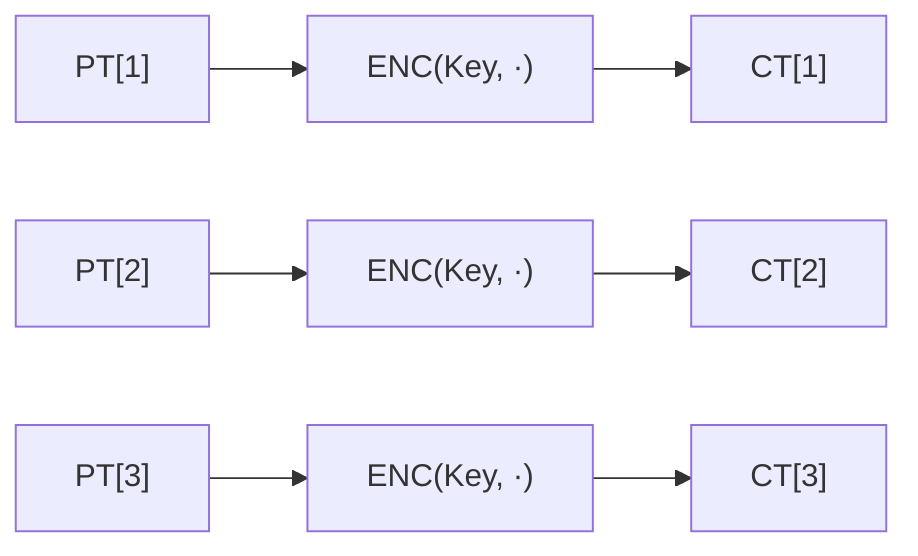

# [ECB.001] ECB 기본 구조

## 1. 보안요구사항 개요
ECB(Electronic Codebook) 모드는 각 평문 블록을 독립적으로 암호화하는 가장 기본적인 운영모드이다. `CT[i] = ENC(Key, PT[i])` 수식에 따라 블록 간 연쇄 없이 동작하며, 평문 길이는 16바이트(128비트)의 배수여야 한다. 패딩이 필요한 경우 PKCS5를 적용한다.

## 2. 상세 요구사항 (Requirements)
- **ECB-002**: ECB 모드에서 각 평문 블록은 `CT[i] = ENC(Key, PT[i])` 수식에 따라 독립적으로 암호화된다. 평문 길이는 16바이트의 배수여야 하며, 부족한 경우 PKCS5 패딩을 적용한다. 블록 간 연쇄가 없으므로 동일 평문 블록은 항상 동일 암호문을 생성한다.

## 3. 작성 예시 (Examples)
### 3.1. 수식 표현

| 연산 | 수식 | 설명 |
| :--- | :--- | :--- |
| 암호화 | CT[i] = ENC(Key, PT[i]) | 각 블록 독립 암호화 |
| 복호화 | PT[i] = DEC(Key, CT[i]) | 각 블록 독립 복호화 |

### 3.2. 코드 예시

```c
/* ECB 암호화: 블록 독립 처리 */
for (int i = 0; i < num_blocks; i++) {
    lea_encrypt(ct + i * 16, pt + i * 16, &key);
}
```

### 3.3. 서술형 예시
"본 구현은 ECB 운영모드로서 각 16바이트 평문 블록을 독립적으로 LEA 암호화 함수에 통과시켜 암호문을 생성한다. 블록 간 연쇄 구조가 없으므로 병렬 처리가 가능하나, 동일 평문이 동일 암호문으로 매핑되는 특성에 유의해야 한다."

## 4. 구조도 및 시각 자료 (Visuals)
### 4.1. ECB 모드 구조 (Mermaid)



### 4.2. 구조 설명
- 각 블록이 완전히 독립적이므로 **병렬 암호화/복호화 모두 가능**하다.
- IV나 카운터가 불필요하여 구현이 가장 단순하다.
- 동일 평문 블록 → 동일 암호문 블록이므로, 데이터 패턴이 암호문에 노출될 수 있다.

## 5. 해설 및 증빙 가이드 (Guide)
- **ECB의 보안 한계**: 동일 평문이 동일 암호문으로 매핑되므로, 이미지 등 패턴이 있는 데이터에서 원본 구조가 암호문에 반영된다. 실무에서는 CBC, CTR 등 연쇄 모드 사용을 권장한다.
- **PKCS5 패딩**: 평문이 16바이트 배수가 아닌 경우 부족한 바이트 수만큼의 값으로 패딩한다 (예: 3바이트 부족 → `0x03 0x03 0x03` 추가).
- **용도**: 주로 단일 블록 암호화(키 래핑 등)나 KCMVP 검증의 알고리즘 정확성 테스트(KAT, MCT)에 사용된다.
- **증빙 시 주안점**: ECB를 사용하는 경우 그 타당성(단일 블록, 테스트 용도 등)을 설계서에 명시해야 한다.
- **참고 규격**: 블록암호 LEA 소스코드 사용 매뉴얼(v1.0) §2.2.1.
