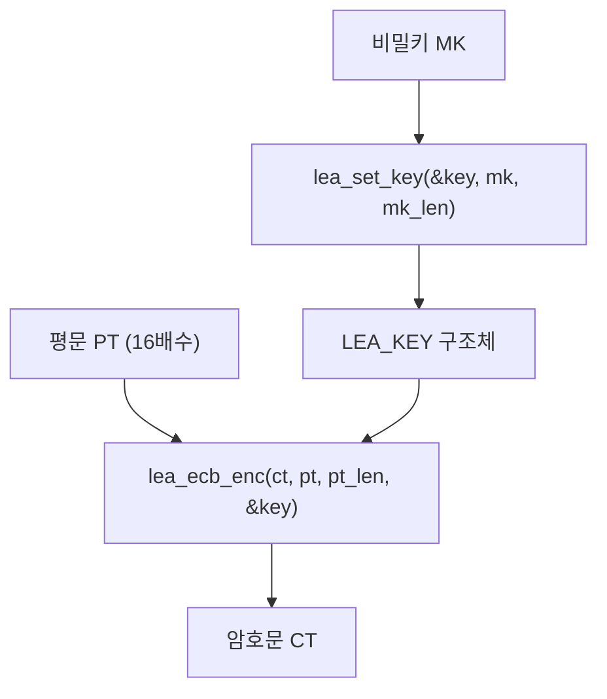

# [ECB.002] LEA 전용 ECB API

## 1. 보안요구사항 개요
국보연(KISA) 배포 매뉴얼에서 정의한 LEA 전용 표준 인터페이스 함수명을 사용하여 ECB 암복호화를 수행해야 한다. ECB 모드는 암호화와 복호화 모두 SIMD 가속을 지원한다.

## 2. 상세 요구사항 (Requirements)
- **ECB-001**: 국보연 배포 매뉴얼에서 정의한 LEA 전용 표준 인터페이스 함수명을 사용해야 한다. 암호화: `lea_ecb_enc(ct, pt, pt_len, key)`, 복호화: `lea_ecb_dec(pt, ct, ct_len, key)`. `pt_len`/`ct_len`은 16의 배수이며, `key`는 `lea_set_key`로 설정된 `LEA_KEY` 구조체이다. SIMD 가속(SSE2, AVX2 등)을 지원한다.

## 3. 작성 예시 (Examples)
### 3.1. 표 형식 예시 (API 명세)

| 함수명 | 프로토타입 | 설명 |
| :--- | :--- | :--- |
| lea_ecb_enc | `void lea_ecb_enc(unsigned char *ct, const unsigned char *pt, unsigned int pt_len, const LEA_KEY *key)` | ECB 암호화 |
| lea_ecb_dec | `void lea_ecb_dec(unsigned char *pt, const unsigned char *ct, unsigned int ct_len, const LEA_KEY *key)` | ECB 복호화 |

### 3.2. 매개변수 상세

| 매개변수 | 타입 | 크기/조건 | 설명 |
| :--- | :--- | :--- | :--- |
| ct / pt | `unsigned char *` | 입력 길이 이상 | 암호문/평문 출력 버퍼 |
| pt / ct | `const unsigned char *` | pt_len / ct_len | 평문/암호문 입력 |
| pt_len / ct_len | `unsigned int` | 16의 배수 | 입력 데이터 길이 |
| key | `const LEA_KEY *` | - | lea_set_key로 설정된 키 구조체 |

### 3.3. 코드 예시

```c
#include "lea.h"

LEA_KEY key;
uint8_t mk[16] = { /* 128비트 비밀키 */ };
uint8_t pt[64] = { /* 64바이트 평문 (16의 배수) */ };
uint8_t ct[64];
uint8_t pt2[64];

/* 키 설정 */
lea_set_key(&key, mk, 16);

/* ECB 암호화 (IV 불필요) */
lea_ecb_enc(ct, pt, 64, &key);

/* ECB 복호화 */
lea_ecb_dec(pt2, ct, 64, &key);
```

### 3.4. CBC/CTR API와의 차이점

| 항목 | ECB API | CBC API | CTR API |
| :--- | :--- | :--- | :--- |
| IV/CTR 매개변수 | 없음 | iv (16바이트) | ctr (16바이트) |
| 입력 길이 제약 | 16의 배수 | 16의 배수 | 임의 길이 |
| SIMD 가속 | enc/dec 모두 | enc만 제한적 | enc 가능 |

## 4. 구조도 및 시각 자료 (Visuals)
### 4.1. API 호출 흐름 (Mermaid)



### 4.2. 구조 설명
- ECB는 IV/CTR이 불필요하므로 매개변수가 4개로 가장 단순하다.
- 블록 독립성 덕분에 암호화/복호화 모두 SIMD 가속이 가능하다.

## 5. 해설 및 증빙 가이드 (Guide)
- **표준 함수명 준수**: `lea_ecb_enc`, `lea_ecb_dec` 외의 자체 함수명 사용은 검증 시 부적합 판정의 원인이 된다.
- **pt_len은 16의 배수**: 16의 배수가 아닌 입력을 전달하면 정의되지 않은 동작이 발생할 수 있다. 호출 전 패딩 처리가 필요하다.
- **SIMD 가속**: ECB의 블록 독립성으로 인해 암호화와 복호화 모두 SIMD 병렬 처리가 가능하다. 이는 CBC(암호화 순차 필수)보다 유리한 점이다.
- **증빙 시 주안점**: 프로젝트에서 `lea_ecb_enc`/`lea_ecb_dec` 호출이 존재하는지, ECB 사용 목적(KAT/MCT 등)이 명시되어 있는지 확인한다.
- **참고 규격**: 블록암호 LEA 소스코드 사용 매뉴얼(v1.0) §4.3.2.
