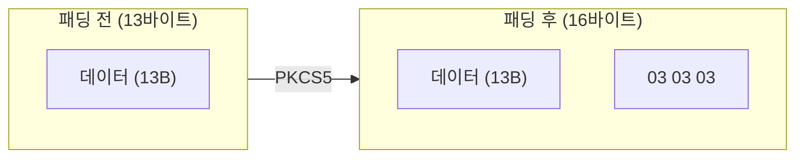

# [ECB.003] 평문 길이 제약

## 1. 보안요구사항 개요
ECB 모드에서 평문과 암호문의 길이는 반드시 16바이트(128비트)의 배수여야 한다. LEA의 블록 크기가 128비트이므로, 블록 단위 독립 암호화 구조상 불완전한 블록은 처리할 수 없다. 패딩이 필요한 경우 PKCS5를 적용한다.

## 2. 상세 요구사항 (Requirements)
- **ECB-002**: ECB 모드에서 평문과 암호문의 길이는 반드시 16바이트(128비트)의 배수여야 한다. 입력 데이터가 16바이트 배수가 아닌 경우 PKCS5 패딩을 적용하여 배수로 맞춘 후 암호화해야 한다.

## 3. 작성 예시 (Examples)
### 3.1. PKCS5 패딩 규칙

| 원본 길이 (mod 16) | 부족 바이트 | 패딩 값 | 패딩 후 총 길이 |
| :--- | :--- | :--- | :--- |
| 13바이트 | 3 | `03 03 03` | 16바이트 |
| 16바이트 | 16 | `10 10 ... 10` (16개) | 32바이트 |
| 30바이트 | 2 | `02 02` | 32바이트 |

### 3.2. 코드 예시 (PKCS5 패딩 적용)

```c
/* PKCS5 패딩 적용 */
int pkcs5_pad(uint8_t *buf, int data_len, int buf_size) {
    int pad_len = 16 - (data_len % 16);
    if (data_len + pad_len > buf_size)
        return -1;

    for (int i = 0; i < pad_len; i++)
        buf[data_len + i] = (uint8_t)pad_len;

    return data_len + pad_len;
}

/* 사용 예시 */
uint8_t buf[64];
memcpy(buf, plaintext, 50);
int padded_len = pkcs5_pad(buf, 50, 64);  /* 50 → 64 (14바이트 패딩) */
lea_ecb_enc(ct, buf, padded_len, &key);
```

### 3.3. 코드 예시 (PKCS5 패딩 제거)

```c
/* PKCS5 패딩 제거 */
int pkcs5_unpad(const uint8_t *buf, int buf_len) {
    if (buf_len == 0 || buf_len % 16 != 0)
        return -1;

    uint8_t pad_val = buf[buf_len - 1];
    if (pad_val < 1 || pad_val > 16)
        return -1;

    for (int i = 0; i < pad_val; i++) {
        if (buf[buf_len - 1 - i] != pad_val)
            return -1;
    }
    return buf_len - pad_val;
}
```

### 3.4. 서술형 예시
"본 구현은 ECB 모드 사용 시 평문 길이가 16바이트 배수가 아닌 경우 PKCS5 패딩을 적용하여 블록 크기에 맞추며, 복호화 후 패딩을 검증하여 제거한다."

## 4. 구조도 및 시각 자료 (Visuals)
### 4.1. 패딩 적용 예시 (Mermaid)



### 4.2. 구조 설명
- PKCS5 패딩: 부족한 바이트 수를 값으로 하는 바이트를 반복하여 채운다.
- 원본이 정확히 16바이트 배수인 경우에도 16바이트 패딩 블록을 추가한다 (패딩 존재를 항상 보장).

## 5. 해설 및 증빙 가이드 (Guide)
- **16바이트 배수 강제**: `lea_ecb_enc`/`lea_ecb_dec`에 16의 배수가 아닌 길이를 전달하면 정의되지 않은 동작이 발생한다.
- **패딩 검증 필수**: 복호화 후 패딩 값이 올바른지 반드시 검증해야 한다. 검증 없이 패딩을 제거하면 데이터 무결성이 보장되지 않는다.
- **CTR 모드와의 차이**: CTR 모드는 임의 길이를 허용하므로 패딩이 불필요하다. 패딩 처리가 복잡한 경우 CTR 사용을 고려한다.
- **증빙 시 주안점**: ECB API 호출 전 패딩이 올바르게 적용되는지, 복호화 후 패딩 검증이 수행되는지 확인한다.
- **참고 규격**: 블록암호 LEA 소스코드 사용 매뉴얼(v1.0) §2.2.1.
