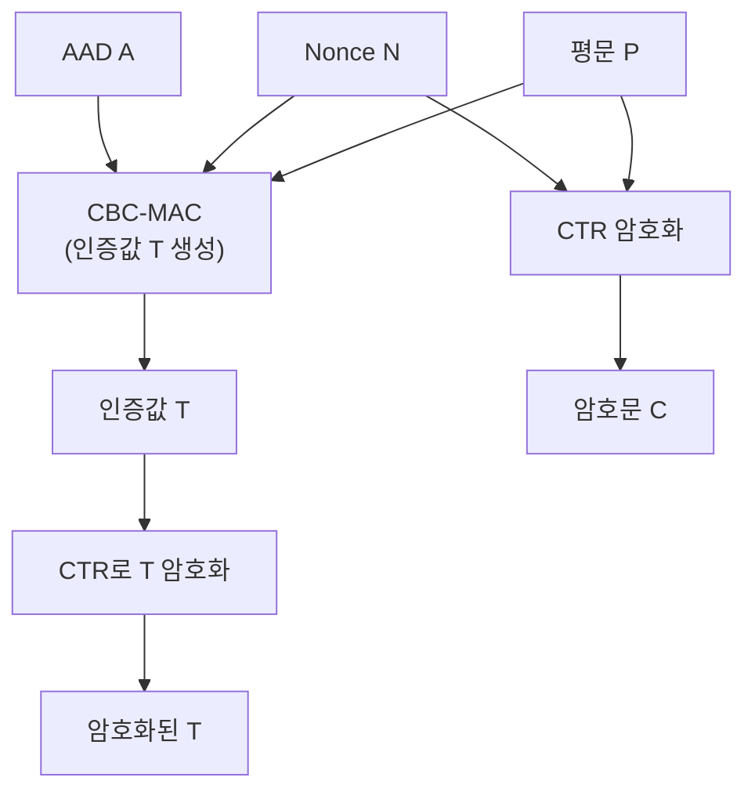

# [CCM.001] CCM 구조 개요

## 1. 보안요구사항 개요
CCM(Counter with CBC-MAC)은 기밀성과 인증을 동시에 제공하는 인증 암호화(Authenticated Encryption) 운영모드이다. 평문, Nonce, 추가 인증 데이터(AAD)를 입력받아 암호문과 인증값(Tag)을 생성하며, Nonce 길이는 7~13바이트, 인증값 길이는 4, 6, 8, 10, 12, 14, 16바이트 중 하나를 선택한다.

## 2. 상세 요구사항 (Requirements)
- **CCM-001**: CCM 모드는 CTR 모드(기밀성)와 CBC-MAC(인증)을 결합한 구조로, 평문 + Nonce + AAD를 입력받아 암호문 + 인증값(Tag)을 출력한다. Nonce 길이는 7~13바이트이고, 인증값(Tag) 길이는 4, 6, 8, 10, 12, 14, 16바이트 중 하나를 선택한다. 복호화 시 인증값 검증에 실패하면 평문을 폐기하고 오류를 반환해야 한다.

## 3. 작성 예시 (Examples)
### 3.1. 표 형식 예시

| 항목 | 규격 |
| :--- | :--- |
| 모드 구조 | CTR (기밀성) + CBC-MAC (인증) |
| Nonce 길이 | 7, 8, 9, 10, 11, 12, 13 바이트 |
| 인증값(Tag) 길이 | 4, 6, 8, 10, 12, 14, 16 바이트 |
| 입력 | 평문(P), Nonce(N), AAD(A) |
| 출력 | 암호문(C), 인증값(T) |

### 3.2. CCM 매개변수 관계

| Nonce 길이 (n) | 카운터 필드 길이 (q=15-n) | 최대 메시지 길이 |
| :--- | :--- | :--- |
| 7바이트 | 8바이트 | 2⁶⁴ 바이트 |
| 13바이트 | 2바이트 | 65535 바이트 |

### 3.3. 코드 예시

```c
/* CCM 암호화 */
uint8_t nonce[12];  /* 12바이트 Nonce */
uint8_t tag[16];    /* 16바이트 인증값 */
int tag_len = 16;

drbg_generate(nonce, 12);

int ret = lea_ccm_enc(ct, tag, pt, pt_len,
                      nonce, 12, aad, aad_len,
                      tag_len, &key);

/* CCM 복호화 (인증 검증 포함) */
ret = lea_ccm_dec(pt_out, ct, ct_len,
                  nonce, 12, aad, aad_len,
                  tag, tag_len, &key);
if (ret != 0) {
    memset(pt_out, 0, ct_len);  /* 인증 실패 시 평문 폐기 */
    return -1;
}
```

### 3.4. 서술형 예시
"본 구현은 CCM 운영모드를 사용하여 LEA 블록암호 기반의 인증 암호화를 수행한다. 12바이트 Nonce와 16바이트 인증값을 사용하며, 복호화 시 인증값 검증에 실패하면 복호화된 평문을 0으로 채우고 오류를 반환한다."

## 4. 구조도 및 시각 자료 (Visuals)
### 4.1. CCM 내부 구조 (Mermaid)



### 4.2. 구조 설명
- CBC-MAC 단계: 평문, Nonce, AAD로부터 인증값(Tag)을 생성한다.
- CTR 암호화 단계: 평문을 CTR 모드로 암호화하고, Tag도 CTR로 암호화하여 전송한다.
- 두 단계가 동일한 키를 공유하되, 서로 다른 카운터 영역을 사용한다.

## 5. 해설 및 증빙 가이드 (Guide)
- **인증 암호화의 필요성**: 단순 암호화(CBC, CTR)만으로는 데이터 무결성을 보장할 수 없다. CCM은 암호화와 인증을 하나의 운영모드로 통합한다.
- **Nonce 길이 선택**: Nonce가 짧을수록 카운터 필드가 길어져 더 큰 메시지를 처리할 수 있지만, Nonce 충돌 위험이 증가한다.
- **인증값 길이 선택**: 보안 강도가 높을수록 긴 인증값을 사용한다. KCMVP에서는 보통 8바이트 이상을 권장한다.
- **증빙 시 주안점**: Nonce 길이와 인증값 길이가 규격 범위 내인지, 복호화 시 인증 검증 실패 처리가 올바른지 확인한다.
- **참고 규격**: 암호모듈 구현안내서 §2.2.6.
