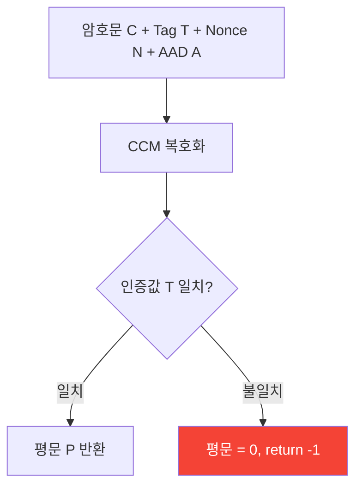

# [CCM.002] Nonce 유일성

## 1. 보안요구사항 개요
CCM 모드에서 동일한 키로 Nonce를 재사용하면 기밀성과 인증 모두가 파괴된다. 매 암호화 호출마다 반드시 고유한 Nonce를 사용해야 하며, 복호화 시 인증값 검증에 실패하면 -1을 반환하고 복호화된 평문을 0으로 채워야 한다.

## 2. 상세 요구사항 (Requirements)
- **CCM-001**: 동일한 키로 Nonce를 재사용하는 것은 절대 금지된다. Nonce 재사용 시 CTR 키스트림이 반복되어 기밀성이 파괴되고, CBC-MAC의 인증 보장도 무력화된다. 복호화 시 인증값 검증에 실패하면 -1을 반환하고, 복호화된 평문 버퍼를 0으로 채워야 한다.

## 3. 작성 예시 (Examples)
### 3.1. Nonce 재사용의 위험성

| 상황 | 결과 |
| :--- | :--- |
| 같은 Key, 같은 Nonce로 P1 암호화 | (C1, T1) 생성 |
| 같은 Key, 같은 Nonce로 P2 암호화 | (C2, T2) 생성 |
| 공격자가 C1 ⊕ C2 계산 | P1 ⊕ P2 노출 (기밀성 파괴) |
| 추가적으로 | CBC-MAC 위조 가능 (인증 파괴) |

### 3.2. 올바른 Nonce 관리

```c
/* 올바른 예: 매 호출마다 고유 Nonce 생성 */
uint8_t nonce[12];
drbg_generate(nonce, 12);  /* DRBG로 고유 Nonce 생성 */

lea_ccm_enc(ct, tag, pt, pt_len,
            nonce, 12, aad, aad_len,
            tag_len, &key);
```

### 3.3. 인증 실패 처리

```c
/* 복호화 시 인증 검증 실패 처리 */
int ret = lea_ccm_dec(pt_out, ct, ct_len,
                      nonce, 12, aad, aad_len,
                      tag, tag_len, &key);

if (ret != 0) {
    memset(pt_out, 0, ct_len);  /* 평문 폐기 (0으로 채움) */
    return -1;                   /* 일반적 오류 코드만 반환 */
}
```

### 3.4. 서술형 예시
"본 구현은 CCM 모드 암호화 시 매번 DRBG로 12바이트 고유 Nonce를 생성하며, 복호화 시 인증값이 일치하지 않으면 평문 버퍼를 0으로 채우고 -1을 반환하여 위조된 데이터의 사용을 원천 차단한다."

## 4. 구조도 및 시각 자료 (Visuals)
### 4.1. 인증 검증 흐름 (Mermaid)



### 4.2. 구조 설명
- 복호화 과정에서 재계산된 인증값과 수신된 인증값을 비교한다.
- 불일치 시 복호화된 평문은 신뢰할 수 없으므로 반드시 폐기(0으로 채움)한다.

## 5. 해설 및 증빙 가이드 (Guide)
- **Nonce 재사용 금지는 CCM의 핵심 전제**: Nonce가 한 번이라도 재사용되면 CCM의 모든 보안 보장(기밀성 + 인증)이 동시에 무너진다.
- **평문 폐기의 중요성**: 인증 실패 시 복호화된 데이터를 반환하면, 공격자가 이를 이용하여 시스템을 공격할 수 있다. 반드시 0으로 채워야 한다.
- **Nonce 생성 전략**: DRBG 사용이 가장 안전하며, 순차 카운터를 사용할 경우 키 변경 시 카운터를 반드시 초기화해야 한다.
- **증빙 시 주안점**: ① Nonce가 매 호출마다 변경되는지, ② 인증 실패 시 평문을 0으로 채우는지, ③ 오류 코드가 -1(일반값)인지 확인한다.
- **참고 규격**: 암호모듈 구현안내서 §2.2.6.
