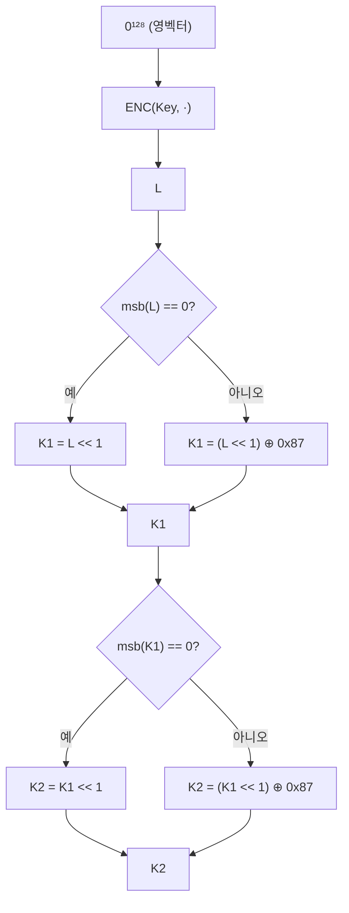

# [CMAC.001] CMAC 보조키 생성

## 1. 보안요구사항 개요
CMAC(Cipher-based Message Authentication Code) 구현 시 비밀키로부터 보조 비밀키 K1, K2를 생성해야 한다. 보조키는 블록 크기에 따른 조건 분기(왼쪽 시프트 << 1)와 조건부 XOR로 계산되며, `lea_cmac_init` 함수에서 라운드키와 함께 사전 계산된다.

## 2. 상세 요구사항 (Requirements)
- **CMAC-001**: CMAC 구현 시 보조 비밀키 K1, K2를 다음 절차로 생성해야 한다:
  1. L = ENC(Key, 0¹²⁸) — 영벡터를 암호화
  2. K1 = (msb(L)==0) ? L<<1 : (L<<1) ⊕ Rb — Rb는 128비트 블록의 경우 0x87
  3. K2 = (msb(K1)==0) ? K1<<1 : (K1<<1) ⊕ Rb
  `lea_cmac_init`에서 라운드키와 보조키를 함께 계산한다.

## 3. 작성 예시 (Examples)
### 3.1. 보조키 생성 수식

| 단계 | 수식 | 설명 |
| :--- | :--- | :--- |
| 1. L 계산 | L = ENC(Key, 0¹²⁸) | 영벡터(0) 암호화 |
| 2. K1 생성 | msb(L)==0 → K1 = L<<1 | 최상위 비트가 0이면 1비트 좌시프트 |
|  | msb(L)==1 → K1 = (L<<1) ⊕ 0x87 | 최상위 비트가 1이면 좌시프트 후 XOR |
| 3. K2 생성 | K1에 동일 규칙 적용 | K1 기반으로 동일 절차 |

### 3.2. 코드 예시

```c
/* CMAC 보조키 생성 (128비트 블록) */
#define CMAC_RB 0x87

void cmac_generate_subkeys(const LEA_KEY *key, uint8_t *K1, uint8_t *K2) {
    uint8_t L[16] = {0};
    uint8_t tmp[16];

    /* Step 1: L = ENC(Key, 0^128) */
    lea_encrypt(L, L, key);

    /* Step 2: K1 생성 */
    left_shift_one_bit(tmp, L);
    if (L[0] & 0x80)
        tmp[15] ^= CMAC_RB;
    memcpy(K1, tmp, 16);

    /* Step 3: K2 생성 */
    left_shift_one_bit(tmp, K1);
    if (K1[0] & 0x80)
        tmp[15] ^= CMAC_RB;
    memcpy(K2, tmp, 16);
}
```

### 3.3. 서술형 예시
"본 구현은 CMAC 운영 시 비밀키로부터 보조키 K1, K2를 생성한다. 영벡터를 LEA로 암호화한 값 L의 최상위 비트에 따라 조건 분기하여 1비트 좌시프트 및 다항식 XOR(Rb=0x87)을 적용한다."

## 4. 구조도 및 시각 자료 (Visuals)
### 4.1. 보조키 생성 흐름 (Mermaid)



### 4.2. 구조 설명
- Rb(다항식 상수)는 블록 크기 128비트의 경우 0x87이다.
- 보조키 생성은 키 설정 시 한 번만 수행하며, 이후 모든 MAC 연산에서 재사용한다.

## 5. 해설 및 증빙 가이드 (Guide)
- **Rb 상수**: LEA의 블록 크기는 128비트이므로 Rb = 0x87을 사용한다. 64비트 블록 암호의 경우 Rb = 0x1B이지만 LEA에는 해당하지 않는다.
- **좌시프트 구현 주의**: 128비트(16바이트) 전체에 대해 1비트 좌시프트를 수행해야 하므로, 바이트 경계에서의 캐리 전파를 올바르게 구현해야 한다.
- **lea_cmac_init 사용**: LEA 소스코드에서는 `lea_cmac_init` 함수가 라운드키와 보조키를 함께 계산하므로, 별도 구현 없이 표준 API를 사용하는 것이 권장된다.
- **증빙 시 주안점**: 보조키 생성 로직에서 msb 확인과 XOR 조건 분기가 올바른지, Rb 상수가 0x87인지 확인한다.
- **참고 규격**: 암호알고리즘 구현안내서 Part 2 4장.
