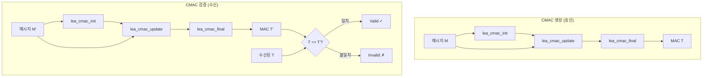

# [CMAC.002] CMAC 검증 로직

## 1. 보안요구사항 개요
CMAC 검증은 수신된 메시지로부터 MAC 값을 재계산한 후, 송신자가 첨부한 MAC(T) 값과 비교하는 과정이다. 두 값이 일치하면 메시지의 무결성과 인증이 확인되고, 불일치 시 Invalid를 출력한다. `lea_cmac_update`로 데이터를 입력하고 `lea_cmac_final`로 최종 MAC을 계산한다.

## 2. 상세 요구사항 (Requirements)
- **CMAC-002**: CMAC 검증 시 수신 메시지로부터 `lea_cmac_update` → `lea_cmac_final` 순서로 MAC을 재계산하고, 수신된 MAC(T) 값과 상수 시간(constant-time) 비교를 수행해야 한다. 불일치 시 "Invalid"를 반환하며, 일치하는 바이트 수나 위치 등을 외부에 노출해서는 안 된다.

## 3. 작성 예시 (Examples)
### 3.1. CMAC API 호출 순서

| 순서 | API | 설명 |
| :--- | :--- | :--- |
| 1 | `lea_cmac_init(ctx, key, key_len)` | CMAC 컨텍스트 초기화 (라운드키 + 보조키) |
| 2 | `lea_cmac_update(ctx, msg, msg_len)` | 메시지 데이터 입력 (여러 번 호출 가능) |
| 3 | `lea_cmac_final(ctx, mac, mac_len)` | 최종 MAC 값 계산 |
| 4 | 상수 시간 비교 | 재계산된 MAC과 수신된 MAC 비교 |

### 3.2. 코드 예시

```c
/* CMAC 생성 */
LEA_CMAC_CTX ctx;
uint8_t mac[16];

lea_cmac_init(&ctx, mk, mk_len);
lea_cmac_update(&ctx, message, msg_len);
lea_cmac_final(&ctx, mac, 16);

/* CMAC 검증 */
uint8_t mac_recv[16] = { /* 수신된 MAC */ };
uint8_t mac_calc[16];

lea_cmac_init(&ctx, mk, mk_len);
lea_cmac_update(&ctx, message, msg_len);
lea_cmac_final(&ctx, mac_calc, 16);

/* 상수 시간 비교 */
int diff = 0;
for (int i = 0; i < 16; i++)
    diff |= mac_calc[i] ^ mac_recv[i];

if (diff != 0) {
    return -1;  /* Invalid */
}
```

### 3.3. 서술형 예시
"본 구현은 CMAC 검증 시 수신된 메시지에 대해 lea_cmac_update, lea_cmac_final 순서로 MAC을 재계산하고, 수신된 MAC 값과 상수 시간 비교를 수행한다. 불일치 시 Invalid(-1)를 반환하며, 타이밍 부채널 공격을 방지한다."

## 4. 구조도 및 시각 자료 (Visuals)
### 4.1. CMAC 생성 및 검증 흐름 (Mermaid)



### 4.2. 구조 설명
- `lea_cmac_update`는 스트리밍 방식으로 여러 번 호출하여 대용량 데이터를 처리할 수 있다.
- `lea_cmac_final`은 마지막 블록에 K1 또는 K2를 XOR하여 최종 MAC을 계산한다.

## 5. 해설 및 증빙 가이드 (Guide)
- **상수 시간 비교 필수**: `memcmp`는 첫 번째 불일치 바이트에서 즉시 반환하므로 타이밍 부채널 공격에 취약하다. 반드시 전체 바이트를 비교하는 상수 시간 비교를 사용해야 한다.
- **K1 vs K2 선택**: 마지막 블록이 완전한 블록(16바이트)이면 K1을 XOR하고, 불완전한 블록이면 10* 패딩 후 K2를 XOR한다.
- **스트리밍 지원**: `lea_cmac_update`를 여러 번 호출하여 대용량 파일의 MAC을 메모리 부담 없이 계산할 수 있다.
- **증빙 시 주안점**: ① `lea_cmac_init` → `update` → `final` 호출 순서, ② 상수 시간 비교 구현, ③ Invalid 시 적절한 오류 처리를 확인한다.
- **참고 규격**: 암호알고리즘 구현안내서 Part 2 4장.
