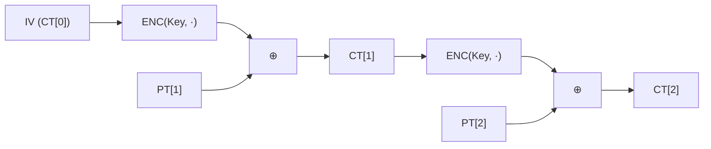

# [CFB.001] CFB 기본 구조

## 1. 보안요구사항 개요
CFB(Cipher Feedback) 모드는 이전 암호문 블록을 ENC 함수의 입력으로 사용하고, 그 출력과 평문을 XOR하여 암호문을 생성하는 자기 동기(Self-synchronizing) 스트림 암호 방식의 운영모드이다. CFB-128은 128비트 단위로 피드백하며, IV(16바이트)가 필요하고 임의 길이 평문을 허용한다.

## 2. 상세 요구사항 (Requirements)
- CFB-128 암호화 수식: `CT[i] = PT[i] ⊕ ENC(Key, CT[i-1])`, `CT[0] = IV`
- CFB-128 복호화 수식: `PT[i] = CT[i] ⊕ ENC(Key, CT[i-1])`, `CT[0] = IV`
- 암호화와 복호화 모두 ENC 함수만 사용한다 (DEC 불필요).
- IV는 16바이트이며 DRBG로 생성해야 한다.
- LEA 표준 API: `lea_cfb128_enc(ct, pt, pt_len, iv, key)`, `lea_cfb128_dec(pt, ct, ct_len, iv, key)`.

## 3. 작성 예시 (Examples)
### 3.1. 표 형식 예시

| 항목 | 내용 |
| :--- | :--- |
| 모드 명칭 | CFB-128 (Cipher Feedback, 128비트 단위) |
| 암호화 수식 | CT[i] = PT[i] ⊕ ENC(Key, CT[i-1]) |
| 복호화 수식 | PT[i] = CT[i] ⊕ ENC(Key, CT[i-1]) |
| DEC 함수 필요 여부 | 불필요 (ENC만 사용) |
| IV 길이 | 16바이트 (128비트) |
| 평문 길이 제약 | 임의 길이 허용 |

### 3.2. API 명세

| 함수명 | 프로토타입 | 설명 |
| :--- | :--- | :--- |
| lea_cfb128_enc | `void lea_cfb128_enc(unsigned char *ct, const unsigned char *pt, unsigned int pt_len, unsigned char *iv, const LEA_KEY *key)` | CFB-128 암호화 |
| lea_cfb128_dec | `void lea_cfb128_dec(unsigned char *pt, const unsigned char *ct, unsigned int ct_len, unsigned char *iv, const LEA_KEY *key)` | CFB-128 복호화 |

### 3.3. 코드 예시

```c
#include "lea.h"

LEA_KEY key;
uint8_t mk[16] = { /* 비밀키 */ };
uint8_t iv[16];
uint8_t pt[100] = { /* 임의 길이 평문 */ };
uint8_t ct[100];

lea_set_key(&key, mk, 16);
drbg_generate(iv, 16);

/* CFB-128 암호화 (임의 길이 허용) */
lea_cfb128_enc(ct, pt, 100, iv, &key);
```

### 3.4. 서술형 예시
"본 구현은 CFB-128 운영모드를 사용하여 이전 암호문 블록을 LEA ENC 함수의 입력으로 피드백하고, 출력과 평문을 XOR하여 암호문을 생성한다. DEC 함수는 사용하지 않으며, 임의 길이의 평문을 처리할 수 있다."

## 4. 구조도 및 시각 자료 (Visuals)
### 4.1. CFB-128 암호화 흐름 (Mermaid)



### 4.2. CBC와의 비교

| 항목 | CBC | CFB-128 |
| :--- | :--- | :--- |
| XOR 위치 | ENC 이전 (PT ⊕ CT[i-1]) | ENC 이후 (ENC(CT[i-1]) ⊕ PT) |
| DEC 함수 필요 | 복호화 시 필요 | 불필요 |
| 평문 길이 제약 | 16의 배수 | 임의 길이 |

## 5. 해설 및 증빙 가이드 (Guide)
- **ENC만 사용**: CFB는 CTR과 마찬가지로 암복호화 모두 ENC만 사용한다. DEC 함수를 구현하거나 호출할 필요가 없다.
- **자기 동기 특성**: 전송 중 비트 오류 발생 시 이후 1~2블록 후 자동 복구되는 특성이 있다.
- **CBC와의 차이**: CBC는 XOR 후 ENC이지만, CFB는 ENC 후 XOR이다. 이 차이가 CFB에서 DEC가 불필요한 이유이다.
- **증빙 시 주안점**: `lea_cfb128_enc`/`lea_cfb128_dec` 표준 API 사용 여부, IV 16바이트 준수, DEC 미사용을 확인한다.
- **참고 규격**: 블록암호 LEA 소스코드 사용 매뉴얼(v1.0) §4.3.8, §4.3.9.
