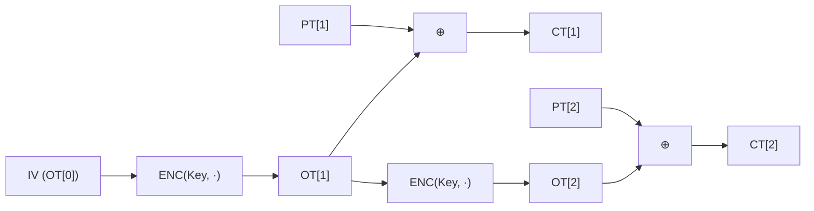

# [OFB.001] OFB 기본 구조

## 1. 보안요구사항 개요
OFB(Output Feedback) 모드는 ENC 함수의 출력을 다시 ENC의 입력으로 피드백하여 키스트림을 생성하고, 이를 평문과 XOR하여 암호문을 만드는 동기식 스트림 암호 방식의 운영모드이다. 암호화와 복호화의 구조가 완전히 동일하며, IV는 16바이트, 임의 길이 평문을 허용한다.

## 2. 상세 요구사항 (Requirements)
- OFB 수식:
  - 키스트림 생성: `OT[i] = ENC(Key, OT[i-1])`, `OT[0] = IV`
  - 암호화: `CT[i] = PT[i] ⊕ OT[i]`
  - 복호화: `PT[i] = CT[i] ⊕ OT[i]` (암호화와 동일 구조)
- 암호화와 복호화 모두 ENC 함수만 사용한다 (DEC 불필요).
- IV는 16바이트이며 DRBG로 생성해야 한다.
- LEA 표준 API: `lea_ofb_enc(ct, pt, pt_len, iv, key)`, `lea_ofb_dec(pt, ct, ct_len, iv, key)`.

## 3. 작성 예시 (Examples)
### 3.1. 표 형식 예시

| 항목 | 내용 |
| :--- | :--- |
| 모드 명칭 | OFB (Output Feedback) |
| 키스트림 생성 | OT[i] = ENC(Key, OT[i-1]), OT[0] = IV |
| 암호화 수식 | CT[i] = PT[i] ⊕ OT[i] |
| 복호화 수식 | PT[i] = CT[i] ⊕ OT[i] (동일) |
| DEC 함수 필요 여부 | 불필요 (ENC만 사용) |
| IV 길이 | 16바이트 (128비트) |
| 평문 길이 제약 | 임의 길이 허용 |

### 3.2. API 명세

| 함수명 | 프로토타입 | 설명 |
| :--- | :--- | :--- |
| lea_ofb_enc | `void lea_ofb_enc(unsigned char *ct, const unsigned char *pt, unsigned int pt_len, unsigned char *iv, const LEA_KEY *key)` | OFB 암호화 |
| lea_ofb_dec | `void lea_ofb_dec(unsigned char *pt, const unsigned char *ct, unsigned int ct_len, unsigned char *iv, const LEA_KEY *key)` | OFB 복호화 |

### 3.3. 코드 예시

```c
#include "lea.h"

LEA_KEY key;
uint8_t mk[16] = { /* 비밀키 */ };
uint8_t iv[16];
uint8_t pt[100] = { /* 임의 길이 평문 */ };
uint8_t ct[100];

lea_set_key(&key, mk, 16);
drbg_generate(iv, 16);

/* OFB 암호화 (임의 길이 허용) */
lea_ofb_enc(ct, pt, 100, iv, &key);
```

### 3.4. 서술형 예시
"본 구현은 OFB 운영모드를 사용하여 ENC 출력을 다시 ENC 입력으로 피드백하는 방식으로 키스트림을 생성하고, 평문과 XOR하여 암호문을 생성한다. 암복호화가 동일 구조이며, DEC 함수는 사용하지 않는다."

## 4. 구조도 및 시각 자료 (Visuals)
### 4.1. OFB 모드 흐름 (Mermaid)



### 4.2. CFB와의 비교

| 항목 | CFB-128 | OFB |
| :--- | :--- | :--- |
| ENC 입력 | 이전 암호문 CT[i-1] | 이전 ENC 출력 OT[i-1] |
| 키스트림 의존성 | 평문/암호문에 의존 | 평문/암호문에 독립 |
| 비트 오류 전파 | 1~2블록 | 해당 비트만 |
| 병렬 처리 | 복호화만 | 불가 |

### 4.3. 구조 설명
- 키스트림이 평문/암호문과 완전히 독립적이므로, 키스트림을 사전 계산할 수 있다.
- 전송 중 비트 오류는 해당 비트에만 영향을 미친다 (오류 전파 없음).
- 반면, 비트 삽입/삭제 시에는 동기가 깨져 이후 모든 블록에 영향을 준다.

## 5. 해설 및 증빙 가이드 (Guide)
- **ENC만 사용**: OFB는 CTR, CFB와 마찬가지로 ENC 함수만으로 암복호화를 수행한다.
- **키스트림 독립성**: OFB의 키스트림은 Key와 IV만으로 결정되므로, 평문을 알기 전에 사전 생성이 가능하다. 이는 실시간 암호화에 유리하다.
- **CFB와의 핵심 차이**: CFB는 암호문을 피드백하지만, OFB는 ENC 출력을 피드백한다. 따라서 OFB의 키스트림은 데이터와 무관하다.
- **IV 재사용 금지**: 동일 키로 IV를 재사용하면 동일 키스트림이 생성되어 CTR과 같은 보안 문제가 발생한다.
- **증빙 시 주안점**: `lea_ofb_enc`/`lea_ofb_dec` 표준 API 사용 여부, IV 16바이트 준수, IV 유일성 보장을 확인한다.
- **참고 규격**: 블록암호 LEA 소스코드 사용 매뉴얼(v1.0) §4.3.10, §4.3.11.
