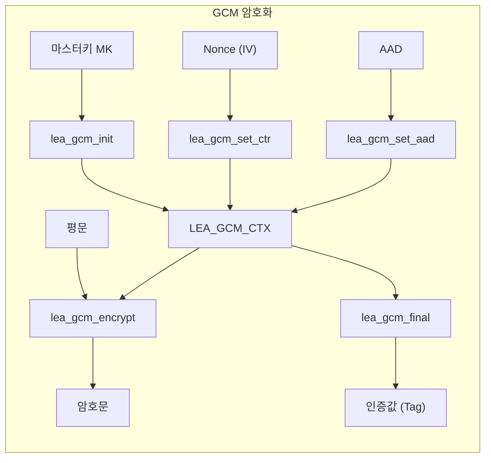

# [GCM.001] GCM 기본 구조

## 1. 보안요구사항 개요
GCM(Galois/Counter Mode)은 블록암호 LEA에 대한 인증 암호화(Authenticated Encryption) 운영모드로, 기밀성과 무결성을 동시에 보장한다. Nonce, AAD(Associated Authenticated Data), 평문을 입력받아 암호문과 인증값(Tag)을 생성하며, 인증값 길이는 4~16바이트를 지원한다. 내부적으로 CTR 모드 암호화와 GHASH 기반 인증을 결합한 구조이다.

## 2. 상세 요구사항 (Requirements)
- **GCM 인증 암호화 구조**: GCM은 Nonce + AAD + 평문을 입력으로 받아 암호문 + 인증값(Tag)을 출력해야 한다. 인증값 길이는 4~16바이트 범위에서 선택 가능하다.
- **복호화 시 인증값 검증**: 복호화 과정에서 수신된 인증값과 계산된 인증값이 불일치할 경우 함수는 `-1`을 반환하고, 복호화된 평문은 사용하지 않아야 한다.
- **GHASH 가속**: PCLMULQDQ 명령어를 활용한 GHASH 연산 가속을 지원하여 인증값 생성 성능을 향상시킬 수 있다.
- **API 규격**: 아래 6개 함수로 GCM 운영모드의 전체 생명주기를 관리한다.

| 함수명 | 기능 |
| :--- | :--- |
| `lea_gcm_init(ctx, mk, mk_len)` | GCM 컨텍스트 초기화 및 마스터키 설정 |
| `lea_gcm_set_ctr(ctx, iv, iv_len)` | Nonce(IV) 설정 및 카운터 초기화 |
| `lea_gcm_set_aad(ctx, aad, aad_len)` | AAD(부가 인증 데이터) 설정 |
| `lea_gcm_encrypt(ctx, ct, pt, pt_len)` | 평문 암호화 |
| `lea_gcm_decrypt(ctx, pt, ct, ct_len)` | 암호문 복호화 |
| `lea_gcm_final(ctx, tag, tag_len)` | 인증값(Tag) 생성 또는 검증 완료 |

## 3. 작성 예시 (Examples)
### 3.1. GCM 암호화 API 호출 순서 (C 코드)

```c
LEA_GCM_CTX ctx;
unsigned char mk[16] = { /* 외부 주입 키 */ };
unsigned char iv[12] = { /* 96비트 Nonce */ };
unsigned char aad[] = { /* 부가 인증 데이터 */ };
unsigned char pt[] = { /* 평문 */ };
unsigned char ct[sizeof(pt)];
unsigned char tag[16];

lea_gcm_init(&ctx, mk, 16);
lea_gcm_set_ctr(&ctx, iv, 12);
lea_gcm_set_aad(&ctx, aad, sizeof(aad));
lea_gcm_encrypt(&ctx, ct, pt, sizeof(pt));
lea_gcm_final(&ctx, tag, 16);
```

### 3.2. GCM 복호화 및 인증 검증 (C 코드)

```c
LEA_GCM_CTX ctx;
unsigned char pt_out[sizeof(ct)];
unsigned char tag_recv[16] = { /* 수신된 인증값 */ };
int ret;

lea_gcm_init(&ctx, mk, 16);
lea_gcm_set_ctr(&ctx, iv, 12);
lea_gcm_set_aad(&ctx, aad, sizeof(aad));
lea_gcm_decrypt(&ctx, pt_out, ct, sizeof(ct));
ret = lea_gcm_final(&ctx, tag_recv, 16);

if (ret == -1) {
    /* 인증값 불일치 — 복호화 결과 사용 금지 */
    memset(pt_out, 0, sizeof(pt_out));
}
```

### 3.3. 서술형 예시
"본 구현은 LEA-GCM 인증 암호화 모드를 사용한다. 96비트 Nonce와 AAD를 설정한 후 평문을 암호화하며, `lea_gcm_final`을 통해 16바이트 인증값(Tag)을 생성한다. 복호화 시 인증값이 불일치하면 `-1`을 반환하고 평문 버퍼를 제로화한다."

### 3.4. 인증값 길이별 보안 강도

| 인증값 길이 (바이트) | 인증값 길이 (비트) | 비고 |
| :--- | :--- | :--- |
| 16 | 128 | 권장 (최대 보안 강도) |
| 12 | 96 | 일반적 사용 |
| 8 | 64 | 최소 권장 |
| 4 | 32 | 제한적 환경 전용 |

## 4. 구조도 및 시각 자료 (Visuals)
### 4.1. GCM 암호화 흐름도 (Mermaid)



### 4.2. GCM 내부 구조 설명
- **CTR 암호화 경로**: Nonce로부터 카운터 블록을 생성하고 LEA 암호화를 수행한 후 평문과 XOR하여 암호문을 생성한다.
- **GHASH 인증 경로**: AAD와 암호문을 GF(2¹²⁸) 위의 다항식 곱셈(GHASH)으로 누적 해싱하여 인증값을 계산한다.
- **PCLMULQDQ 가속**: x86 환경에서 GHASH의 캐리리스 곱셈(Carry-less Multiplication)을 하드웨어 가속으로 처리한다.

## 5. 해설 및 증빙 가이드 (Guide)
- **Nonce 유일성**: 동일 키에서 Nonce가 재사용되면 기밀성과 인증이 모두 파괴된다. Nonce는 반드시 유일하게 관리해야 하며, 카운터 또는 CSPRNG로 생성한다.
- **인증값 검증 필수**: `lea_gcm_final`의 반환값이 `-1`인 경우 복호화된 데이터를 절대 사용하지 않아야 한다. 이를 무시하면 위조된 데이터를 처리하는 보안 사고로 이어진다.
- **AAD 활용**: 헤더, 프로토콜 버전 등 암호화하지 않되 무결성을 보장해야 하는 데이터를 AAD로 전달한다.
- **증빙 시 주안점**: 소스 코드에서 `lea_gcm_final` 반환값 검사 로직이 존재하는지 확인하고, 인증 실패 시 평문 버퍼가 제로화되는지 검증한다.
- **참고 규격**: 블록암호 LEA 소스코드 사용 매뉴얼(v1.0) §4.3.18~§4.3.23.
