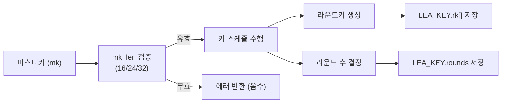

# [API.001] 핵심 함수명 규격

## 1. 보안요구사항 개요
LEA 블록암호의 핵심 API는 키 설정 함수 `lea_set_key`이며, `LEA_KEY` 구조체에 라운드키와 라운드 수 정보를 저장한다. 마스터키 길이는 16, 24, 32바이트만 허용되며, 이외의 값은 에러로 처리해야 한다.

## 2. 상세 요구사항 (Requirements)
- **LEA-051**: 키 설정 함수는 `lea_set_key(LEA_KEY *key, const unsigned char *mk, unsigned int mk_len)` 시그니처를 준수해야 한다. 함수 호출 시 마스터키로부터 라운드키를 생성하여 `LEA_KEY` 구조체에 저장한다.
- **LEA-052**: `LEA_KEY` 구조체는 라운드키 배열과 라운드 수 정보를 포함하여 `struct` 또는 `typedef`로 정의되어야 한다. 마스터키 길이(`mk_len`)는 16(128비트), 24(192비트), 32(256비트)만 유효하며, 그 외 값이 입력되면 에러를 반환해야 한다.

## 3. 작성 예시 (Examples)
### 3.1. 함수 시그니처

```c
/**
 * @brief LEA 마스터키로부터 라운드키를 생성하여 LEA_KEY에 저장
 * @param key    라운드키가 저장될 LEA_KEY 구조체 포인터
 * @param mk     마스터키 바이트 배열
 * @param mk_len 마스터키 길이 (16, 24, 32)
 * @return 성공 시 0, 에러 시 음수
 */
int lea_set_key(LEA_KEY *key, const unsigned char *mk, unsigned int mk_len);
```

### 3.2. LEA_KEY 구조체 정의 예시

```c
typedef struct {
    unsigned int rk[192];  /* 라운드키 배열 (최대 32라운드 × 6워드) */
    unsigned int rounds;   /* 라운드 수: 24(128비트), 28(192비트), 32(256비트) */
} LEA_KEY;
```

### 3.3. 키 설정 호출 예시

```c
LEA_KEY key;
unsigned char mk[32] = { /* 외부에서 주입된 256비트 마스터키 */ };

int ret = lea_set_key(&key, mk, 32);
if (ret < 0) {
    /* 에러 처리: 잘못된 키 길이 등 */
}
```

### 3.4. 키 길이별 라운드 수

| 마스터키 길이 (바이트) | 마스터키 길이 (비트) | 라운드 수 (Nr) |
| :--- | :--- | :--- |
| 16 | 128 | 24 |
| 24 | 192 | 28 |
| 32 | 256 | 32 |

### 3.5. 서술형 예시
"본 구현은 `lea_set_key` 함수를 통해 마스터키를 입력받고 `LEA_KEY` 구조체에 라운드키를 생성·저장한다. 마스터키 길이는 16, 24, 32바이트만 허용하며, 유효하지 않은 길이 입력 시 음수를 반환한다."

## 4. 구조도 및 시각 자료 (Visuals)
### 4.1. 키 설정 흐름도 (Mermaid)



### 4.2. 구조 설명
- `lea_set_key`는 모든 운영모드(ECB, CBC, CTR, GCM 등)에서 가장 먼저 호출되는 핵심 초기화 함수이다.
- `LEA_KEY` 구조체는 이후 암호화/복호화 함수에 전달되어 라운드키를 참조하는 데 사용된다.

## 5. 해설 및 증빙 가이드 (Guide)
- **키 길이 검증 필수**: `mk_len`이 16, 24, 32가 아닌 값일 때 정상 동작하지 않도록 반드시 입력 검증 로직이 존재해야 한다.
- **구조체 정의 확인**: `LEA_KEY`가 `struct` 또는 `typedef struct`로 정의되어 있고, 라운드키 배열과 라운드 수 필드를 포함하는지 확인한다.
- **증빙 시 주안점**: 소스 코드에서 `lea_set_key` 함수명과 시그니처가 규격과 일치하는지, `LEA_KEY` 구조체가 올바르게 정의되어 있는지 검증한다.
- **참고 규격**: 블록암호 LEA 소스코드 사용 매뉴얼(v1.0) §4.3.1.
