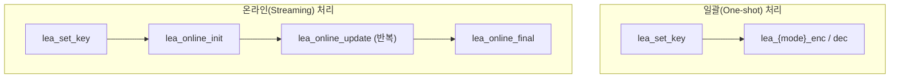

# [API.002] 모드별 함수명 규격

## 1. 보안요구사항 개요
LEA 소스코드의 운영모드별 암호화·복호화 함수는 `lea_{mode}_{enc|dec}` 패턴의 명명 규칙을 따라야 하며, 온라인(스트리밍) 처리 시에는 `lea_online_init`, `lea_online_update`, `lea_online_final` 패턴을 사용한다. 함수명의 일관성은 검증 시스템과의 호환성 및 코드 가독성을 보장한다.

## 2. 상세 요구사항 (Requirements)
- **LEA-053**: 각 운영모드의 암호화·복호화 함수는 아래 명명 규칙을 엄격히 준수해야 한다. 함수명이 규격과 불일치하면 검증 시스템(MOVS)과의 연동에 실패할 수 있다.

### 2.1. 일괄(One-shot) 처리 함수명

| 운영모드 | 암호화 함수 | 복호화 함수 |
| :--- | :--- | :--- |
| ECB | `lea_ecb_enc` | `lea_ecb_dec` |
| CBC | `lea_cbc_enc` | `lea_cbc_dec` |
| CTR | `lea_ctr_enc` | `lea_ctr_dec` |
| CFB128 | `lea_cfb128_enc` | `lea_cfb128_dec` |
| OFB | `lea_ofb_enc` | `lea_ofb_dec` |

### 2.2. 온라인(스트리밍) 처리 함수명

| 함수명 | 역할 |
| :--- | :--- |
| `lea_online_init` | 온라인 모드 컨텍스트 초기화 |
| `lea_online_update` | 데이터 청크 단위 처리 |
| `lea_online_final` | 잔여 데이터 처리 및 종료 |

## 3. 작성 예시 (Examples)
### 3.1. 일괄 처리 함수 시그니처 (C 코드)

```c
/* ECB 모드 */
void lea_ecb_enc(unsigned char *ct, const unsigned char *pt,
                 unsigned int pt_len, const LEA_KEY *key);
void lea_ecb_dec(unsigned char *pt, const unsigned char *ct,
                 unsigned int ct_len, const LEA_KEY *key);

/* CBC 모드 */
void lea_cbc_enc(unsigned char *ct, const unsigned char *pt,
                 unsigned int pt_len, const unsigned char *iv,
                 const LEA_KEY *key);
void lea_cbc_dec(unsigned char *pt, const unsigned char *ct,
                 unsigned int ct_len, const unsigned char *iv,
                 const LEA_KEY *key);

/* CTR 모드 */
void lea_ctr_enc(unsigned char *ct, const unsigned char *pt,
                 unsigned int pt_len, const unsigned char *ctr,
                 const LEA_KEY *key);
void lea_ctr_dec(unsigned char *pt, const unsigned char *ct,
                 unsigned int ct_len, const unsigned char *ctr,
                 const LEA_KEY *key);

/* CFB128 모드 */
void lea_cfb128_enc(unsigned char *ct, const unsigned char *pt,
                    unsigned int pt_len, const unsigned char *iv,
                    const LEA_KEY *key);
void lea_cfb128_dec(unsigned char *pt, const unsigned char *ct,
                    unsigned int ct_len, const unsigned char *iv,
                    const LEA_KEY *key);

/* OFB 모드 */
void lea_ofb_enc(unsigned char *ct, const unsigned char *pt,
                 unsigned int pt_len, const unsigned char *iv,
                 const LEA_KEY *key);
void lea_ofb_dec(unsigned char *pt, const unsigned char *ct,
                 unsigned int ct_len, const unsigned char *iv,
                 const LEA_KEY *key);
```

### 3.2. 온라인 처리 함수 시그니처 (C 코드)

```c
int lea_online_init(LEA_ONLINE_CTX *ctx, int mode, const LEA_KEY *key,
                    const unsigned char *iv);
int lea_online_update(LEA_ONLINE_CTX *ctx, unsigned char *out,
                      const unsigned char *in, unsigned int in_len);
int lea_online_final(LEA_ONLINE_CTX *ctx, unsigned char *out);
```

### 3.3. 서술형 예시
"본 구현은 LEA 운영모드별 함수명으로 `lea_ecb_enc`, `lea_cbc_dec` 등 `lea_{mode}_{enc|dec}` 패턴을 사용하며, 대용량 데이터의 스트리밍 처리를 위해 `lea_online_init`, `lea_online_update`, `lea_online_final`을 제공한다."

## 4. 구조도 및 시각 자료 (Visuals)
### 4.1. API 호출 패턴 비교 (Mermaid)



### 4.2. 구조 설명
- **일괄 처리**: 전체 평문/암호문이 메모리에 있을 때 한 번의 함수 호출로 처리한다.
- **온라인 처리**: 데이터를 청크 단위로 분할하여 `update`를 반복 호출하고, 마지막에 `final`로 잔여 데이터를 처리한다. 대용량 파일 암호화에 적합하다.

## 5. 해설 및 증빙 가이드 (Guide)
- **명명 규칙 엄수**: 함수명이 규격과 다르면(예: `lea_ECB_encrypt` 대신 `lea_ecb_enc`) 검증 시스템과의 자동 연동이 실패할 수 있으므로 소문자 및 약어 규칙을 정확히 따라야 한다.
- **CFB 모드 주의**: CFB 모드는 피드백 크기에 따라 `cfb1`, `cfb8`, `cfb128`로 세분화된다. 매뉴얼 규격에서는 `lea_cfb128_enc`를 기본으로 명시하고 있다.
- **증빙 시 주안점**: 소스 코드에서 각 운영모드 함수명이 위 표의 명명 규칙과 정확히 일치하는지 검증하고, 온라인 처리 함수의 `init → update → final` 호출 순서가 보장되는지 확인한다.
- **참고 규격**: 블록암호 LEA 소스코드 사용 매뉴얼(v1.0) §4.2.
