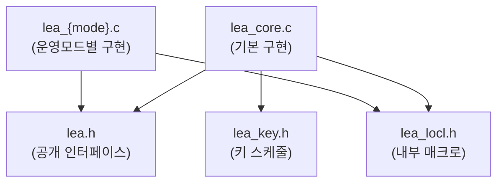

# [API.003] 구조체 및 타입

## 1. 보안요구사항 개요
LEA 소스코드는 `LEA_KEY`, `LEA_ONLINE_CTX`, `LEA_GCM_CTX`, `LEA_CMAC_CTX` 등 핵심 구조체와 `uint32_t` 기반의 32비트 워드 연산 타입을 사용한다. 이러한 타입과 구조체는 `lea.h`(공개 인터페이스), `lea_locl.h`(내부용), `lea_core.c`(기본 구현), `lea_key.h`(키 스케줄) 등의 소스 파일에 정의된다.

## 2. 상세 요구사항 (Requirements)
- **LEA-052**: LEA 구현에 필요한 핵심 구조체 및 타입이 아래와 같이 정의되어야 하며, 각 구조체는 해당 기능에 필요한 상태 정보를 완전히 포함해야 한다.

### 2.1. 핵심 구조체 목록

| 구조체 | 용도 | 주요 필드 |
| :--- | :--- | :--- |
| `LEA_KEY` | 라운드키 + 라운드 수 저장 | `rk[]` (라운드키 배열), `rounds` (라운드 수) |
| `LEA_ONLINE_CTX` | 온라인 암복호화 컨텍스트 | 모드, 키, IV, 버퍼, 버퍼 길이 |
| `LEA_GCM_CTX` | GCM 모드 컨텍스트 | 키, 카운터, GHASH 상태, AAD 길이 |
| `LEA_CMAC_CTX` | CMAC 컨텍스트 | 키, 서브키, 버퍼 |

### 2.2. 기본 타입

| 타입 | 크기 | 용도 |
| :--- | :--- | :--- |
| `uint32_t` | 32비트 | LEA의 모든 ARX 연산의 기본 워드 단위 |
| `unsigned char` | 8비트 | 바이트 단위 입출력 버퍼 |

### 2.3. 소스 파일 구성

| 파일명 | 역할 |
| :--- | :--- |
| `lea.h` | 공개 인터페이스 (함수 선언, 구조체 정의) |
| `lea_locl.h` | 내부용 헤더 (매크로, 내부 함수) |
| `lea_core.c` | 기본 암복호화 함수 구현 |
| `lea_key.h` | 키 스케줄 관련 정의 |

## 3. 작성 예시 (Examples)
### 3.1. 구조체 정의 코드 (C 코드)

```c
/* lea.h — 공개 인터페이스 */

typedef struct {
    unsigned int rk[192];   /* 라운드키 배열 */
    unsigned int rounds;    /* 라운드 수 (24/28/32) */
} LEA_KEY;

typedef struct {
    int mode;               /* 운영모드 (ECB, CBC, CTR 등) */
    LEA_KEY key;            /* 내부 키 정보 */
    unsigned char iv[16];   /* 초기벡터 */
    unsigned char buf[16];  /* 잔여 데이터 버퍼 */
    unsigned int buf_len;   /* 버퍼에 저장된 바이트 수 */
} LEA_ONLINE_CTX;

typedef struct {
    LEA_KEY key;            /* 내부 키 정보 */
    unsigned char ctr[16];  /* 카운터 블록 */
    unsigned char H[16];    /* GHASH 서브키 */
    unsigned char ghash[16];/* GHASH 누적값 */
    unsigned int aad_len;   /* AAD 길이 */
    unsigned int pt_len;    /* 처리된 평문 길이 */
} LEA_GCM_CTX;

typedef struct {
    LEA_KEY key;            /* 내부 키 정보 */
    unsigned char K1[16];   /* CMAC 서브키 1 */
    unsigned char K2[16];   /* CMAC 서브키 2 */
    unsigned char buf[16];  /* 데이터 버퍼 */
    unsigned int buf_len;   /* 버퍼에 저장된 바이트 수 */
} LEA_CMAC_CTX;
```

### 3.2. 표 형식 정리

| 구조체 | 파일 위치 | 가시성 |
| :--- | :--- | :--- |
| `LEA_KEY` | `lea.h` | 공개 (외부 호출자 접근 가능) |
| `LEA_ONLINE_CTX` | `lea.h` | 공개 |
| `LEA_GCM_CTX` | `lea.h` | 공개 |
| `LEA_CMAC_CTX` | `lea.h` | 공개 |

### 3.3. 서술형 예시
"본 구현은 `lea.h` 헤더 파일에 `LEA_KEY`, `LEA_ONLINE_CTX`, `LEA_GCM_CTX`, `LEA_CMAC_CTX` 구조체를 typedef로 정의하며, 32비트 워드 연산은 `uint32_t` 타입을 사용한다. 내부 구현 세부사항은 `lea_locl.h`에, 기본 암복호화 로직은 `lea_core.c`에 위치한다."

## 4. 구조도 및 시각 자료 (Visuals)
### 4.1. 소스 파일 의존성 구조 (Mermaid)



### 4.2. 구조 설명
- `lea.h`는 외부 사용자가 참조하는 유일한 공개 헤더로, 모든 구조체와 함수 선언을 포함한다.
- `lea_locl.h`는 내부 구현 전용 헤더로, 바이트 오더 변환 매크로 등 내부 유틸리티를 정의한다.
- `lea_key.h`는 키 스케줄 과정에서 사용하는 상수(delta 값 등)를 정의한다.

## 5. 해설 및 증빙 가이드 (Guide)
- **구조체 완전성**: 각 구조체가 해당 기능의 전체 상태를 유지하기에 충분한 필드를 포함하는지 확인한다. 예를 들어 `LEA_GCM_CTX`에 GHASH 상태가 누락되면 인증값 계산이 불가능하다.
- **타입 일관성**: 32비트 워드 연산에 `int`, `unsigned long` 등 플랫폼 의존적 타입 대신 `uint32_t`를 사용하는지 확인한다.
- **헤더 분리 원칙**: 공개 인터페이스(`lea.h`)와 내부 구현(`lea_locl.h`)이 분리되어 있는지 확인하여 정보 은닉 원칙이 지켜지는지 검증한다.
- **증빙 시 주안점**: 소스 코드에서 `LEA_KEY`, `LEA_ONLINE_CTX` 등 구조체가 정의되어 있고, 필수 필드(라운드키, 라운드 수 등)를 포함하는지 확인한다.
- **참고 규격**: 블록암호 LEA 소스코드 사용 매뉴얼(v1.0) §4.2.
