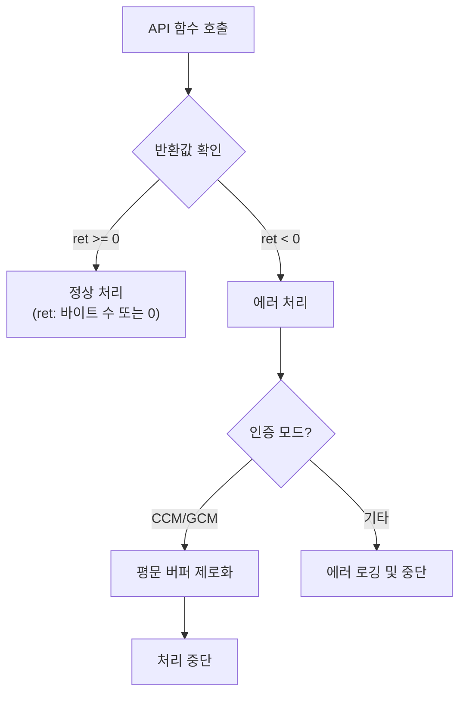

# [API.004] 에러 반환 규격

## 1. 보안요구사항 개요
LEA API 함수는 에러 발생 시 음수를 반환하고, 정상 동작 시 0 이상의 정수를 반환하는 통일된 에러 반환 규약을 따른다. 특히 인증 암호화 모드(CCM, GCM)에서 인증값 불일치 시 `-1`을 반환하며, 복호화된 평문을 0으로 채워 유출을 방지해야 한다.

## 2. 상세 요구사항 (Requirements)
- **LEA-044**: 모든 LEA API 함수는 아래의 에러 반환 규약을 준수해야 한다.

### 2.1. 함수별 반환값 규격

| 함수명 | 정상 반환값 | 에러 반환값 | 비고 |
| :--- | :--- | :--- | :--- |
| `lea_online_init` | 0 이상 | 음수 | 모드/키 설정 실패 |
| `lea_online_update` | `out`에 기록된 바이트 수 | 음수 | 입력 데이터 처리 실패 |
| `lea_online_final` | `out`에 기록된 바이트 수 | 음수 | 잔여 데이터 처리 실패 |
| `lea_ccm_dec` | 0 이상 | -1 | 인증값 불일치 시, 평문을 0으로 채움 |
| `lea_gcm_final` | 0 이상 | -1 | 복호화 시 인증값 불일치 |

## 3. 작성 예시 (Examples)
### 3.1. 온라인 처리 에러 검사 (C 코드)

```c
LEA_ONLINE_CTX ctx;
int ret;

ret = lea_online_init(&ctx, MODE_CBC_ENC, &key, iv);
if (ret < 0) {
    /* 초기화 실패 처리 */
    return ret;
}

ret = lea_online_update(&ctx, out_buf, in_data, in_len);
if (ret < 0) {
    /* 데이터 처리 실패 */
    return ret;
}
/* ret >= 0: out_buf에 기록된 바이트 수 */

ret = lea_online_final(&ctx, out_buf + written);
if (ret < 0) {
    /* 최종 처리 실패 */
    return ret;
}
```

### 3.2. CCM 복호화 인증 검증 (C 코드)

```c
int ret = lea_ccm_dec(pt, ct, ct_len, mk, mk_len, iv, iv_len,
                      aad, aad_len, tag_len);
if (ret == -1) {
    /* 인증값 불일치: 평문은 이미 0으로 채워짐 */
    /* 복호화 결과를 절대 사용하지 않음 */
}
```

### 3.3. GCM 복호화 인증 검증 (C 코드)

```c
lea_gcm_init(&ctx, mk, mk_len);
lea_gcm_set_ctr(&ctx, iv, iv_len);
lea_gcm_set_aad(&ctx, aad, aad_len);
lea_gcm_decrypt(&ctx, pt, ct, ct_len);

int ret = lea_gcm_final(&ctx, tag, tag_len);
if (ret == -1) {
    /* 인증값 불일치: 복호화 결과 사용 금지 */
    memset(pt, 0, ct_len);
}
```

### 3.4. 서술형 예시
"본 구현의 모든 LEA API 함수는 에러 발생 시 음수를 반환하며, 정상 동작 시 0 이상의 정수를 반환한다. `lea_ccm_dec` 및 `lea_gcm_final`은 인증값 불일치 시 `-1`을 반환하고, 복호화된 평문 버퍼를 0으로 제로화하여 위조 데이터 유출을 방지한다."

## 4. 구조도 및 시각 자료 (Visuals)
### 4.1. 에러 처리 흐름도 (Mermaid)



### 4.2. 구조 설명
- 모든 API 함수는 반환값 부호로 성공/실패를 판별한다.
- 인증 암호화 모드에서는 인증 실패 시 반드시 평문 버퍼를 제로화하는 추가 단계가 필수이다.

## 5. 해설 및 증빙 가이드 (Guide)
- **반환값 검사 누락 방지**: 호출 측에서 반환값 검사를 누락하면 인증 실패 상태에서도 평문을 사용하는 보안 사고가 발생할 수 있다. 모든 API 호출 후 반드시 `ret < 0` 검사를 수행해야 한다.
- **인증 실패 시 제로화**: CCM/GCM 복호화에서 인증값 불일치 시 평문 버퍼를 0으로 채우는 것은 선택이 아닌 필수 요구사항이다.
- **에러 정보 노출 금지**: 에러 반환 시 구체적인 실패 원인(패딩 오류, 키 길이 오류 등)을 외부에 노출하면 오라클 공격에 취약해질 수 있으므로 주의한다.
- **증빙 시 주안점**: 소스 코드에서 모든 API 함수의 반환값이 음수/0 이상으로 일관되게 처리되는지, 인증 실패 시 제로화 로직이 존재하는지 확인한다.
- **참고 규격**: 블록암호 LEA 소스코드 사용 매뉴얼(v1.0) §4.3.12.
