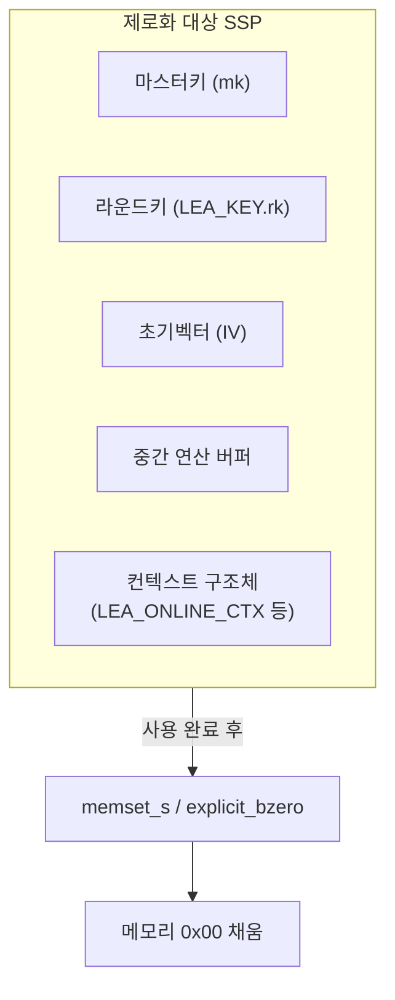

# [SEC.001] 잔존정보 제로화

## 1. 보안요구사항 개요
암호 키, IV(초기벡터), 라운드키, 중간 연산 데이터 등 민감 정보가 저장된 메모리 영역은 사용 후 반드시 명시적으로 제로화(Zeroization)해야 한다. 일반 `memset`은 컴파일러 최적화에 의해 제거될 수 있으므로 최적화 방지가 보장된 함수를 사용해야 한다.

## 2. 상세 요구사항 (Requirements)
- **COM-001**: 암호 키·IV·중간 데이터 등 SSP(Sensitive Security Parameter)가 저장된 메모리는 사용 완료 후 명시적으로 제거(제로화)해야 하며, 컴파일러 최적화에 의해 제로화 코드가 생략되지 않도록 보장해야 한다.

### 2.1. 허용 제로화 함수

| 함수명 | 플랫폼 | 특징 |
| :--- | :--- | :--- |
| `memset_s` | C11 (Annex K) | 표준 C, 최적화 방지 보장 |
| `SecureZeroMemory` | Windows | Win32 API, 최적화 방지 보장 |
| `explicit_bzero` | Linux/BSD | POSIX 확장, 최적화 방지 보장 |
| `RtlSecureZeroMemory` | Windows (커널) | 커널 드라이버용 |

### 2.2. 사용 금지 패턴

| 패턴 | 위험성 |
| :--- | :--- |
| `memset(key, 0, len)` | 컴파일러가 "dead store"로 판단하여 제거 가능 |
| 단순 루프 대입 `key[i] = 0` | 동일한 최적화 위험 |

## 3. 작성 예시 (Examples)
### 3.1. 올바른 제로화 코드 (C 코드)

```c
#include <string.h>

/* C11 memset_s 사용 */
void secure_cleanup(void *buf, size_t len) {
    memset_s(buf, len, 0, len);
}

/* Linux/BSD explicit_bzero 사용 */
void secure_cleanup_linux(void *buf, size_t len) {
    explicit_bzero(buf, len);
}

/* Windows SecureZeroMemory 사용 */
void secure_cleanup_win(void *buf, size_t len) {
    SecureZeroMemory(buf, len);
}
```

### 3.2. LEA 키 사용 후 제로화 예시

```c
LEA_KEY key;
unsigned char mk[32] = { /* 외부 주입 키 */ };

lea_set_key(&key, mk, 32);
lea_ecb_enc(ct, pt, pt_len, &key);

/* 사용 완료 후 제로화 */
memset_s(&key, sizeof(LEA_KEY), 0, sizeof(LEA_KEY));
memset_s(mk, sizeof(mk), 0, sizeof(mk));
```

### 3.3. 위험한 코드 예시 (금지 패턴)

```c
/* 위험: 컴파일러가 이 memset을 제거할 수 있음 */
LEA_KEY key;
lea_set_key(&key, mk, 32);
lea_ecb_enc(ct, pt, pt_len, &key);
memset(&key, 0, sizeof(LEA_KEY));  /* dead store 최적화 대상 */
/* key 이후 참조 없음 → 컴파일러가 제거 가능 */
```

### 3.4. 서술형 예시
"본 구현은 암호 키 및 라운드키가 저장된 `LEA_KEY` 구조체와 마스터키 버퍼를 암호 연산 완료 후 `memset_s`를 사용하여 명시적으로 제로화한다. 컴파일러 최적화에 의한 제거를 방지하기 위해 일반 `memset` 대신 C11 표준의 `memset_s`를 사용한다."

## 4. 구조도 및 시각 자료 (Visuals)
### 4.1. 제로화 적용 대상 (Mermaid)



### 4.2. 구조 설명
- 모든 SSP(민감 보안 매개변수)는 사용 후 즉시 제로화 대상이다.
- 스택 변수, 힙 할당 버퍼, 구조체 내부 필드 모두 제로화 범위에 포함된다.

## 5. 해설 및 증빙 가이드 (Guide)
- **컴파일러 최적화 문제**: `-O2` 이상 최적화 옵션에서 `memset` 호출이 제거되는 것은 실제로 발생하는 문제이며, 보안 감사에서 빈번히 지적된다.
- **volatile 포인터 우회**: `memset_s`가 지원되지 않는 환경에서는 `volatile` 포인터를 통한 제로화 루프도 대안이 될 수 있다.
- **스코프 종료 시점**: 함수 반환 직전, 또는 해당 변수의 마지막 사용 직후에 제로화를 수행해야 한다.
- **증빙 시 주안점**: 소스 코드에서 `LEA_KEY`, 마스터키 버퍼, IV 등 모든 SSP에 대해 `memset_s`, `explicit_bzero` 등의 제로화 호출이 존재하는지 확인하고, 일반 `memset`만 사용하는 경우 위험 플래그를 발생시킨다.
- **참고 규격**: 암호기술 구현안내서.
