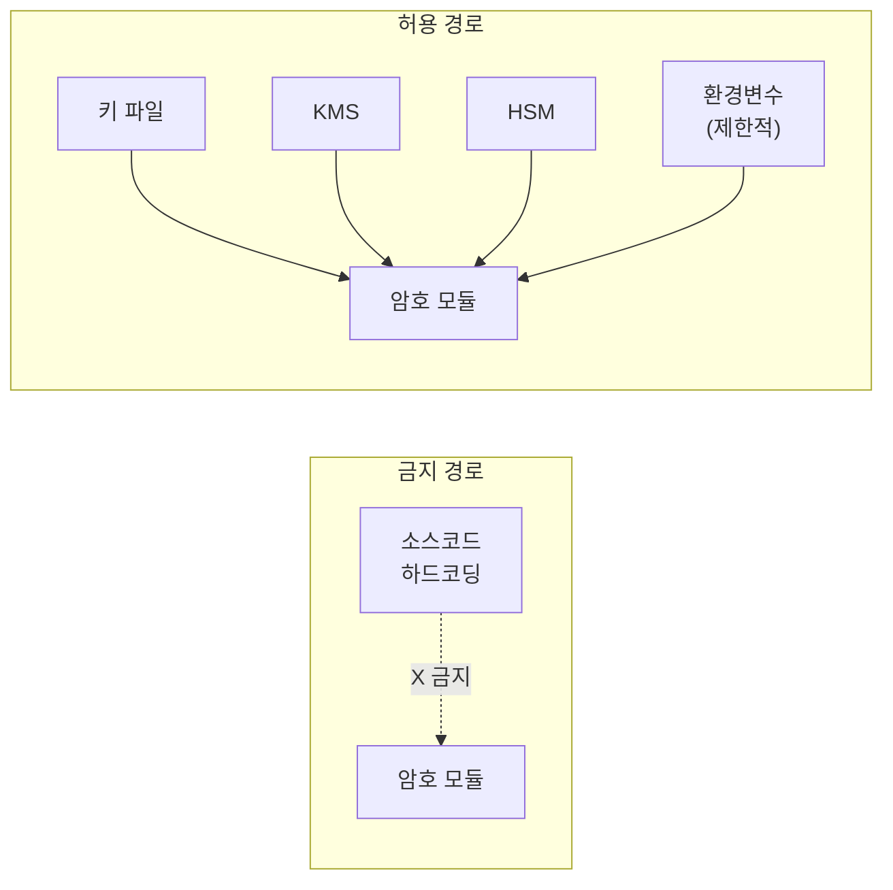

# [SEC.002] 하드코딩 금지

## 1. 보안요구사항 개요
암호 키 또는 IV(초기벡터)가 소스코드에 하드코딩되면 역공학을 통해 쉽게 노출될 수 있으므로, 반드시 외부에서 안전하게 주입(파일, KMS, HSM 등)해야 한다. 연속된 16진수 리터럴 패턴은 하드코딩 의심 대상이다.

## 2. 상세 요구사항 (Requirements)
- **COM-003**: 암호 키 또는 IV가 소스코드에 상수(리터럴)로 포함되어서는 안 된다. 키 자료(Key Material)는 파일, KMS(Key Management System), HSM(Hardware Security Module) 등 외부 소스에서 런타임에 주입해야 한다.

### 2.1. 하드코딩 탐지 패턴

| 의심 패턴 | 정규식 | 설명 |
| :--- | :--- | :--- |
| 연속 16진수 리터럴 | `(0x[0-9a-fA-F]+\s*,\s*){8,}` | 8개 이상 연속된 16진수 상수 |
| 긴 문자열 상수 | `"[0-9a-fA-F]{32,}"` | 16바이트 이상 16진수 문자열 |
| 바이트 배열 초기화 | `\{0x[0-9a-fA-F]{2}(,\s*0x[0-9a-fA-F]{2}){15,}\}` | 16바이트 이상 배열 초기화 |

### 2.2. 허용 예외

| 항목 | 사유 |
| :--- | :--- |
| 키 스케줄 상수 (delta) | 알고리즘 규격에 명시된 공개 상수 |
| 테스트 벡터 (KAT) | 검증 목적의 공개된 시험값 |
| GHASH 초기값 | GCM 규격에 정의된 공개 상수 |

## 3. 작성 예시 (Examples)
### 3.1. 위반 코드 (금지 패턴)

```c
/* 위반: 암호 키가 소스코드에 하드코딩됨 */
unsigned char master_key[16] = {
    0x0f, 0x1e, 0x2d, 0x3c, 0x4b, 0x5a, 0x69, 0x78,
    0x87, 0x96, 0xa5, 0xb4, 0xc3, 0xd2, 0xe1, 0xf0
};

/* 위반: IV가 상수로 고정됨 */
unsigned char iv[16] = {
    0x00, 0x01, 0x02, 0x03, 0x04, 0x05, 0x06, 0x07,
    0x08, 0x09, 0x0a, 0x0b, 0x0c, 0x0d, 0x0e, 0x0f
};
```

### 3.2. 준수 코드 (올바른 패턴)

```c
/* 준수: 키를 외부 파일에서 읽어옴 */
unsigned char master_key[16];
int ret = load_key_from_file("/secure/keystore/lea.key", master_key, 16);
if (ret < 0) {
    /* 키 로드 실패 처리 */
    return -1;
}

/* 준수: IV를 CSPRNG에서 생성 */
unsigned char iv[16];
generate_random_iv(iv, 16);
```

### 3.3. 허용 예시 (키 스케줄 상수)

```c
/* 허용: LEA 키 스케줄 공개 상수 (delta) */
static const uint32_t delta[8] = {
    0xc3efe9db, 0x44626b02, 0x79e27c8a, 0x78df30ec,
    0x715ea49e, 0xc785da0a, 0xe04ef22a, 0xe7ae6536
};
```

### 3.4. 서술형 예시
"본 구현은 암호 키를 소스코드에 하드코딩하지 않으며, 외부 키 저장소(파일 또는 KMS)에서 런타임에 안전하게 주입한다. 소스코드 내의 16진수 상수는 키 스케줄용 공개 상수(delta)와 검증용 테스트 벡터에 한정된다."

## 4. 구조도 및 시각 자료 (Visuals)
### 4.1. 키 주입 경로 (Mermaid)



### 4.2. 구조 설명
- 암호 키와 IV는 반드시 런타임에 외부 경로를 통해 주입된다.
- 소스코드에 직접 기술하는 것은 알고리즘 규격상 공개 상수(delta 등)와 검증용 테스트 벡터만 허용된다.

## 5. 해설 및 증빙 가이드 (Guide)
- **자동 탐지**: L1 스캔 단계에서 정규식 `(0x[0-9a-fA-F]+\s*,\s*){8,}` 패턴으로 하드코딩 의심 구간을 탐지한다. 탐지된 코드가 허용 예외(delta 상수, KAT 벡터)에 해당하는지 L2에서 판별한다.
- **환경변수 주의**: 환경변수를 통한 키 주입은 프로세스 목록이나 `/proc` 파일시스템을 통해 노출될 수 있으므로 주의가 필요하다.
- **증빙 시 주안점**: 소스 코드 전체에서 16바이트 이상의 연속 16진수 리터럴을 검색하고, 각각이 암호 키/IV인지 공개 상수인지 구분하여 확인한다.
- **참고 규격**: 암호기술 구현안내서.
