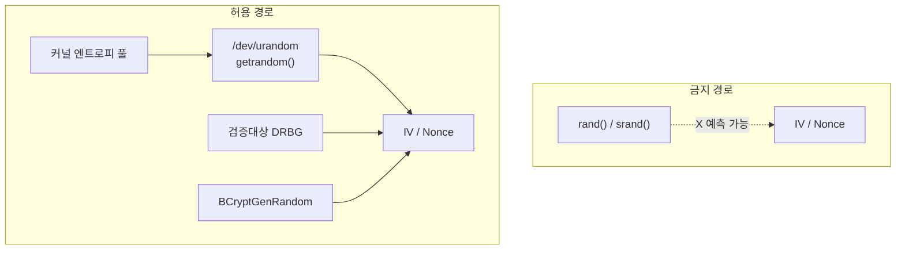

# [SEC.003] CSPRNG 사용

## 1. 보안요구사항 개요
IV(초기벡터), Nonce 등 암호 연산에 사용되는 난수는 반드시 암호학적으로 안전한 의사난수 발생기(CSPRNG: Cryptographically Secure Pseudo-Random Number Generator)로 생성해야 한다. `rand()`, `srand()` 등 비암호학적 난수 함수는 예측 가능하므로 사용이 금지된다.

## 2. 상세 요구사항 (Requirements)
- **COM-004**: IV, Nonce, 키 생성 등 암호 연산에 사용되는 모든 난수는 검증대상 난수 발생기(DRBG: Deterministic Random Bit Generator) 또는 운영체제가 제공하는 CSPRNG를 통해 생성해야 한다.

### 2.1. 사용 금지 함수

| 함수명 | 이유 |
| :--- | :--- |
| `rand()` | 선형 합동 생성기(LCG) — 예측 가능 |
| `srand()` | `rand()`의 시드 함수 — 시드 노출 시 전체 시퀀스 예측 가능 |
| `random()` | 비암호학적 PRNG |
| `drand48()` | 48비트 선형 합동 — 예측 가능 |

### 2.2. 허용 CSPRNG 소스

| 소스 | 플랫폼 | 비고 |
| :--- | :--- | :--- |
| `/dev/urandom` | Linux/macOS | 커널 엔트로피 풀 기반 |
| `getrandom()` | Linux (3.17+) | 시스템 콜, 블로킹/논블로킹 선택 |
| `BCryptGenRandom` | Windows | CNG(Cryptography Next Generation) API |
| `CryptGenRandom` | Windows (레거시) | CryptoAPI |
| 검증대상 DRBG | 플랫폼 무관 | KCMVP 검증된 DRBG 모듈 |

## 3. 작성 예시 (Examples)
### 3.1. 위반 코드 (금지 패턴)

```c
/* 위반: 비암호학적 rand() 사용 */
unsigned char iv[16];
srand(time(NULL));
for (int i = 0; i < 16; i++) {
    iv[i] = rand() & 0xFF;
}
```

### 3.2. 준수 코드 — Linux (C 코드)

```c
#include <sys/random.h>

unsigned char iv[16];
ssize_t ret = getrandom(iv, sizeof(iv), 0);
if (ret != sizeof(iv)) {
    /* 난수 생성 실패 처리 */
    return -1;
}
```

### 3.3. 준수 코드 — /dev/urandom (C 코드)

```c
#include <stdio.h>

unsigned char iv[16];
FILE *fp = fopen("/dev/urandom", "rb");
if (fp == NULL || fread(iv, 1, 16, fp) != 16) {
    /* 난수 생성 실패 처리 */
    if (fp) fclose(fp);
    return -1;
}
fclose(fp);
```

### 3.4. 준수 코드 — Windows (C 코드)

```c
#include <bcrypt.h>

unsigned char iv[16];
NTSTATUS status = BCryptGenRandom(NULL, iv, sizeof(iv),
                                  BCRYPT_USE_SYSTEM_PREFERRED_RNG);
if (!BCRYPT_SUCCESS(status)) {
    /* 난수 생성 실패 처리 */
    return -1;
}
```

### 3.5. 서술형 예시
"본 구현은 IV 및 Nonce 생성 시 `getrandom()` 시스템 콜을 사용하여 암호학적으로 안전한 난수를 생성한다. `rand()`, `srand()` 등 비암호학적 난수 함수는 일절 사용하지 않는다."

## 4. 구조도 및 시각 자료 (Visuals)
### 4.1. 난수 생성 경로 비교 (Mermaid)



### 4.2. 구조 설명
- CSPRNG는 운영체제 커널의 엔트로피 풀(하드웨어 이벤트, 인터럽트 타이밍 등)로부터 예측 불가능한 난수를 생성한다.
- `rand()`는 단순 수학 공식(LCG)에 기반하므로 시드만 알면 전체 출력을 예측할 수 있어 암호 용도로 사용할 수 없다.

## 5. 해설 및 증빙 가이드 (Guide)
- **자동 탐지**: L1 스캔 단계에서 `rand()`, `srand()`, `random()`, `drand48()` 함수 호출을 탐지한다. 해당 함수가 암호 연산(키/IV 생성)과 관련된 문맥에서 사용되는지 L2에서 판별한다.
- **DRBG 사용 권장**: KCMVP 검증 환경에서는 운영체제 CSPRNG보다 검증대상 DRBG 모듈을 사용하는 것이 더 엄격한 요구사항 충족에 유리하다.
- **GCM Nonce 특수성**: GCM 모드의 Nonce는 유일성이 핵심이므로, 카운터 기반 생성도 허용되지만 카운터 관리 로직의 안전성이 보장되어야 한다.
- **증빙 시 주안점**: 소스 코드 전체에서 `rand`, `srand`, `random`, `drand48` 호출이 존재하지 않는지 확인하고, IV/Nonce 생성 코드가 CSPRNG를 사용하는지 검증한다.
- **참고 규격**: 암호기술 구현안내서.
