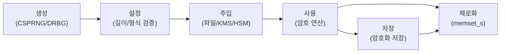
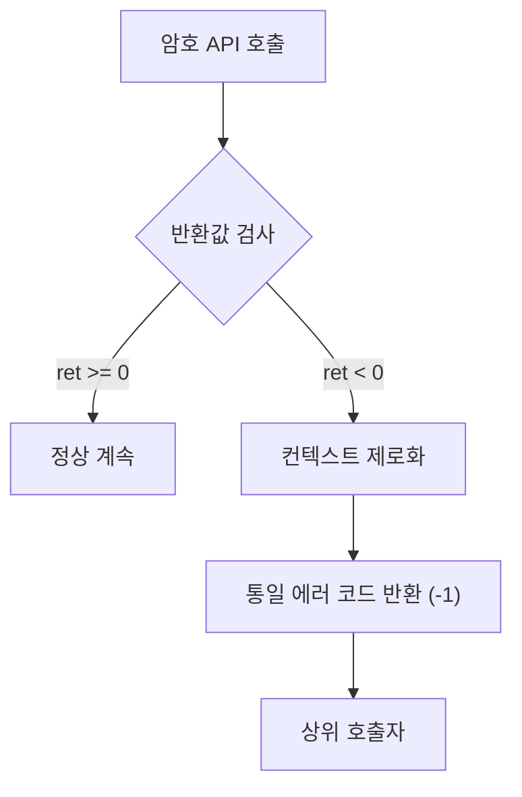

# [SEC.004] 에러 처리 및 상태관리

## 1. 보안요구사항 개요
암호 연산 실패 시 에러를 반환하고 상위 호출자에서 적절히 처리해야 하며, 에러 메시지에 구체적인 실패 원인(패딩 오류, 키 형식 오류 등)을 노출해서는 안 된다. 또한 단순 알고리즘 구현 외에 SSP(민감 보안 매개변수)의 생성, 설정, 주입, 저장, 제로화 등 전체 생명주기에 걸친 보안 요구사항을 만족해야 한다.

## 2. 상세 요구사항 (Requirements)
- **COM-002**: 암호 연산 함수는 실패 시 에러를 반환하고, 호출자는 반드시 이를 검사하여 처리해야 한다. 에러 발생 시 구체적인 원인을 외부에 노출하지 않아야 하며, SSP의 전체 생명주기(생성→설정→주입→저장→제로화)에 걸쳐 보안 요구사항을 준수해야 한다.

### 2.1. 에러 처리 원칙

| 원칙 | 설명 |
| :--- | :--- |
| 에러 전파 | 모든 암호 함수의 반환값을 검사하고, 에러 시 상위로 전파 |
| 원인 비노출 | 패딩 오류, 키 길이 오류 등 구체적 원인을 외부에 노출하지 않음 |
| 일관된 에러 응답 | 실패 유형에 관계없이 동일한 에러 코드를 반환하여 오라클 공격 방지 |

### 2.2. SSP 생명주기 관리

| 단계 | 요구사항 |
| :--- | :--- |
| 생성 | CSPRNG 또는 검증대상 DRBG를 통해 생성 |
| 설정 | 올바른 길이와 형식의 SSP만 허용 |
| 주입 | 외부 주입 경로(파일, KMS, HSM)를 통해 전달 |
| 저장 | 암호화된 형태로 저장, 평문 저장 금지 |
| 제로화 | 사용 완료 후 `memset_s` 등으로 명시적 제거 |

## 3. 작성 예시 (Examples)
### 3.1. 올바른 에러 처리 (C 코드)

```c
int perform_encryption(const unsigned char *pt, unsigned int pt_len,
                       unsigned char *ct, const LEA_KEY *key,
                       const unsigned char *iv) {
    LEA_ONLINE_CTX ctx;
    int ret;

    ret = lea_online_init(&ctx, MODE_CBC_ENC, key, iv);
    if (ret < 0) {
        goto cleanup;
    }

    ret = lea_online_update(&ctx, ct, pt, pt_len);
    if (ret < 0) {
        goto cleanup;
    }

    ret = lea_online_final(&ctx, ct + ret);
    if (ret < 0) {
        goto cleanup;
    }

cleanup:
    memset_s(&ctx, sizeof(ctx), 0, sizeof(ctx));
    return (ret < 0) ? -1 : 0;  /* 구체적 에러 코드 노출 금지 */
}
```

### 3.2. 위반 패턴 — 에러 원인 노출 (금지)

```c
/* 위반: 구체적 에러 원인을 외부에 노출 */
if (padding_error) {
    printf("Error: Invalid PKCS7 padding\n");  /* 패딩 오라클 공격 가능 */
    return ERR_PADDING_INVALID;
}
if (key_len_error) {
    printf("Error: Key length must be 16, 24, or 32\n");
    return ERR_KEY_LENGTH;
}
```

### 3.3. 준수 패턴 — 일관된 에러 응답

```c
/* 준수: 실패 유형에 관계없이 동일한 응답 */
if (padding_error || key_len_error || auth_error) {
    return -1;  /* 통일된 에러 코드 */
}
```

### 3.4. 서술형 예시
"본 구현은 모든 암호 연산 함수의 반환값을 검사하며, 실패 시 `-1`을 통일적으로 반환하여 구체적인 에러 원인을 외부에 노출하지 않는다. SSP는 CSPRNG를 통해 생성하고, 사용 완료 후 `memset_s`로 제로화하는 전체 생명주기 관리를 수행한다."

## 4. 구조도 및 시각 자료 (Visuals)
### 4.1. SSP 생명주기 (Mermaid)



### 4.2. 에러 처리 흐름 (Mermaid)



### 4.3. 구조 설명
- 모든 암호 API 호출 후 반환값을 즉시 검사하여 에러를 전파한다.
- 에러 발생 시 사용 중인 컨텍스트를 제로화한 후 통일된 에러 코드를 반환한다.

## 5. 해설 및 증빙 가이드 (Guide)
- **패딩 오라클 공격 방지**: CBC 모드에서 패딩 오류와 복호화 오류를 구분하여 반환하면 패딩 오라클 공격(Padding Oracle Attack)에 취약해진다. 반드시 동일한 에러 코드를 반환해야 한다.
- **goto cleanup 패턴**: C 언어에서는 `goto cleanup` 패턴을 사용하여 에러 발생 시에도 반드시 제로화 코드를 거치도록 하는 것이 일반적이다.
- **로깅 주의**: 내부 로그에 에러 세부사항을 기록하는 것은 허용되나, 외부 인터페이스(API 반환값, 에러 메시지)를 통해 노출되어서는 안 된다.
- **증빙 시 주안점**: 소스 코드에서 모든 암호 함수 호출 후 반환값을 검사하는지, 에러 메시지에 구체적 실패 원인이 포함되지 않는지, SSP가 전체 생명주기에 걸쳐 안전하게 관리되는지 확인한다.
- **참고 규격**: 암호기술 구현안내서.
